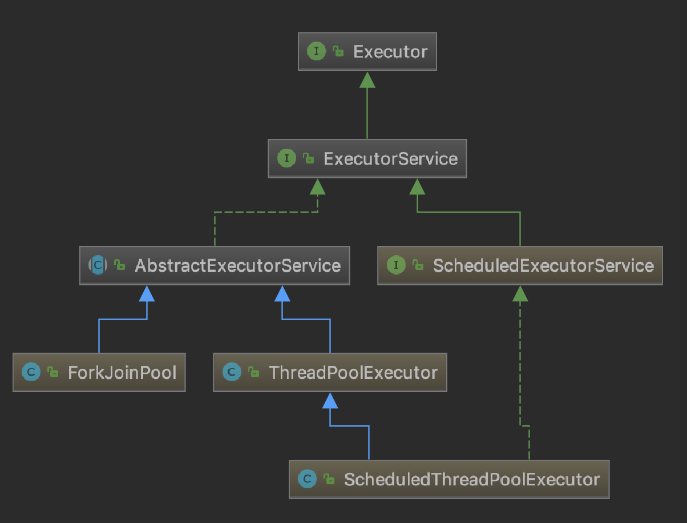
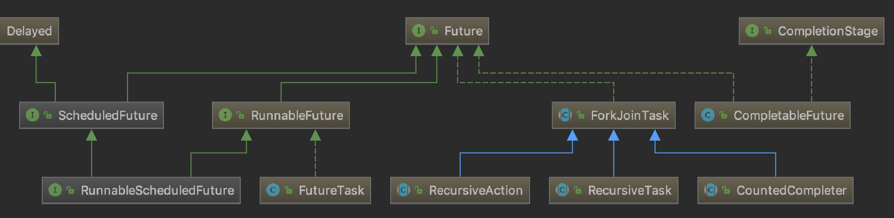

# Executor线程池 和 Future、Callable

之前对Executor框架和Future只是一知半解，看Netty源码有点吃力；索性就在这里将他们深入学习一下。
然而只是看Executor的源码，不理解其设计初衷也是难以把握重点，记不住。

### Executor线程池源码结构

+ Executor框架的作用

    设计Executor的初衷是想把任务和“任务的运行方法（是怎样运行的）”、“线程的使用”、“线程的调度”分离开来（也就是解耦）；
    即Executor框架把任务的提交和执行进行解耦，只需要定义好任务，然后提交给线程池，而不用关心该任务是如何执行、被哪个线程执行，以及什么时候执行。

+ Executor线程池类图

    
    
    - Executor
        
        定义了一个execute()方法用于执行Runnable实例。
        
    - ExecutorService(核心接口)
    
        就是按照设计初衷设计的接口，并不关注线程的实现，对外看来我们只需要提交任务（3种重载的submit方法，2种重载的invokeAll，2种重载的invokeAny；
        invokeAll是批量提交多个任务，全部执行结束后，将结果异步返回到集合类对象中，invokeAny是批量提交，任意一个执行完成或异常退出就返回，
        其他未执行完毕的任务被撤销）
        然后等待执行结果，以及对其进行状态检查（isShutdown，isTerminated），控制关闭（shutdown，shutdownNow，shutdownNow）。
        
    - ScheduledExecutorService
        
        在ExecutorService基础上添加了计划任务方法相当于submit方法的加强版。可以延迟执行，按周期循环执行，按延迟循环执行。
        
        scheduleAtFixedRate 与 scheduleWithFixedDelay区别：第一个方法是固定的频率来执行某项计划，它不受计划执行时间的影响。到时间，它就执行。 
        而第二个方法，相对固定，据鄙人理解，是相对任务的。即无论某个任务执行多长时间，等执行完了，我再延迟指定的时间。也就是第二个方法，它受计划执行时间的影响。 
    
    - AbstractExecutorService
        
        这个抽象类实现了提交任务的方法（3+2+2），submit和invokeAll借助FutureTask实现，invokeAny借助ExecutorCompletionService实现。
        
    - ForkJoinPool
    
        TODO: 一个比较另类的线程池，分析Netty源码用不到，后面再研究。
        
    - ThreadPoolExecutor（核心实现类）
    
        除了实现接口的方法外还提供了好多查询修改线程池本身状态的方法。
        
        ThreadPoolExecutor 线程池内部实现：下面单独开出一节分析。
        
    - ScheduleThreadPoolExecutor
    
        在ThreadPoolExecutor基础上主要拓展了计划任务方法。
        
    - Executors（具有参考意义）
        
        包装ThreadPoolExecutor方法做的一个工具类，内部基本都是static方法，很方便使用。
        实现了很多定制化的线程池类型，任务类型以及线程工厂。自己如果想定制一个线程池完全可以参考这个类的实现。
        
+ Callable 与 Future、FutureTask

    - Callable 
    
        Callable 和 Runnable 都是最基础且最简单的接口，一个带返回值一个不带返回值。

    - Future、FutureTask
    
        
    
        Future就是对于具体的Runnable或者Callable任务的执行结果进行取消、查询是否完成、获取结果的接口。
    
        FutureTask
    
+ FutureTask 与 ExecutorCompletionService

    CompletionService用于提交一组Callable任务，其take方法返回已完成的一个Callable任务对应的Future对象。

+ ThreadFactory

    接口，创建线程。

### ThreadPoolExecutor 内部实现原理

从一个简单的例子 ThreadPoolExecutorDemo.java（直接从Executors中copy出一个相对复杂的实例）开始，通过调试理解内部实现。

