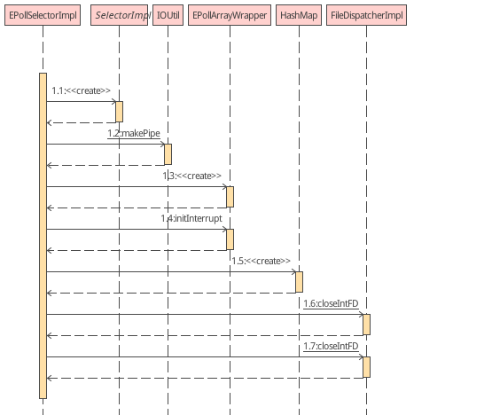

## Java NIO 完全解析

Java源码下载（包括JVM）：http://hg.openjdk.java.net/jdk8u/jdk8u60/jdk/file/935758609767

Java NIO 目的提升IO效率，处理性能（CPU不行搞GPU）已经不是瓶颈，IO性能才是软件性能的瓶颈。


#### 1 基础概念
+ **Java IO 与 Linux IO模型** 
  
    Java IO无非是将数据写进或移出缓冲区。
    然后调用系统调用通过Linux IO实现数据传入内核再到硬件的操作（研究这部分去看《Unix系统编程》，有讲内核IO的操作与实现）。
    
+ **内核空间与用户空间**
  
    这个不用说了，主要是隔离，之间通过系统调用通信。
    
+ **DirectBuffer中的“direct[直接内存]”的理解**  
  
    个人理解是通过JNI调用系统调用，然后以C/C++的方式（malloc、alloc）分配的内存，同样属于内存空间，但是不受Java GC管理。这部分内存常和Java Heap对比来讲，常被称作“堆外内存”。操作Java Heap内存需要先将Heap内存拷贝到堆外内存，然后再拷贝到内核Buffer执行真正的处理，所以DirectBuffer比HeapBuffer会少一次拷贝。
    
    Java虽然引入了GC，但是也没有抛弃C/C++的指针（Java通过Unsafe类保留了指针操作）

+ **Linux mmap**

  内存映射(memory map)，将内核空间的内存[但不限于内存条的内存地址，还包括硬件设备的物理地址]直接映射到一个文件[用户空间]（Linux一切皆文件），通过该文件直接操作内核内存。

  内存映射文件允许你使用direct（DirectByteBuffer）或者non-direct 字节缓存（HeapByteBuffer）来直接读写内存。 

+ **mmap分页** 
  
    Linux mmap涉及数据分页，操作是以页为单位，一页一页地取数据的。

+ **Socket编程和Linux epoll模型**

+ **适配器模式**

  原本的设计和需要的有差异但是功能基本是一样的，通过适配器（Adapter）将原本的设计（Adaptee）转换为需要的样子（Target）， ServerSocketChannelImpl 为Adaptee， ServerSocket为Target，通过ServerSocketAdapter 将 ServerSocketChannelImpl 方法改造成 ServerSocket方法的样子。

  举一个方法适配的例子

  ```java
  public void bind(SocketAddress local) throws IOException {
  	bind(local, 50);
  }
  ```

  

#### 2 工作原理简述

将Java NIO中的类与熟悉的东西（Socket、EPoll）关联起来更容易理解，关联关系查看后面总结。

以ServerSocketChannel、SocketChannel和EPollSelectorImpl这种最常见的组合说明：

**服务端：**

1）检测系统环境，通过SPI动态加载ServerSocketChannel实现类并实例化（就是创建Socket服务端）；

2）由于ServerSocketChannelImpl和ServerSocket接口方法有差异，通过适配器模式将ServerSocketChannelImpl实例适配为ServerSocket实例；

3）执行Socket服务端与IP端口绑定（检查传参；查看端口占用；是否启用SDP协议启用且符合协议规则则将TCP Socket转换为 SDP Socket，暂时不管SDP，最终执行native bind0方法；然后启动Socket监听（Net.listen），最终执行 native listen方法）；

4）配置非阻塞模式；

5）检测环境，和第一步一样通过SPI加载EPollSelectorProvider，然后创建EPollSelectorImpl实例；

​	

​	5.1）第一步创建了几个SelectionKey的集合，keys、selectedKeys、publicKeys、publicSelectedKeys，这几			个成员功能参考后面详细解释。

​	5.2）创建了一个Linux 非阻塞管道（SocketChannel与底层数据通信是通过Linux管道实现的），高32位是读			端，低32位是写端。

​	5.3）创建epoll实例（EPollArrayWrapper），分配pollArray内存（TODO：为什么是8192*12？eventsLow			和eventsHigh又是何时切换的？），监控管道读端的EPOLLIN事件。

6） 客户端SocketChannel向服务端发送连接请求，服务端epoll会监听到socket fd上的事件，并将事件和触发事件的Channel信息记录到Selector的SelectionKey Set集合publicSelectedKeys中。然后Selector.select()会跳出阻塞。

７) 然后就只需要从Selector中取出publicSelectedKeys的内容，针对每个Channel和事件做处理即可。

相关细节：

1. 由一个专门的线程处理所有IO事件，并负责分发。

2. 事件驱动机制，事件到来的时候触发操作，不需要阻塞地监视事件。

3. 线程间通过wait,notify通信，减少线程切换。
   

#### 3 java.nio 类组

还有些与系统相关的实现类在sun.nio.ch包中。

+ Channel及Selector类

+ Charset类

+ File类

+ Buffer类

+ 异常类

+ CharBufferSpliterator

+ ByteOrder

+ Bits

#### 4 NIO 组件

##### 4.1 Channel 通道  

java.nio包，不仅提供了NIO还提供了AIO，Channel的实现类主要有两大类，一个是网络Channel，一个是文件Channel。网络Channel中又包含了AIO模式的Channel。但是注意java.nio只是提供抽象类，java nio实现依赖于系统，sun针对不同系统提供了不同的实现（在sun.nio.ch中）。

网络Channel (AsynchronousSocketChannel [AIO] 、ServerSocketChannel、SocketChannel、DatagramChannel [UDP])

文件Channel（FileChannel）

+ **ServerSocketChannelImpl**

  ServerSocketChannelImpl（sun.nio.ch.ServerSocketChannelImpl）的实现应该在各个系统上都是通用的(TODO：不同系统上实现是否有差异，需要下载对应环境JDK源码比较)，但其具体实现也是通过SPI动态加载，然后由SelectorProvider实例创建的（这部分参考4.2）。

  提供开启、关闭、强制杀死、ServerSocket功能（socket()将ServerSocketChannelImpl适配成ServerSocket实例，bind()绑定IP端口并监听客户端连接， configureBlocking()配置阻塞还是非阻塞模式【通过IOUtil操作ServerSocket文件描述符】，accept()等待接入），Net事件类型转epoll事件类型。

  **类继承关系**

  ```java
  ServerSocketChannelImpl(C)
  	->	ServerSocketChannel(AC)					//拓展Socket接口，如bind、socket、accept、getLocalAddress
          ->	AbstractSelectableChannel(AC)	//
              ->	SelectableChannel(AC)		//可以通过Selector被多路复用的Channel
                  ->	AbstractinterruptiableChannel(AC)	//依赖实现的interruptable接口及implCloseChannel()实现对Channel的打开，提供 begin()、end()、close()接口实现
                      ->	InterruptibleChannel(I)			//关闭（重复定义？）
                          ->	Channel(I)
                      ->	Channel(I)
                  ->	Channel(I)
          ->	NetworkChannel(I)	//绑定和获取Socket地址、设置和获取Socket配置项
              ->	Channel(I)		//是否打开、关闭
  ```

  **成员**

  ```java
  fd = {FileDescriptor@514} 	//ServerSocket文件描述符（文件描述符对应操作系统对底层硬件封装的操作接口）是操作底层硬件的应用空间接口（一般跟代码跟到系统调用对应的native方法就够了，更多详情参考Linux手册）通过Net.serverSocket()创建
  fdVal = 30					//fd的值
  thread = 0
  lock = {Object@515} 
  stateLock = {Object@516} 	//同步更新ServerSocketChannel状态的锁
  state = 0					//ServerSocketchannel状态（-1：未初始化，0：启用中，1：强制关闭）
  localAddress = null
  isReuseAddress = false
  socket = null				//ServerSocketAdaptor实例,由适配器模式的特点知道其实就是ServerSocketChannelImpl,只不过是包装了一层
  provider = {EPollSelectorProvider@517} 
  keys = null
  keyCount = 0
  keyLock = {Object@518} 
  regLock = {Object@519} 
  blocking = true				//ServerSocket是否为阻塞模式，默认为阻塞模式
  closeLock = {Object@520} 	
  open = true
  interruptor = null
  interrupted = null
  ```

+ **SocketChannelImpl**

  本质上就是个Socket文件描述符，由 Net.socket()创建。

  **类继承关系**
  
  ```java
  SocketChannelImpl(C)
  	->	SocketChanel(AC)
  		->	AbstractSelectableChannel(AC)			//
  			->	SelectableChannel(AC)
  				->	AbstracInterruptibleChannel(AC)
  					->	InterruptibleChannel(I)
  						->	Channel(I)
      				->	Channel(I)
  				->	Channel(I)
  		->	ScatteringByteChannel(I)
  			->	ReadableByteChannel(I)
  			
  		->	ByteChannel(I)
  			->	ReadableByteChannel(I)
  				->	Channel(I)
  			->	WritableByteChannel(I)
  				->	Channel(I)
  		->	GathringByteChannel(I)
  			->	WritableByteChannel(I)
  				->	Channel(I)
  		->	NetworkChannel(I)
  			-> 	Channel(I)
  		->	SelChImpl(I)
			-> 	Channel(I)
  ```

  **成员**
  
  ```java
  fd = {FileDescriptor@557} 	//Socket文件描述符
  fdVal = 30					//Socket文件描述符value
  readerThread = 0
  writerThread = 0
  readLock = {Object@558} 
  writeLock = {Object@559} 
  stateLock = {Object@560} 
  isReuseAddress = false
  state = 0
  localAddress = null
  remoteAddress = null
  isInputOpen = true
  isOutputOpen = true
  readyToConnect = false
  socket = null
  provider = {EPollSelectorProvider@519} 
  keys = null					//当前Channel注册到所有Selector返回的SelectorKey的数组
  keyCount = 0
  keyLock = {Object@561} 
  regLock = {Object@562} 
  blocking = false			//socket是否配置为阻塞模式，默认为阻塞模式
  closeLock = {Object@563} 
  open = true
  interruptor = null
interrupted = null
  ```

  **连接处理流程**
  
  ```java
  //1）SocketChannel和关注事件注册到Selector
  socketChannel.register(selector, SelectionKey.OP_CONNECT);
  	//	a) 首先从keys中查找Selector，看当前SocketChannel有没有已经和此Selector绑定，如果已经绑定过则更新感兴趣的事件集合
  	SelectionKey k = findKey(sel);
  	k.interestOps(ops);
  	//	b) 没有绑定Selector就需要注册，注册是通过Selector的register()方法，创建 SelectionKeyImpl实例，将自己和Selector放到这个实例里面；
		//  将这个关联实例放到Selector的fdToKey集合，便于Selector查找与其绑定的Channel；
  	//	将Channel的fd放到eventsLow或eventsHigh，默认检测事件为空（值为0）
	//	将SelectionKeyImpl实例放到Selector的keys，和fdToKey集合的区别？（存的东西好像都一样，只不过一个是Map<int, SelectionKeyImpl>,一个是Set<SelectionKeyImpl>）
  	//	设置关注的事件到eventsHigh（里面涉及SelectionKey事件定义转换为Net IO事件的过程）
  //	SelectionKey OP_READ OP_WRITE OP_CONNECT 分别对应 Net POLLIN POLLOUT POLLCONN
  	k = ((AbstractSelector)sel).register(this, ops, att);
  	// c) 将关联实例放到Channel的keys，便于Channel查找与其绑定的Selector；
  	addKey(k);
  //2) SocketChannel 发起连接
  socketChannel.connect(new InetSocketAddress(host, port));
  //3) 轮训监听epoll事件，即最终是调用EPollArrayWrapper的 poll(), 即 epollWait()。
  //	a) 清理被cancelled的SelectionKey
  //	b) poll(), 这个过程会更新 selectedKeys 添加有事件触发的Channel的SelectionKey， publicSelectedKeys是其引用
  //	c) 获取所有触发事件的 Channel的 SelectionKey集合
  selector.select(100);
  selector.selectedKeys();
  //4) 解析并处理事件，有个有趣的问题OP_CONNECT 和 OP_WRITE在操作系统层面是同一个事件,那么事件触发后怎么判断是哪个事件，看后面分析）
  //	a) 判断事件类型 readyOps()
  //	b) OP_CONNECT：则执行连接结果处理 SocketChannel$finishConnect()；对于读写操作，OP_READ：则执行 SocketChannel$read()， OP_WRITE: 则执行 SocketChannel$write()
  ```
  
  SelectionKey事件、Net IO事件、Linux epoll事件对应关系
  
  SelectionKey事件（定义了4种）与Net IO事件(定义了6种，值通过native方法从内核获取， 如果使用epoll模型的话[最新内核定义了15种事件]，查看 /sysdeps/unix/sysv/linux/sys/epoll.h ./sysdeps/unix/sysv/linux/bits/poll.h)
  
  | SelectionKey   | Net      | Linux epoll      |
  | -------------- | -------- | ---------------- |
  | OP_READ = 1    | POLLIN   | EPOLLIN = 0x001  |
  | OP_WRITE = 4   | POLLOUT  | EPOLLOUT = 0x004 |
  | OP_CONNECT = 8 | POLLCONN | EPOLLOUT = 0x004 |
  | OP_ACCEPT = 16 |          |                  |
  |                | POLLERR  | EPOLLERR = 0x008 |
  |                | POLLHUP  | EPOLLHUP = 0x010 |
  |                | POLLNVAL | POLLNVAL = 0x020 |
  
  - OP_CONNECT 和 OP_WRITE事件触发后如何区分
  
    SelectionKeyImpl 类中有个interestOps成员变量估计就是专门做这个事情的，Channel注册到Selector时是有明确指出是要关注OP_CONNECT还是OP_WRITE事件，走到系统层后才混淆的，那么在走到系统层之前记录下这个事件类型到interestOps，而且不允许同时监听这两种事件，那么后面触发的事件不就是 interestOps 记录的事件了么。然后先注册OP_CONNECT事件，建立连接之后，重新注册OP_WRITE事件（会清楚之前的SelectionKey），然后监可写事件。从而避免 OP_CONNECT和OP_WRITE的混淆问题。
  
  

如何打开，执行读写等操作、关闭通道？

Scatter/Gather？

文件通道访问文件以及锁定文件？

内存映射文件的使用？

新的FileChannel类提供了一个名为map()的方法，该方法在一个打开的文件和一个特殊类型的ByteBuffer之间建立一个虚拟内存映射；


##### 4.2 Selector 选择器  

对应epoll

Selector可以同时监控一个或多个NIO Channel实例，判断出哪个Channel已经准备好了读写。

TODO：结合JVM深入研究实现。

+ **SelectorProvider** （用于创建Selector实例）

  首次启动会检测操作系统类型，针对不同的系统，会通过SPI动态加载不同的SelectorProvider实现(sun.nio包中提供)。

  Linux： EPollSelectorProvider
  MacOS: KQueueSelectorProvider
  Window:  WindowsSelectorProvider

  ```java
  EPollSelectorProvider(C)			//提供创建Selector及SelectableChannel的方法, 其中openSelector创建EPollSelectorImpl
  	->	SelectorProviderImpl(AC)	//提供创建TCP/UDP socket Channel、Pipe、Selector的方法，其中openServerSocketChannel()创建ServerSocketChanelImpl对象;
  		->	SelectorProvider(AC)	//除了定义上面方法的抽象外，就是实现了SPI动态加载Selector实现类的功能；SPI用起来也比较简单，原理就先放一放，但无非就是类加载而已
  ```

+ **EPollSelectorImpl** （Linux中Selector的实现类）

  成员

  ```java
  fd0 = 32		//TODO：fd0和fd1一个是服务端一个是客户端 Socket fd
  fd1 = 33
  pollWrapper = {EPollArrayWrapper@627} 	//参考后面分析
  fdToKey = {HashMap@628}  size = 1		//与Selector绑定的Channel文件句柄Map [Map<Integer, SelectionKeyImpl>], SelectionKeyImpl参考后面分析
  closed = false
  interruptLock = {Object@629} 
  interruptTriggered = false
  selectedKeys = {HashSet@630}  size = 0	//The set of keys with data ready for an operation ?
  keys = {HashSet@631}  size = 1			//Selector中注册的SelectorKey实例集合
  publicKeys = {Collections$UnmodifiableSet@632}  size = 1	//
  publicSelectedKeys = {Util$3@633}  size = 0		//
  selectorOpen = {AtomicBoolean@634} "true"
  provider = {EPollSelectorProvider@517} 			//创建此Selector的SelectorProvider实例
  cancelledKeys = {HashSet@635}  size = 0			//
  interruptor = {AbstractSelector$1@727} 
  ```

  实例化流程

  从构造方法断点调试

  ```java
  EPollSelectorImpl(SelectorProvider sp) throws IOException {
      //1) 首先创建一个线程安全的变量 seletorOpen，修改状态为 true, 然后实例化一些容器类：cancelledKeys、keys、selectedKeys、publicKeys、publicSelectedKeys
      super(sp);
      //2) 通过native方法创建一条管道，管道是用于Linux进程通信的。TODO：NIO中管道是做什么的？
      long pipeFds = IOUtil.makePipe(false);
      //管道：高32位代表读fd 低32位代表写fd
      fd0 = (int) (pipeFds >>> 32);	//读fd
      fd1 = (int) pipeFds;			//写fd
      //3) 创建epoll fd，分配epollWait监测到的fd的事件的容器，分配epollCtl感兴趣的fd的事件的容器
      pollWrapper = new EPollArrayWrapper();
      //4) outgoingInterruptFD = fd1， incomingInterruptFD = fd0; 
      //	 然后 epollCtl添加监控管道读端的EPOLLIN事件，TODO:为什么要建个管道读？
      pollWrapper.initInterrupt(fd0, fd1);
      //5) 最后分配已fd为键，SelectionKeyImpl为值的容器，TODO：
      fdToKey = new HashMap<>();
  }
  ```

+ **SelectionKeyImpl**（SelectorKey用于绑定Channel与Selector，即Socket和EPoll，知道一方可以获取另一方）

  Channel向Selector注册成功后都会返回一个SelectionKey对象；注册的过程就是创建一个SelectionKeyImpl绑定实例，然后将自己（Channel实例）以及目标Selector实例还有感兴趣的事件存到绑定实例中；然后获取Channel文件句柄编号将它和SelectorKey保存到Selector、Channel中。所以Selector、Channel中可以获得SelectionKey集合，通过SelectionKey可以获取绑定的Channel和Selector。

+ **EPollArrayWrapper**（很重要）

  对epoll系统调用的封装（ 源码路径：jdk\src\solaris\classes\sun\nio\ch ），epoll的使用参考 《Linux epoll.md》。

  ```java
  //这三个本地方法对应epoll的3个系统调用
  //创建一个新的epoll实例,返回引用此epoll实例的文件描述符，当所有引用此epoll实例的文件描述符被关闭后，系统内核会自动释放此epoll实例的资源
  private native int epollCreate();
  //添加、修改、删除 epoll 实例 interest 列表中的条目（即添加、修改、删除epoll实例感兴趣的流对应的事件）
  // epfd: epoll实例的文件描述符
  // op: c操作类型: EPOLL_CTL_ADD EPOLL_CTL_MOD EPOLL_CTL_DEL
  // fd: 感兴趣的文件描述符（即被监听的对象）
  // event: 感兴趣的fd对象的事件集合
private native void epollCtl(int paramInt1, int paramInt2, int paramInt3, int paramInt4);
  // 等待epoll实例监听的对象的事件发生，如果所有被监听对象都没有事件发生则会阻塞
  // epfd: epoll实例的文件描述符
  // events: 触发的事件集合指针（用于存储实际触发的事件的数据）
  // maxevents: 返回触发事件最大数量
  // timeout: 阻塞时间ms，-1：只要没有事件会无限期阻塞，0：即使没有事件也会立即返回
  // 返回值： 实际触发事件的个数
  private native int epollWait(long paramLong1, int paramInt1, long paramLong2, int paramInt2) throws IOException;
  ```
  
  public/default接口
  
  ```java
  //public:
  
  //获取interrupted
  interrupt():void
  //获取intteruptedIndex,  
  interruptIndex():int
      
  //default:
      
  //构造方法
  //1）创建byte数组eventsLow用于存储epoll感兴趣的文件描述符的事件[epollCtl中添加的fd的event]（为了性能考虑默认使用byte数组，如果文件描述符的事件数据量超出这个byte数组容量，会转换为Map[eventsHigh]存储）
  //2）创建BitSet用于记录文件描述符是否注册到此epoll
  //3）然后创建epoll实例
  //4）为本地对象分配存储空间 pollArray
  //5）如果系统支持打开的最大文件描述符数量大于MAX_UPDATE_ARRAY_SIZE(64*1024),则启用eventsHigh
  EPollArrayWrapper()
  
  //监控连接进来的fd的EPOLLIN事件
  //1）设置outgoingInterruptFD（即自创的Socket的fd），incomingInterruptFD（即连接进来的Socket的fd）
  //2）然后向当前epfd提交新增监控incomingInterruptFD的EPOLLIN事件
  initInterrupt(int, int):void
  
  //干的都是epoll_ctl的活
  putEventOps(int, int):void
  putDescriptor(int, int):void
  getEventOps(int):int
  getDescriptor(int):int 
  add(int):void
  remove(int):void
  
  //更新监控某个fd的事件    
  setInterest(int, int):void
  
  //启动监控
  poll(long):int	//timeout参数是轮训时间
  ```
  
  成员
  
  ```java
  epfd = 33									//创建的epoll实例文件描述符
  pollArray = {AllocatedNativeObject@555} 	//用于存储epollWait监控到的事件,TODO：具体怎么用的，存那么多个fd的事件，怎么定位的？
  pollArrayAddress = 139817228148736			//变量内存地址，走到jvm后还是使用C指针操作的
  outgoingInterruptFD = 32		//管道写端；自己创建的文件描述符（一般都是Socket fd，对于服务端来说，指的是ServerSocketChannel，而对于客户端来说是SocketChannel）
  incomingInterruptFD = 31		//管道读端；连接进来的文件描述符（还是以Socket举例，对于服务端来说，指的是SocketChannel，而对于客户端来说是ServerSocketChannel）
  interruptedIndex = 0			//只是用于轮训处理epollWait某次轮训监控到的事件（表示此次触发事件的第几个事件）
  updated = 0						//只是用来临时存储epollWait某次轮训监控到的事件数量
  updateLock = {Object@556} 			
  updateCount = 0
  updateDescriptors = {int[64]@557} 
  eventsLow = {byte[65536]@558} 			//这个是存储epoll感兴趣的文件events,即 epollCtl fd的event， 以fd的值为索引
  eventsHigh = {HashMap@559}  size = 0	//功能同上，但是可以存储不限容量的要监控的文件events
  registered = {BitSet@560} "{}"	//记录注册到此epoll实例的文件描述符
  interrupted = false
  ```


##### 4.3 Buffer 缓冲区 

NIO Channel读写都是通过Buffer，然后看看引入Buffer有什么优点？之前看Netty知道里面重写了Buffer实现，引入对象池概念，通过Buffer对象复用大幅度减少了内存空间的重复分配和释放，提升了性能；然后比较NIO Buffer和Netty Buffer相比有什么不足？

NIO Buffer的引入相当于byte[]数组操作，方便很多，同时提供了直接内存访问以及mmap内存映射的支持，优化了数据读写的性能。

###### Buffer分类

NIO Buffer包中全部类都继承抽象类Buffer，基本对每一种基本数据类型封装了定制的Buffer抽象，而所有基本数据类型的Buffer又依赖ByteBuffer实现；Buffer默认使用Java Heap堆空间的内存(Java 创建一个基本数据类型就是在堆空间分配地址)，但是可以通过DirectBuffer接口拓展直接内存访问（以malloc、alloc分配，通过指针访问）；ByteBuffer额外提供了对Linux mmap的支持（MappedByteBuffer，即可使用直接内存也可使用Java Heap内存）。

+ **CharBuffer**(AC)
+ **DoubleBuffer**(AC)
+ **ShortBuffer**(AC)
+ **ByteBuffer**(AC)
  + HeapByteBuffer(AC)
  + MappedByteBuffer(AC)
+ **FloatBuffer**(AC)
+ **LongBuffer**(AC)
+ **IntBuffer**(AC)
+ **DirectBuffer**(I)

###### 常用方法

包含容量（Capacity）、上界（Limit，缓冲区现存元素的计数）、读写位置Position、标记（Mark，备忘位置） 、创建副本等操作。

###### NIO Buffer 与 Netty Buffer 对比

Netty引入对象池，对NIO Buffer做了进一步优化，详细参考《Netty Reactor模型分析.md》。


#### 5 总结

从Linux epoll socket实例（参考项目根目录epoll）入手，理解NIO，很容易理解。对于Linux平台，NIO只是封装了epoll，额外引入了缓冲区。

Selector.open()方法就是通过epoll_create创建一个epoll IO多路复用器；EPollArrayWrapper是JDK最底层的epoll封装类。Selector对象核心就是一个IO多路复用器。
  ```java
  Selector.open()
    new EPollSelectorImpl(this)
      //创建epoll文件和Linux双向管道
      new EPollArrayWrapper()
  ```
  Channel对应Linux的一个文件，可以是Socket文件，可能是个文本文件等等。
  ```java
  //这一步只是创建一个文件
  ServerSocketChannel serverSocketChannel = ServerSocketChannel.open();
  //这个才是真正将文件绑定到某个socket端口之上
  serverSocketChannel.bind(new InetSocketAddress(port));
  ```
  Channel（比如SocketServerChannel）的register(Selector, int)方法就是将需要监听对象（对应Linux某文件）和要监听的事件，通过epoll_ctl注册到epoll中监听。
  ```java
  serverSocketChannel.register(selector, SelectionKey.OP_ACCEPT);
    //将Channel和OP_ACCEPT事件注册到epoll多路复用器
    pollWrapper.add(fd);
      //这个只是在事件监听记录容器中清空一下fd作为索引对应位置byte值
      setUpdateEvents(fd, (byte)0, true);
    //将事件添加到事件监听记录容器（每个Channel在这个容器占有１byte空间用于记录要监听哪些事件，以Channel fd 值作为索引）
    k.interestOps(ops);
      sk.selector.putEventOps(sk, newOps);
        pollWrapper.setInterest(ch.getFDVal(), ops);
          setUpdateEvents(fd, b, false);
  ```
  开始监听事件，就是调用epoll_wait的JDK封装方法，返回触发事件的个数，同时将触发事件的Channel的信息记录到Selector的SelectionKey Set集合(Set<SelectionKey> publicSelectedKeys)中。
  ```
  selector.select();
    doSelect(timeout)
      pollWrapper.poll(timeout);
        updated = epollWait(pollArrayAddress, NUM_EPOLLEVENTS, timeout, epfd);
  ```

#### 6 遗留

上面只是分析TCP Socket模式NIO原理，还遗留UDP、文件IO、SPI等部分没有分析。