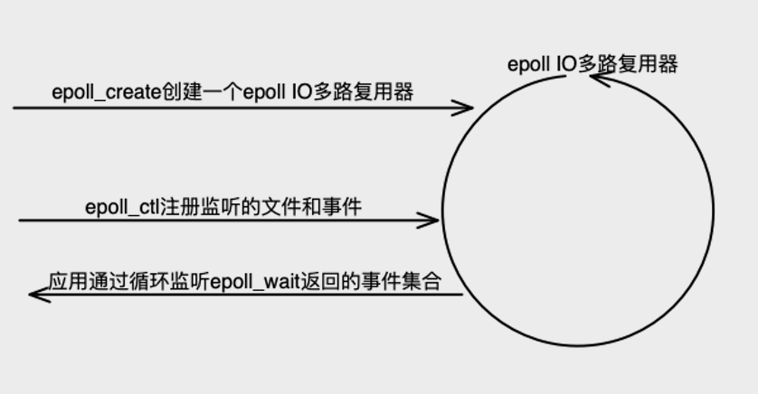

## Linux epoll

Linux手册：[EPOLL(7) man](http://www.man7.org/linux/man-pages/man7/epoll.7.html) 

GNU C 下载：[GNU libc](http://mirrors.nju.edu.cn/gnu/libc/)

参考：[IO多路复用：select、poll、epoll示例]( https://blog.csdn.net/lisonglisonglisong/article/details/51328062 )

### 描述

可以监控多个文件描述符，查看是否可以在文件描述符上进行IO操作。

可以边沿触发或者水平触发。

水平触发：默认工作模式，即当epoll_wait检测到某描述符事件就绪并通知应用程序时，应用程序可以不立即处理该事件；下次调用epoll_wait时，会再次通知此事件。

边缘触发：当epoll_wait检测到某描述符事件就绪并通知应用程序时，应用程序必须立即处理该事件。如果不处理，下次调用epoll_wait时，不会再次通知此事件。（直到你做了某些操作导致该描述符变成未就绪状态了，也就是说边缘触发只在状态由未就绪变为就绪时通知一次）。

结构体epoll可以看做两个列表的容器，其中 interest list 保存要监控的文件描述符（包含感兴趣的事件），ready list 保存IO已准备好可访问的文件描述符。

三个系统调用



```C
// 创建一个新的epoll实例,返回引用此epoll实例的文件描述符，当所有引用此epoll实例的文件描述符被关闭后，系统内核会自动释放此epoll实例的资源
int epoll_create(int size);		//linux 2.6.8 后 size参数被忽略
int epoll_create1(int flags);	//flag等于0等同于 epoll_create()
// 添加、修改、删除 epoll 实例 interest 列表中的条目（每一项都是一个关注某些epoll_event的文件描述符）
// epfd: epoll实例的文件描述符
// op: c操作类型: EPOLL_CTL_ADD EPOLL_CTL_MOD EPOLL_CTL_DEL
// fd: 感兴趣的文件描述符（即被监听的对象）
// event: 感兴趣的fd对象的事件集合
int epoll_ctl(int epfd, int op, int fd, struct epoll_event *event);
// 等待epoll实例监听的对象的事件发生，如果所有被监听对象都没有事件发生则会阻塞
// epfd: epoll实例的文件描述符
// events: 触发的事件集合指针
// maxevents: 返回触发事件最大数量
// timeout: 阻塞时间ms
int epoll_wait(int epfd, struct epoll_event *events,
                      int maxevents, int timeout);
int epoll_pwait(int epfd, struct epoll_event *events,
                      int maxevents, int timeout,
                      const sigset_t *sigmask);
```

epoll_event 结构：

```C
typedef union epoll_data {
	void    *ptr;
	int      fd;
	uint32_t u32;
	uint64_t u64;
} epoll_data_t;

struct epoll_event {
	uint32_t     events;    /* Epoll events */
	epoll_data_t data;      /* User data variable */
}
```

epoll 事件类型：

```txt
EPOLLERR		表示对应的文件描述符发生错误；
EPOLLET			将EPOLL设为边缘触发(Edge Triggered)模式，这是相对于水平触发(LT)来说的。
EPOLLEXCLUSIVE 
EPOLLHUP		表示对应的文件描述符被挂断；
	EPOLLHUP并不代表对端结束了连接，这一点需要和EPOLLRDHUP区分。通常情况下EPOLLHUP表示的是本端挂断。
EPOLLIN			表示对应的文件描述符可以读（包括对端SOCKET正常关闭[即close]）；
	EPOLLIN事件则只有当对端有数据写入时才会触发，ET模式触发一次后需要不断读取所有数据直到读完EAGAIN为	止。否则剩下的数据只有在下次对端有写入时才能一起取出来了。
EPOLLMSG
EPOLLONESHOT	只监听一次事件;
	当监听完这次事件之后，如果还需要继续监听这个socket的话，需要再次把这个socket加入到EPOLL队列里
EPOLLOUT		表示对应的文件描述符可以写；
	EPOLLOUT事件只有在连接时触发一次，其他时候想要触发，那你要先准备好下面条件：
	1.某次write，写满了发送缓冲区，返回错误码为EAGAIN。
	2.对端读取了一些数据，又重新可写了，此时会触发EPOLLOUT。
	简单地说：EPOLLOUT事件只有在不可写到可写的转变时刻，才会触发一次，是边沿触发。
	如果想强制触发一次，直接调用epoll_ctl重新设置一下event(event.events必须包含EPOLLOUT)就可以了。
EPOLLPRI		表示对应的文件描述符有紧急的数据可读（这里应该表示有带外数据到来）；
EPOLLRDBAND
EPOLLRDHUP		表示对端关闭连接或者正在读写时被强制关闭；
EPOLLRDNORM
EPOLLWAKEUP
EPOLLWRBAND
EPOLLWRNORM
```

epoll 和 poll 区别：

(1) select==>时间复杂度O(n)

它仅仅知道了，有I/O事件发生了，却并不知道是哪那几个流（可能有一个，多个，甚至全部），我们只能无差别轮询所有流，找出能读出数据，或者写入数据的流，对他们进行操作。所以select具有O(n)的无差别轮询复杂度，同时处理的流越多，无差别轮询时间就越长。

(2) poll==>时间复杂度O(n)

poll本质上和select没有区别，它将用户传入的数组拷贝到内核空间，然后查询每个fd对应的设备状态， 但是它没有最大连接数的限制，原因是它是基于链表来存储的.

(3) epoll==>时间复杂度O(1) ，就是借助上面 epoll_event 将流和事件关联起来实现降低复杂度的

epoll可以理解为event poll，不同于忙轮询和无差别轮询，epoll会把哪个流发生了怎样的I/O事件通知我们。所以我们说epoll实际上是事件驱动（每个事件关联上fd）的，此时我们对这些流的操作都是有意义的。（复杂度降低到了O(1)）

### 实例代码

参考：[基于Linux epoll实现的Socket服务](https://github.com/kwseeker/netty/tree/master/epoll)

