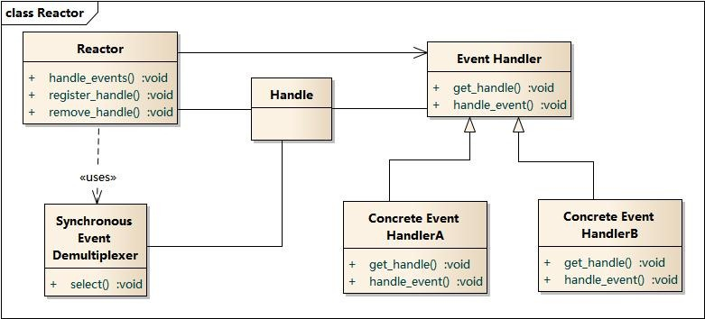
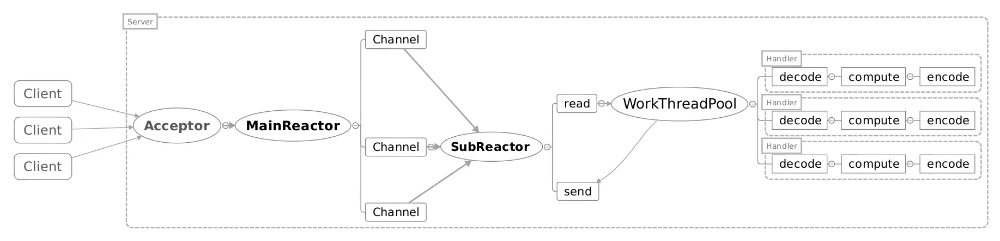

## Netty Reactor 模型分析

Author：Arvin Lee

Email：xiaohuileee@gmail.com

从Reactor模型理解Netty的源码会有种豁然开朗的感觉。

PS: 第一遍看接口，第二遍调试看实现。先了解框架的模型模式，再理解源码会清晰很多。

### Reactor模型图

UML图



流程图


主从Reactor模型图：



### Netty Server代码

```java
public class NettyServer {

    /**
     * main函数中跑的逻辑就是创建 Reactor 线程模型主结构的。
     */
    public static void main(String[] args) {

        EventLoopGroup parentGroup = new NioEventLoopGroup(1);  //处理接收事件的线程组（这里只分配一个线程）
        EventLoopGroup childGroup = new NioEventLoopGroup();              //默认分配1个线程，可以通过代码传参设置，以及通过配置文件 io.netty.eventLoopThreads 配置

        try {
            //创建启动器及两个主要的线程组
            ServerBootstrap serverBootstrap = new ServerBootstrap();         //TODO：子线程池的属性：childOptions, childAttrs, config, childGroup, childHandler 父线程池的属性：group，channelFactory，localAddress，options，attrs，handler
            serverBootstrap.group(parentGroup, childGroup);                  //针对childGroup和group的赋值操作
            serverBootstrap.channel(NioServerSocketChannel.class);           //针对channelFactory的赋值操作
            serverBootstrap.handler(new ServerHandler());
            //启动参数配置
            serverBootstrap.option(ChannelOption.SO_BACKLOG, 128)       //针对options的赋值操作，SO_BACKLOG用于设置存储排队请求的队列的长度
                    .option(ChannelOption.SO_KEEPALIVE, true)           //针对options的赋值操作，SO_KEEPALIVE设置保持长连接
                    .childHandler(new ChannelInitializer<SocketChannel>() {     //针对childHandler的赋值操作，设置处理连接的channel
                        @Override
                        protected void initChannel(SocketChannel ch) {
                            ch.pipeline().addLast(new DelimiterBasedFrameDecoder(Integer.MAX_VALUE, Delimiters.lineDelimiter()[0]));
                            ch.pipeline().addLast(new ServerHandler());
                        }
                    });
            ChannelFuture future = serverBootstrap.bind(8888).sync();   //使用ChannelFuture同步绑定端口（这步是服务初始化的真正开始，里面最核心的是ServerBootstrap的init()方法）
            future.channel().closeFuture().sync();                              //绑定完成后关闭ChannelFuture
        } catch (InterruptedException e) {
            log.error("NettyServer initial error: ", e);
            e.printStackTrace();
        } finally {
            parentGroup.shutdownGracefully();
            childGroup.shutdownGracefully();
        }
    }
}
```

### Netty 核心概念


### Netty Reactor模型实现分析

其中 parentGroup  对应图中的 mainReactor，childGroup 对应图中的 subReactor;

parentGroup和childGroup中各建了一组NioEventLoop对应图中的SynchronousEventdemultiplexer;

#### 一、线程池准备

##### 1、NioEventLoopGroup（两个）

这个类？？

```java
NioEventLoopGroup(C)					//
    -> 	MultithreadEventLoopGroup(C)			//
        -> 	MultithreadEventExecutorGroup(C)	//
            -> 	AbstractEventExecutorGroup(C)	//
                -> EventExecutorGroup(I)
        -> 	EventLoopGroup(I)					//拓展了Channel的注册方法（对应图中register_handle()）、以及遍历用的next()
			-> EventExecutorGroup(I)
 EventExecutorGroup(I)					//线程池关闭、任务提交与执行、EventExecutor遍历、查看状态
 	-> 	ScheduleExecutorService(I)			//Java线程池执行计划任务的接口
 	-> 	Iterable<EventExecutor>				//支持EventExecutor迭代
 EventExecutor(I)
 	-> 	EventExecutorGroup(I)
```

Debug跟代码

```java
new NioEventLoopGroup(1);
	NioEventLoopGroup$NioEventLoopGroup(int nThreads)
        MultithreadEventLoopGroup$MultithreadEventLoopGroup(int nThreads, Executor executor, Object... args)
        	MultithreadEventExecutorGroup$MultithreadEventExecutorGroup(int nThreads, Executor executor, Object... args)		//真正的初始化流程，断点加这里
        		//使用默认的线程工厂创建任务执行器，用于下面建NioEventLoop
        		executor = new ThreadPerTaskExecutor(newDefaultThreadFactory());
        		//新建一批NioEventLoop（默认16个）
				children = new EventExecutor[nThreads];	
				children[i] = newChild(executor, args);
				//创建NioEventLoop的选择器EventExecutorChooser，如果创建的NioEventLoop的个数是2的幂次方，则采用&求应该选择哪个NioEventLoop处理，否则采用%求。引入Chooser只是为了优化性能。
				chooser = chooserFactory.newChooser(children);
				//FutureListener<Object>，服务终止监听器，当所有的NioEventLoop都退出后，则terminationFuture.setSuccess(null); ，而terminationFuture（DefaultPromise实例）是用于服务shutdown善终的最终处理（依赖GlobalEventExecutor通知监听者）。
                for (EventExecutor e: children) {
                    e.terminationFuture().addListener(terminationListener);
                }
```

成员

```java
children = {EventExecutor[16]@864} 
readonlyChildren = null
terminatedChildren = {AtomicInteger@829} "0"
terminationFuture = {DefaultPromise@830} "DefaultPromise@32709393(incomplete)"
chooser = {DefaultEventExecutorChooserFactory$PowerOfTwoEventExecutorChooser@1053} 
```

+ ThreadPerTaskExecutor（用于第2步）

  使用给定的线程工厂创建线程并执行任务。这个类实现很简单没有创建线程池，内部会为每个任务创建一个线程。

+ DefaultEventExecutorChooserFactory & EventExecutorChooser

  仅仅是为优化哪怕一点性能而引入。

+ RejectedExecutionHandler（用于第2步）

  当线程池的任务缓存队列已满并且线程池中的线程数目达到maximumPoolSize，如果还有任务到来就会采取任务拒绝策略，通常有以下四种策略：

  ```txt
  ThreadPoolExecutor.AbortPolicy:丢弃任务并抛出RejectedExecutionException异常。
  ThreadPoolExecutor.DiscardPolicy：也是丢弃任务，但是不抛出异常。
  ThreadPoolExecutor.DiscardOldestPolicy：丢弃队列最前面的任务，然后重新尝试执行任务（重复此过程）
  ThreadPoolExecutor.CallerRunsPolicy：由调用线程处理该任务
  ```

+ DefaultPromise

  下面单独解析。

##### 2、NioEventLoop

```java
NioEventLoop(C)
	-> 	SingleThreadEventLoop(C)
		-> 	SingleThreadEventExecutor(C)	//单线程处理任务的事件执行器，内部通过MpscQueue保存事件处理任务
    		-> 	AbstractScheduledEventExector(C)
    			->	AbstractEventExecutor(C)
    				->EventExecutor(I)
    				->AbstractExecutorService(C)
    		-> 	OrderedEventExecutor(I)
    	-> 	EventLoop(I)					//覆盖EventExecutor$parent()方法,修改返回值类型为EventLoopGroup
    		-> 	OrderedEventExecutor			//顺序执行事件处理任务接口（空接口）
    			-> 	EventExecutor(I)			//拓展判断是否在事件循环中方法、创建Promise方法、创建Future方法
    				->	EventExecutorGroup(I)	//参考前面的解析
    		->	EventLoopGroup					//参考前面的解析
```

初始化

```java
//对于parentGroup nThreads = 1, childGroup nThreads = 默认值16
NioEventLoopGroup$this(nThreads, executor, SelectorProvider.provider());
NioEventLoopGroup$this(nThreads, executor, selectorProvider, DefaultSelectStrategyFactory.INSTANCE);
NioEventLoopGroup$super(nThreads, executor, selectorProvider, selectStrategyFactory, RejectedExecutionHandlers.reject());
	NioEventLoopGroup$newChild(Executor executor, Object... args)	//executor即ThreadPerTaskExecutor， args即上面构造方法中的三个对象
		
```

成员

```java
selectNowSupplier = {NioEventLoop$1@1093} 
selector = {SelectedSelectionKeySetSelector@1094} 
unwrappedSelector = {EPollSelectorImpl@1095} 
selectedKeys = {SelectedSelectionKeySet@1096}  size = 0
provider = {EPollSelectorProvider@869} 
wakenUp = {AtomicBoolean@1097} "false"
selectStrategy = {DefaultSelectStrategy@886} 
ioRatio = 50
cancelledKeys = 0
needsToSelectAgain = false
tailTasks = {MpscUnboundedArrayQueue@1098}  size = 0
taskQueue = {MpscUnboundedArrayQueue@1099}  size = 0
thread = null
threadProperties = null
executor = {ThreadPerTaskExecutor@861} 
interrupted = false
threadLock = {Semaphore@907} "java.util.concurrent.Semaphore@3d99d22e[Permits = 0]"
shutdownHooks = {LinkedHashSet@909}  size = 0
addTaskWakesUp = false
maxPendingTasks = 2147483647
rejectedExecutionHandler = {RejectedExecutionHandlers$1@879} 
lastExecutionTime = 0
state = 1
gracefulShutdownQuietPeriod = 0
gracefulShutdownTimeout = 0
gracefulShutdownStartTime = 0
terminationFuture = {DefaultPromise@912} "DefaultPromise@49fc609f(incomplete)"
scheduledTaskQueue = null
parent = {NioEventLoopGroup@827} 
selfCollection = {Collections$SingletonSet@906}  size = 1
```

+ ThreadPerTaskExecutor(参考第1小节)
+ SelectorProvider
+ selectStrategyFactory
+ RejectedExecutionHandlers（参考第1小节）

##### 3、DefaultPromise

```java
DefaultPromise(C)
	-> 	AbstractFuture(AC)	//实现 get() 方法
		-> 	Future(I)
	-> 	Promise(I)		//拓展了 修改结果并通知所有监听者的方法
		-> 	Future(I)		//Netty Future拓展：增加了查看状态方法、增删监听者、异步任务同步获取结果等方法
			-> 	Future(I)	//JUC Future 接口功能：取消异步任务、查看任务状态、获取任务执行结果
```

Promise接口的注释 `Special {@link Future} which is writable`，Netty的Future继承JUC包里面Future，增加了对监听者的增删，同步等操作。Promise继承Future的接口，增加了对结果的修改操作 。

#### 二、服务器启动

成员

```java
childOptions = {LinkedHashMap@783}  size = 0		//
childAttrs = {LinkedHashMap@784}  size = 0			//
config = {ServerBootstrapConfig@785} "ServerBootstrapConfig(group: NioEventLoopGroup, channelFactory: NioServerSocketChannel.class, options: {SO_BACKLOG=128, SO_KEEPALIVE=true}, handler: top.kwseeker.nettyutil.server.handler.ServerHandler@3b088d51, childGroup: NioEventLoopGroup, childHandler: top.kwseeker.nettyutil.server.NettyServer$1@2781e022)"	//
childGroup = {NioEventLoopGroup@764} 	//子NioEventLoopGroup
childHandler = {NettyServer$1@888} 		//客户端ChannelHandler
group = {NioEventLoopGroup@551} 		//父NioEventLoopGroup
channelFactory = {ReflectiveChannelFactory@828} "NioServerSocketChannel.class"	//创建ServerSocketChannel的工厂
localAddress = null						//
options = {LinkedHashMap@786}  size = 2	//
attrs = {LinkedHashMap@787}  size = 0	//
handler = {ServerHandler@840} 			//服务端ChannelHandler
```

##### 1、实例化ServerBootstrap

Bootstrap 用于配置整个Netty应用，关联各个组件。

```java
ServerBootstrap
	->	AbstractBootstrap(C)
		-> 	Cloneable(I)
		->	Channel(I)		//一个Channel对象对应着一个Socket端，有服务端ServerSocket和客户端Socket，Netty将它们分别封装成了ServerSocketChannel和SocketChannel
    		->	AttributeMap(I)			//Attribute属性封装接口，AttributeMap提供通过key获取Attribute的方法
    		->	ChannelOutboundInvoker(I)	//这个接口可以看到Socket中常用的接口
    		->	Comparable<Channel>(I)
```

##### 2、实例化ServerSocketChannel工厂

Netty提供了三种类型的ServerSocketChannel， EpollServerSocketChannel 、KQueueServerSocketChannel、NioServerSocketChannel。

+ ReflectiveChannelFactory

  通过反射创建制定类型ServerSocketChannel实例的工厂，里面主要是一个 newChannel() 方法。

+ ServerSocketChannelImpl （需要Java nio和net的基础）

  服务端实现，实现依赖Java NIO 和 Java Net。

+ SocketChannel 

  客户端实现。

##### 3、注册ChannelHandler（责任链模式）

对应图中的EventHandler，一个Channel（对应一个ChannelPipeline）里面可能包含很多个ChannelHandler，连成一条链，一个接一个地对事件进行处理。

代码感觉类似于Spring Security的鉴权链。下面客户端里面具体分析。

##### 4、启动参数配置

Netty本质上是个基于 Java NIO 实现的 Socket 服务，启动参数自然对应 NIO 和 Socket 配置， 

##### 5、监听停止 ChannelFuture

Netty中所有的IO操作都是异步的，


#### 三、客户端启动

##### 1、实例化Bootstrap

成员

```java
config = {BootstrapConfig@791} "BootstrapConfig(group: NioEventLoopGroup, channelFactory: NioSocketChannel.class, options: {SO_KEEPALIVE=true}, handler: top.kwseeker.nettyutil.client.NettyClient$1@1877ab81, resolver: io.netty.resolver.DefaultAddressResolverGroup@1d29cf23)"		 //
resolver = {DefaultAddressResolverGroup@792} 					//
remoteAddress = null											//
group = {NioEventLoopGroup@550} 								//	
channelFactory = {ReflectiveChannelFactory@793} "NioSocketChannel.class"	//SocketChannel工厂
localAddress = null
options = {LinkedHashMap@794}  size = 1
attrs = {LinkedHashMap@795}  size = 0		
handler = {NettyClient$1@796} 				//
```


##### 2、实例化SocketChannel工厂

Netty提供了三种类型的客户端SocketChannel， EpollSocketChannel 、KQueueSocketChannel、NioSocketChannel。

+ NioSocketChannel

##### 3、注册ChannelHandler（责任链模式）

ChannelHandler用于处理Channel中的数据，包含一些Netty基本的编解码器和用户自定义的处理器，处理器会被添加到一个ChannelPipeline对象中然后按照添加的顺序依次对Channel数据进行处理。

```java
ChannelInitializer						//实际就是ChannelHandler链的容器,提供Channel读写、激活冻结、ChannelHandler注册注销等方法，但是ChannelHandler链是在连接的时候才初始化的参考 AbstractBootstrap$initAndRegiter()
	->	ChannelInboundHandlerAdapter		
		->	ChannelHandlerAdapter
			->	ChannelHandler
		->	ChannelInboundHandler
			->	ChannelHandler
	-> 	@Sharable
	-> 	Channel
ChannelHandlerContext
    ->	AttributeMap
    ->	ChannelInboundInvoker
    ->	ChannelOutboundInvoker
```


##### 4、 启动参数配置


##### 5、建立连接

```java
ChannelFuture future = bootstrap.connect("localhost", 8888).sync();
	Bootstrap$doResolveAndConnect(remoteAddress, config.localAddress());
		ChannelFuture regFuture = AbstractBootstrap$initAndRegister();	
			//1.创建一个NioSocketChannel，实例化过程中调用父类AbstractChannel的构造方法，会创建一个ChannelPipeline实例（DefaultChannelPipeline）。
			//2.首先将config中配置的ChannelHandler（即bootstrap.handler()中自定义的容器）加入ChannelPipeline末尾，
			//3.读取Bootstrap options配置SocketChannel，具体配置查看NioSocketchannelConfig (内部包含一个Socket客户端实例)
			TODO：哪些配置项，配置对应的java nio net接口
			//4.读取Bootstrap attrs配置SocketChannel
            TODO
            //5.将配置好的SocketChannel注册到NioEventLoopGroup中选一个线程启动Socket连接。
            ChannelFuture regFuture = AbstractBootstrap$config().group().register(channel);
				//5.1 选择一个线程（NioEventLoop）：前面讲的 DefaultEventExecutorChooserFactory.PowerOfTwoEventExecutorChooser 终于派上用场（其实就是把所有线程连成一个圈，指针从某个点开始，每来一个Channel，就分配当前指针指向的线程处理这个Channel，然后指针往后移一位）
				MultithreadEventLoopGroup$next()
                //5.2 注册Channel到线程（NioEventLoop）执行，NioEventLoop继承SingleThreadEventLoop
                SingleThreadEventLoop$register(Channel channel)
                //5.3 首先判断NioEventLoop线程的状态（是否还在忙状态），
                AbstractChannel$register(NioEventLoop，channelPromise)
                AbstractChannel$register0(ChannelPromise)
                //5.4 TODO
                AbstractNioChannel$doRegister()
               	
                
				
				

			
```


##### 6、通过Channel通信

Channel是对Socket的封装，封装了一组API，大大简化了使用Socket进行通信的复杂性。

Channel接口提供了众多的实现类（位于io.netty.channel）

+ EpollServerSocketChannel
+ EpollSocketChannel
+ NioServerSocketChannel
+ NioSocketChannel

##### 7、监听停止


### 总结

1） NioEventLoopGroup 实例化的时候 nThreads 参数尽量是2的幂次方, 2^n（因为性能：& >> %）。


### 附录

+ **Unix domain socket** （进程间通信socket）

  Netty Channel 实现类中有一个EpollServerDomainSocketChannel, 基于Unix domain socket(IPC socket，用于实现同一主机上的进程间通信),　Unix domain socket不需要经过网络协议栈，不需要打包拆包、计算校验和、维护序号和应答等，只是将应用层数据从一个进程拷贝到另一个进程。

