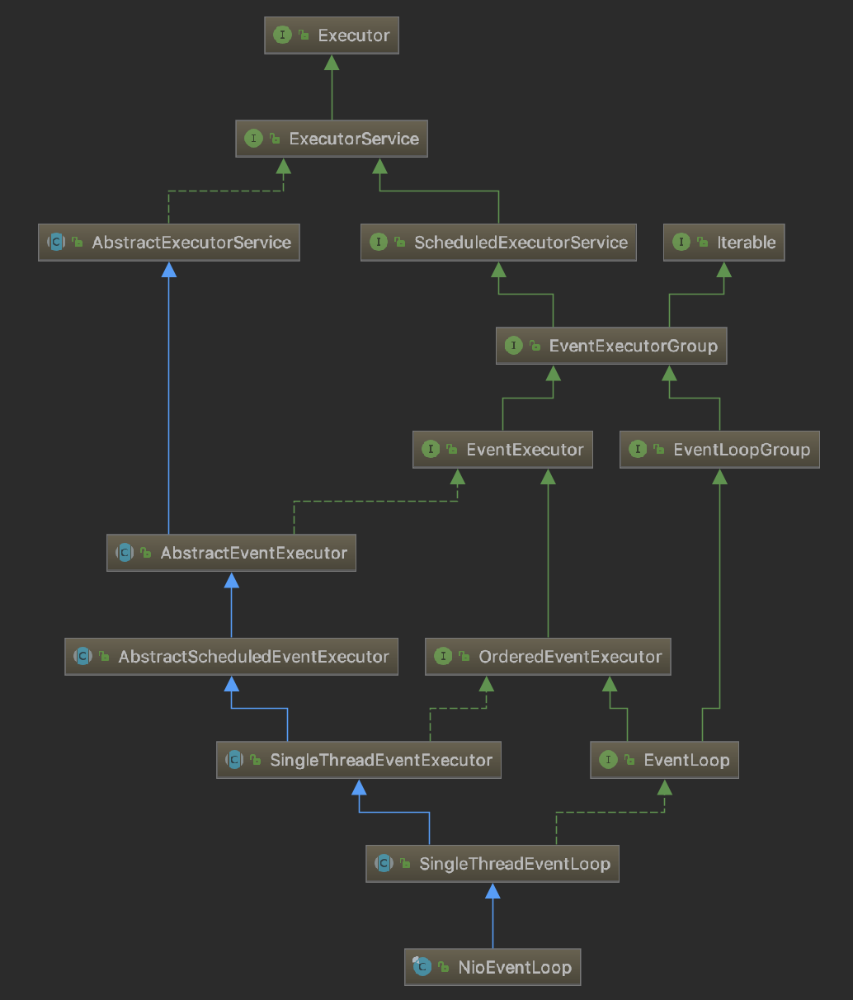
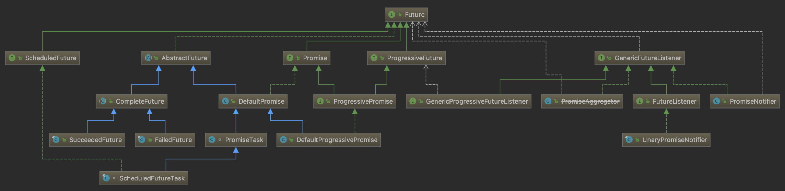

# Netty

参考 

[新手入门：目前为止最透彻的的Netty高性能原理和框架架构解析](https://www.jianshu.com/p/f16698aa8be2?utm_source=oschina-app)

### Netty的组成及功能


### Netty运行流程


+ EventLoopGroup
    
    - NioEventLoopGroup
        
        
        
        NioEventLoopGroup可以理解为一个线程池，内部维护了一组线程，每个线程负责处理多个Channel上的事件，
        而一个Channel只对应于一个线程。
        
        初始化过程经历了一下几个阶段：  
        1）如果不存在executor则创建，此线程池会为每个任务创建一个FastThreadLocalThread线程(采用FastThreadLocal实现线程本地变量)； 
        2）在NioEventLoopGroup中创建一组单线程的事件循环处理器NioEventLoop（里面主要是创建了一组Selector的实例），然后就等着往Selector中注册事件了；  
        3）定义事件注册时选择注册到哪个NioEventLoop，策略是round-robin。
        
        ```
        //默认传参 
        //16,                                           CPU核心数*2
        //null,                                         executor的实现
        //DefaultEventExecutorChooserFactory.INSTANCE,  针对事件选择EventExecutor的策略（round-robin）
        //SelectorProvider.provider(),                  arg[0] 使用系统级默认的Selector provider，
        //DefaultSelectStrategyFactory.INSTANCE,        arg[1] 
        //RejectedExecutionHandlers.reject()            arg[2] 
        protected MultithreadEventExecutorGroup(int nThreads, Executor executor,
                                                EventExecutorChooserFactory chooserFactory, Object... args) {
            //1)
            if (executor == null) {
                //使用默认线程工厂的Executor, 线程工厂规定了线程的创建的规则（池名称，是否Daemon，优先级）
                //线程任务使用了Runnable的一个包装类FastThreadLocalRunnable，线程类型为FastThreadLocal，这个包装类对任务做了两件事情：
                // 1）空指针检查;
                // 2) 任务完成后对任务所在线程做了ThreadLocal变量的自动释放，解决ThreadLocal使用不当导致内存泄漏问题。
                executor = new ThreadPerTaskExecutor(newDefaultThreadFactory());    
            }
    
            //2)
            children = new EventExecutor[nThreads];
            for (int i = 0; i < nThreads; i ++) {
                boolean success = false;
                try {
                    //对于 NioEventLoopGroup 来说就是创建 NioEventLoop，NioEventLoop是单线程的事件循环，将Channel注册到Selector并
                    //在事件循环中执行多路复用
                    children[i] = newChild(executor, args);
                    success = true;
                } catch (Exception e) {
                    // TODO: Think about if this is a good exception type
                    throw new IllegalStateException("failed to create a child event loop", e);
                } finally {
                    if (!success) {
                        for (int j = 0; j < i; j ++) {
                            children[j].shutdownGracefully();
                        }
    
                        for (int j = 0; j < i; j ++) {
                            EventExecutor e = children[j];
                            try {
                                while (!e.isTerminated()) {
                                    e.awaitTermination(Integer.MAX_VALUE, TimeUnit.SECONDS);
                                }
                            } catch (InterruptedException interrupted) {
                                // Let the caller handle the interruption.
                                Thread.currentThread().interrupt();
                                break;
                            }
                        }
                    }
                }
            }
    
            //3）
            //DefaultEventExecutorChooserFactory 使用简单循环法选择下一个EventExecutor的默认实现
            chooser = chooserFactory.newChooser(children);
    
            //4)
            //terminationListener 用于监听NioEventLoopGroup中所有子成员终止状态，FutureListenner<V>只是GenericFutureListener<Future<V>>的别名而已
            //terminatedChildren 子成员（NioEvnetLoop）终止个数计数
            //terminationFuture 表示子成员是否全部退出的状态标识
            final FutureListener<Object> terminationListener = new FutureListener<Object>() {
                @Override
                public void operationComplete(Future<Object> future) throws Exception {
                    if (terminatedChildren.incrementAndGet() == children.length) {
                        terminationFuture.setSuccess(null);
                    }
                }
            };
            for (EventExecutor e: children) {
                e.terminationFuture().addListener(terminationListener);
            }
    
            Set<EventExecutor> childrenSet = new LinkedHashSet<EventExecutor>(children.length);
            Collections.addAll(childrenSet, children);
            readonlyChildren = Collections.unmodifiableSet(childrenSet);
        }
        ```

        * ThreadPerTaskExecutor
            
            使用指定的线程工厂为每一个任务创建一个FastThreadLocalThread线程。
            ```
            public void execute(Runnable command) {
                threadFactory.newThread(command).start();
            }
            ```
                
            使用的线程池工厂
            ```
            //传参（nioEventLoopGroup, false, 10, java.lang.ThreadGroup[name=main, maxpri=10]）
            public DefaultThreadFactory(String poolName, boolean daemon, int priority, ThreadGroup threadGroup) {
                if (poolName == null) {
                    throw new NullPointerException("poolName");
                }
                if (priority < Thread.MIN_PRIORITY || priority > Thread.MAX_PRIORITY) {
                    throw new IllegalArgumentException(
                            "priority: " + priority + " (expected: Thread.MIN_PRIORITY <= priority <= Thread.MAX_PRIORITY)");
                }
        
                prefix = poolName + '-' + poolId.incrementAndGet() + '-';
                this.daemon = daemon;
                this.priority = priority;
                this.threadGroup = threadGroup;
            }
            
            @Override
            public Thread newThread(Runnable r) {
                Thread t = newThread(FastThreadLocalRunnable.wrap(r), prefix + nextId.incrementAndGet());
                try {
                    if (t.isDaemon() != daemon) {
                        t.setDaemon(daemon);
                    }
        
                    if (t.getPriority() != priority) {
                        t.setPriority(priority);
                    }
                } catch (Exception ignored) {
                    // Doesn't matter even if failed to set.
                }
                return t;
            }
            ```
         
        * FastThreadLocal 与 FastThreadLocalRunnable、FastThreadLocalThread（TODO：深入研究）  
        
            Java ThreadLocal 本身如果使用不当容易造成内存泄漏，而使用 Netty FastThreadLocal 工具类则可以解决这个隐患，实现很通用，
            可以借鉴用于日后开发中。
            
            TODO：实现原理先放一放（不然Netty源码不知要看到猴年马月了），其实是在ThreadLocal的设计思想上改进的。
              
        * SelectorProvider  
        
            使用了Java SPI机制。
        
            Java SPI(Service Provider Interface), 是JDK内置的一种服务提供发现机制；是旨在由第三方实施或扩展的API。它可用于启用框架扩展和可替换组件。
            Java的SPI机制可以为某个接口寻找服务实现。
            
            一个服务(Service)通常指的是已知的接口或者抽象类，服务提供方就是对这个接口或者抽象类的实现，
            然后按照SPI 标准存放到资源路径META-INF/services目录下，文件的命名为该服务接口的全限定名。   
            
            维基百科提供了几个实例：[Service Provider Interface](https://en.wikipedia.org/wiki/Service_provider_interface)
            
            In the Java Runtime Environment, SPIs are used in:   
            Java Database Connectivity  
            Java Cryptography Extension  
            Java Naming and Directory Interface  
            Java API for XML Processing  
            Java Business Integration  
            Java Sound  
            Java Image I/O  
            Java File Systems     
        
            ```
            public static SelectorProvider provider() {
                synchronized (lock) {
                    if (provider != null)
                        return provider;
                    return AccessController.doPrivileged(
                        new PrivilegedAction<SelectorProvider>() {
                            public SelectorProvider run() {
                                    if (loadProviderFromProperty())
                                        return provider;
                                    if (loadProviderAsService())
                                        return provider;
                                    provider = sun.nio.ch.DefaultSelectorProvider.create();
                                    return provider;
                                }
                            });
                }
            }
            ```     
            
            代码中涉及到了Java安全访问控制，简单研究下。参考 Java安全控制.md。
            
            估计是因为通过SPI引入第三方的SelectorProvider接口（下面第二种方法），而当前工程可能缺乏第三方访问系统资源的某些权限，故通过AccessController
            特权方式调用第三方的API，避免权限检查失败问题。
            
            代码中提供了三种创建 SelectorProvider 的方法  
            
            loadProviderFromProperty()  
            从配置文件中读取指定的SelectorProvider实现类；  
            
            loadProviderAsService()  
            通过SPI查找可用的SelectorProvider实现；  
            
            sun.nio.ch.DefaultSelectorProvider.create()  
            Demo代码使用的这种默认实现，内部是创建的 KQueueSelectorProvider 的实例。
            
        * EventExecutor 和 EventExecutorGroup
            
            EventExecutor 继承 EventExecutorGroup，可以理解为事件处理器，在线程中处理事件的东西。
            是一个特殊的EventExecutorGroup, 有一些方便的方法可以查看一个线程是否在一个 event loop 中被执行。
            
            EventExecutorGroup 通过next()方法提供EventExecutor实例; 还负责管理它们(EventExecutor实例)的生命周期,允许在全局范围关闭它们。
            
            ```
            protected EventLoop newChild(Executor executor, Object... args) throws Exception {
                return new NioEventLoop(this, executor, (SelectorProvider) args[0],
                    ((SelectStrategyFactory) args[1]).newSelectStrategy(), (RejectedExecutionHandler) args[2]);
            }
            ```
            
            NioEventLoop 和 NioEventLoopGroup 的关系
             
            
            NioEventLoop是单线程的事件循环，作为NioEventLoopGroup的子成员（对8核处理器默认有16个）
            
            NioEventLoop 是 EventExecutor 的实现类，是一个单线程的事件循环处理器。
            
        * EventExecutorChooserFactory
              
            * DefaultEventExecutorChooserFactory
              
                内部实现了两种Chooser，PowerOfTwoEventExecutorChooser 和 GenericEventExecutorChooser；
                当EventExecutor数组size为2的幂 (val & -val) == val 时，选用PowerOfTwoEventExecutorChooser。
                  
            * EventExecutorChooser
            
                只有一个next()方法，返回一个新的EventExecutor。
                
                PowerOfTwoEventExecutorChooser 是从索引0开始，每次next索引加1，idx.getAndIncrement() & executors.length - 1，
                这种写法可以实现循环读取EventExecutor。
                
                GenericEventExecutorChooser 与 PowerOfTwoEventExecutorChooser 不同在于求索引 idx.getAndIncrement() % executors.length ，
                TODO：取余运算同样适用于2的幂，为何还要分成两种写法？
            
        * Future FutureListener Promise DefaultPromise   
        
            
    
            Netty Future接口继承Java Future接口，同样是获取运行结果的。不过额外拓展了一些添加监听及异步或同步等待返回的接口。
            
            FutureListener 用于监听 Future<V> 的结果只有一个operationComplete方法，当Future<V> isDone() 为true，执行 operationComplete()。
            
            * DefaultPromise深入解析
            
            这个类是用来获取结果信息的，就是用来获取线程执行的结果信息，但是在获取结果信息的时候，还可以添加一些监听的信息。
            
            DefaultPromise<V> extends AbstractFuture<V> implements Promise<V>  
            Promise 在Future基础上又添加了几个控制状态的接口；
            AbstractFuture 提供了get()的实现。
            
            TODO：深入解析
            
        * GlobalEventExecutor（不要往里面提交计划任务）
        
            GlobalEventExecutor是具备任务队列的单线程事件执行器,其适合用来实行时间短、碎片化的任务；GlobalEventExecutor是单例的。
                        
            成员变量：
            ```
            SCHEDULE_QUIET_PERIOD_INTERVAL  周期执行quietPeriodTask任务的时间间隔（间隔1s，单位ns）
            INSTANCE                        单例实例
            taskQueue                       任务队列，LinkedBlockingQueue实例
            quietPeriodTask                 周期性计划任务，执行器选用GlobalEventExector.INSTANCE,默认实现无返回Void，run()逻辑为空, 截止1s后，从现在开始执行
            threadFactory                   使用DefaultThreadFactory主要就是包含了FastThreadLocal特性。
            taskRunner(核心)                工作者线程的任务处理主体，当然也是个无限循环，一直不断地从队列中以阻塞方式取任务;
                                            
            started                         工作者线程是否启动的工作状态
            thread                          工作者线程的实体，只有一个工作者线程
            terminationFuture               Future应该理解为一个存储执行结果（一般指线程的执行结果）和状态的容器，FailedFuture就是存储异常状态和结果的容器
            //继承来的属性
            SCHEDULED_FUTURE_TASK_COMPARATOR
            scheduledTaskQueue              计划任务队列，DefaultPriorityQueue<ScheduledFutureTask<?>>
            DEFAULT_SHUTDOWN_QUIET_PERIOD
            DEFAULT_SHUTDOWN_TIMEOUT
            ```
            
            构造方法
            ```
            private GlobalEventExecutor() { scheduledTaskQueue().add(quietPeriodTask);  }
            ```
            
            公共成员方法
            ```
            execute()               先将任务加入到任务队列taskQueue，再判断当前线程是否是工作者线程，不是的话，创建新的工作者线程处理队列中的任务
            //控制线程池工作状态
            shutdownGracefully()
            shutdown()              废弃，使用的话会抛出异常
            //查询线程池状态
            pendingTasks()          剩余待处理任务数量
            inEventLoop(Thread thread)  其实是判断工作者线程是否是
            terminationFuture()     获取异常退出返回
            isShuttingDown()
            isShutdown()
            isTerminated()
            awaitTermination()
            awaitInactivity()
            //继承的方法
            inEventLoop()
            ```
            
            工作原理：  
            1）初始化时创建单例对象，创建两个工作队列，quietPeriodTask并添加到计划任务队列，创建taskRunner实例、terminationFuture实例；  
            2）然后添加任务，非计划任务会被直接插入到taskQueue，而计划任务被插入到scheduleTaskQueue；thread成员变量用于缓存工作者线程，  
               任务添加进来后会判断当前线程是否和thread线程相同，不同的话（首次是为null）会使用threadFactory线程工厂创建一个新的线程并启动，  
               跑taskRunner（其实就是个任务，不过这个任务是处理其他任务的循环）的run()方法；
            3）工作者线程循环跑起来后，就开始从队列取任务处理；
               先从scheduleTaskQueue peek()一个任务，如果为空，则从taskQueue中取任务并返回；如果不为空，则获取这个计划任务的延迟纳秒数，
               选择是否等待地从taskQueue中取任务(注意不管剩余延迟是否是大于0，都先从taskQueue取任务)。如果从taskQueue取不到任务，则从scheduleTaskQueue中取已经可以运行（超过计划延时时间）的任务放到taskQueue；
               如果还是取不到，则返回null。
               
               总结下这个流程的规则：GlobalEventExecutor是可以同时处理计划任务和普通任务的，但是并不适用于处理计划任务，因为从上面的分析可以看到
               并不能保证计划任务按计划的时间点被处理。计划任务队列貌似只是为了按计划清理干完活的工作者的工作者线程的。  
               scheduleTaskQueue是阻塞优先级队列，猜想是通过计划的时间先后进行优先级排序的。
                ```
                Runnable takeTask() {
                    BlockingQueue<Runnable> taskQueue = this.taskQueue;
                    for (;;) {
                        ScheduledFutureTask<?> scheduledTask = peekScheduledTask();
                        if (scheduledTask == null) {
                            Runnable task = null;
                            try {
                                task = taskQueue.take();
                            } catch (InterruptedException e) {
                                // Ignore
                            }
                            return task;
                        } else {
                            long delayNanos = scheduledTask.delayNanos();
                            Runnable task;
                            //不管你计划任务是否到时，都优先处理taskQueue中的任务。begin >>>
                            if (delayNanos > 0) {
                                try {
                                    task = taskQueue.poll(delayNanos, TimeUnit.NANOSECONDS);
                                } catch (InterruptedException e) {
                                    // Waken up.
                                    return null;
                                }
                            } else {
                                task = taskQueue.poll();
                            }
                            // end <<<
            
                            if (task == null) {
                                fetchFromScheduledTaskQueue();
                                task = taskQueue.poll();
                            }
            
                            if (task != null) {
                                return task;
                            }
                        }
                    }
                }
                ```
            4）如果取到任务则执行任务，然后判断任务是否为quietPeriodTask，不是的话直接进入下一个循环去取可处理的任务；
               如果任务是quietPeriodTask，执行quietPeriodTask run() （quietPeriodTask又重新入队了）, 
               然后默认是任务执行完了，然后通过CAS加两次判断（判断下taskQueue是否为空并且scheduleTaskQueue是否为空或size==1）
               看是否可以退出工作者线程。
               
               ```
               public void run() {  //这个才是quietPeriodTask的run(), 其实是将自己又重新加入计划任务队列了
                   assert executor().inEventLoop();
                   try {
                       if (periodNanos == 0) {
                           if (setUncancellableInternal()) {
                               V result = task.call();
                               setSuccessInternal(result);
                           }
                       } else {
                           // check if is done as it may was cancelled
                           if (!isCancelled()) {
                               task.call();
                               if (!executor().isShutdown()) {
                                   long p = periodNanos;
                                   if (p > 0) {
                                       deadlineNanos += p;
                                   } else {
                                       deadlineNanos = nanoTime() - p;
                                   }
                                   if (!isCancelled()) {
                                       // scheduledTaskQueue can never be null as we lazy init it before submit the task!
                                       Queue<ScheduledFutureTask<?>> scheduledTaskQueue =
                                               ((AbstractScheduledEventExecutor) executor()).scheduledTaskQueue;
                                       assert scheduledTaskQueue != null;
                                       scheduledTaskQueue.add(this);
                                   }
                               }
                           }
                       }
                   } catch (Throwable cause) {
                       setFailureInternal(cause);
                   }
               }
               ```
      
            TODO：一直没有弄懂提前内置延时1s的计划任务quietPeriodTask是干什么的？
            前面说GlobalEventExecutor适用于时间短碎片化的任务，这么看来quietPeriodTask可能是用于作为任务处理完成的结束标志的。
    
+ SelectStrategyFactory

    - DefaultSelectStrategyFactory
    
+ RejectedExecutionHandlers

            
### Netty的reactor线程模型


### Netty从channel读取数据，处理数据，返回数据的流程


### TCP连接各种参数配置


### Netty内存池


### Netty支持的各种序列化框架及编码解码器


### Https加密


### Netty实例

