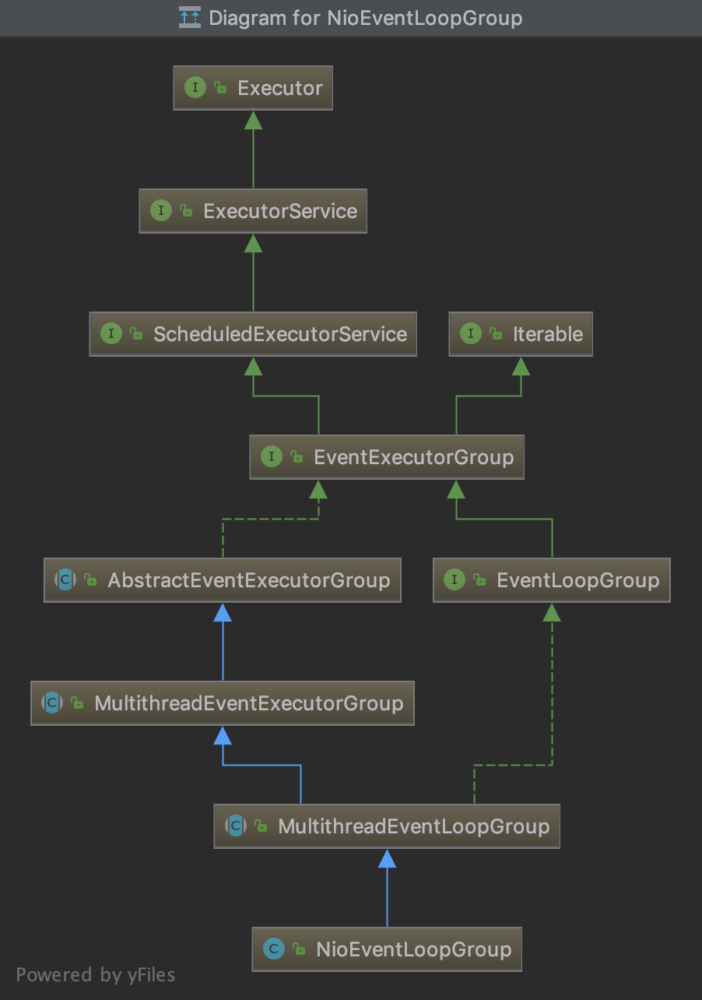

# Netty

参考 

[新手入门：目前为止最透彻的的Netty高性能原理和框架架构解析](https://www.jianshu.com/p/f16698aa8be2?utm_source=oschina-app)

### Netty的组成及功能


### Netty运行流程


+ EventLoopGroup
    
    - NioEventLoopGroup
        
        
        
        NioEventLoopGroup可以理解为一个线程池，内部维护了一组线程，每个线程负责处理多个Channel上的事件，
        而一个Channel只对应于一个线程。
        
        ```
        //默认传参 
        //16,                                           CPU核心数*2
        //null,                                         
        //DefaultEventExecutorChooserFactory.INSTANCE, 
        //SelectorProvider.provider(), 
        //DefaultSelectStrategyFactory.INSTANCE, 
        //RejectedExecutionHandlers.reject()
        protected MultithreadEventExecutorGroup(int nThreads, Executor executor,
                                                EventExecutorChooserFactory chooserFactory, Object... args) {
            if (executor == null) {
                executor = new ThreadPerTaskExecutor(newDefaultThreadFactory());    //
            }
    
            children = new EventExecutor[nThreads];
    
            for (int i = 0; i < nThreads; i ++) {
                boolean success = false;
                try {
                    //对于 NioEventLoopGroup 来说就是创建 NioEventLoop，NioEventLoop是单线程的事件循环，将Channel注册到Selector并
                    //在事件循环中执行多路复用
                    children[i] = newChild(executor, args);
                    success = true;
                } catch (Exception e) {
                    // TODO: Think about if this is a good exception type
                    throw new IllegalStateException("failed to create a child event loop", e);
                } finally {
                    if (!success) {
                        for (int j = 0; j < i; j ++) {
                            children[j].shutdownGracefully();
                        }
    
                        for (int j = 0; j < i; j ++) {
                            EventExecutor e = children[j];
                            try {
                                while (!e.isTerminated()) {
                                    e.awaitTermination(Integer.MAX_VALUE, TimeUnit.SECONDS);
                                }
                            } catch (InterruptedException interrupted) {
                                // Let the caller handle the interruption.
                                Thread.currentThread().interrupt();
                                break;
                            }
                        }
                    }
                }
            }
    
            //DefaultEventExecutorChooserFactory 使用简单循环法选择下一个EventExecutor的默认实现
            chooser = chooserFactory.newChooser(children);
    
            //terminatedChildren 事件处理完成计数
            //terminationFuture 
            //FutureListenner只是GenericFutureListener的别名而已
            final FutureListener<Object> terminationListener = new FutureListener<Object>() {
                @Override
                public void operationComplete(Future<Object> future) throws Exception {
                    if (terminatedChildren.incrementAndGet() == children.length) {
                        terminationFuture.setSuccess(null);
                    }
                }
            };
    
            for (EventExecutor e: children) {
                e.terminationFuture().addListener(terminationListener);
            }
    
            Set<EventExecutor> childrenSet = new LinkedHashSet<EventExecutor>(children.length);
            Collections.addAll(childrenSet, children);
            readonlyChildren = Collections.unmodifiableSet(childrenSet);
        }
        ```
    
    - SelectorProvider
    
        使用了Java SPI机制。
    
        Java SPI(Service Provider Interface), 是JDK内置的一种服务提供发现机制；是旨在由第三方实施或扩展的API。它可用于启用框架扩展和可替换组件。
        Java的SPI机制可以为某个接口寻找服务实现。
        
        一个服务(Service)通常指的是已知的接口或者抽象类，服务提供方就是对这个接口或者抽象类的实现，
        然后按照SPI 标准存放到资源路径META-INF/services目录下，文件的命名为该服务接口的全限定名。   
        
        维基百科提供了几个实例：[Service Provider Interface](https://en.wikipedia.org/wiki/Service_provider_interface)
        
        In the Java Runtime Environment, SPIs are used in:   
        Java Database Connectivity  
        Java Cryptography Extension  
        Java Naming and Directory Interface  
        Java API for XML Processing  
        Java Business Integration  
        Java Sound  
        Java Image I/O  
        Java File Systems  
        
        
    - ThreadPerTaskExecutor
        
        使用的线程池工厂
        ```
        //传参（nioEventLoopGroup, false, 10, java.lang.ThreadGroup[name=main, maxpri=10]）
        public DefaultThreadFactory(String poolName, boolean daemon, int priority, ThreadGroup threadGroup) {
            if (poolName == null) {
                throw new NullPointerException("poolName");
            }
            if (priority < Thread.MIN_PRIORITY || priority > Thread.MAX_PRIORITY) {
                throw new IllegalArgumentException(
                        "priority: " + priority + " (expected: Thread.MIN_PRIORITY <= priority <= Thread.MAX_PRIORITY)");
            }
    
            prefix = poolName + '-' + poolId.incrementAndGet() + '-';
            this.daemon = daemon;
            this.priority = priority;
            this.threadGroup = threadGroup;
        }
        ```
        
        
    
    - EventExecutor
    
        是一个特殊的EventExecutorGroup, 有一些方便的方法可以查看一个线程是否在一个一个 event loop 中被执行。
    
        * EventExecutorGroup
        
            通过next()方法提供EventExecutor实例; 还负责管理它们(EventExecutor实例)的生命周期,允许在全局范围关闭它们。
        
    - NioEventLoop
    
+ SelectStrategyFactory

    - DefaultSelectStrategyFactory
    
+ RejectedExecutionHandlers

+ EventExecutorChooserFactory
    
    - DefaultEventExecutorChooserFactory
    
        内部实现了两种Chooser，PowerOfTwoEventExecutorChooser 和 GenericEventExecutorChooser；
        当EventExecutor数组size为2的幂 (val & -val) == val 时，选用PowerOfTwoEventExecutorChooser。
        
        * EventExecutorChooser
        
            只有一个next()方法，返回一个新的EventExecutor。
        
            PowerOfTwoEventExecutorChooser 是从索引0开始，每次next索引加1，idx.getAndIncrement() & executors.length - 1，
            这种写法可以实现循环读取EventExecutor。
            
            GenericEventExecutorChooser 与 PowerOfTwoEventExecutorChooser 不同在于求索引 idx.getAndIncrement() % executors.length ，
            TODO：取余运算同样适用于2的幂，为何还要分成两种写法？
            
### Netty的reactor线程模型


### Netty从channel读取数据，处理数据，返回数据的流程


### TCP连接各种参数配置


### Netty内存池


### Netty支持的各种序列化框架及编码解码器


### Https加密


### Netty实例

