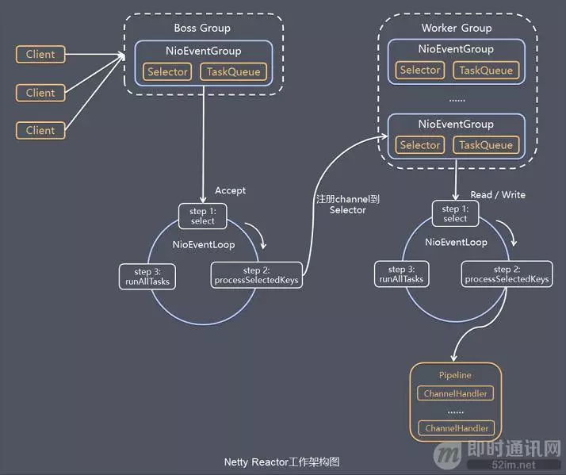
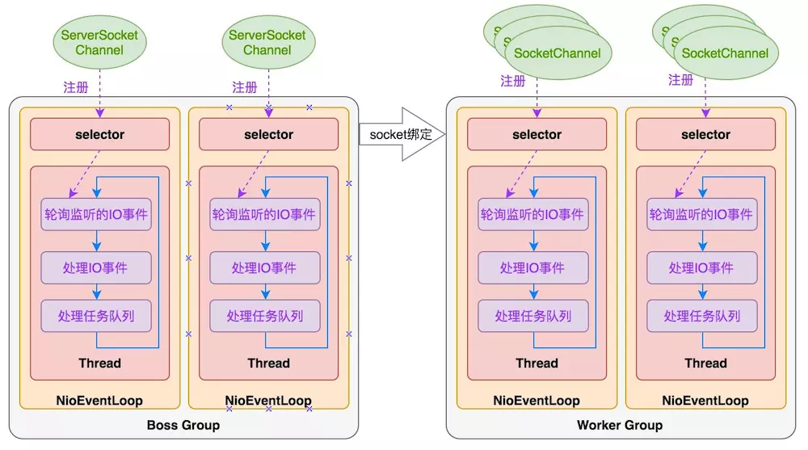

# Netty实战

[书籍源码](https://github.com/ReactivePlatform/netty-in-action-cn)

直接看源码太慢而且没有目的性,所以还是先从上层建筑开始,从简单的开始,先学会使用,
在使用中发现疑问再带着疑问去看源码,最后将上层代码与底层实现结合起来理解.

还有第一遍不要刻意码代码（浪费时间，整体框架原理都不清楚机械地抄一遍有个屁用，保证三天忘完，不要迷信任何人说的），
直接在书籍本身的例子上调试修改；第二遍研究源码和开源应用项目，写测试（这一步是必须认证做的，
不然第一遍的保留的记忆不久就会消失）；
第三遍开发自己的开源项目。

## 第一部分 Netty的概念及体系结构

### 1 Netty——异步与事件驱动

java.nio.channels.Selector是Java的非阻塞I/O实现的关键。它使用了事件通知API以确定在一组非阻塞套接字中有哪些已经就绪能够进行I/O相关的操作。
即可以同时监听多个通道，对就绪的通道进行处理。

TODO： Java NIO Channel Buffer Selector的工作原理

Netty核心组件
+ Channel
    
    可以把Channel看作是传入（入站）或者传出（出站）数据的载体。因此，它可以被打开或者被关闭，连接或者断开连接。
    
+ 回调

    ChannelInboundHandler

    ChannelInboundHandlerAdapter 用于定义回调函数。
    
    ChannelHandlerContext

    每个Channel都拥有一个与之相关联的ChannelPipeline，其持有一个ChannelHandler的实例链。
    在默认的情况下，ChannelHandler会把对它的方法的调用转发给链中的下一个Channel-Handler。
    因此，如果exceptionCaught()方法没有被该链中的某处实现，那么所接收的异常将会被传递到ChannelPipeline的尾端并被记录。
    
+ Future
    
    ChannelFuture  
    
    ChannelFutureListener Netty ChannelFuture可以通过注册多个ChannelFutureListener实现对多个操作结果的监听。
    
+ 事件和ChannelHandler

### 2 你的第一款Netty应用程序

### 3 Netty的组件和设计

#### Channel EventLoop ChannelFuture

Channel——Socket；基本的I/O操作（bind()、connect()、read()和write()）依赖于底层网络传输所提供的原语。     
EventLoop——控制流、多线程处理、并发；用于处理连接的生命周期中所发生的事件。  
ChannelFuture——异步通知。

#### ChannelHandler ChannelPipeline

ChannelPipeline为ChannelHandler链提供了容器，并定义了用于在该链上传播入站和出站事件流的API。
当Channel被创建时，它会被自动地分配到它专属的ChannelPipeline。

ChannelInboundHandler 处理入站事件

ChannelOutboundHandler 处理出站事件

Netty中，可以注册多个handler。ChannelInboundHandler按照注册的先后顺序执行；
ChannelOutboundHandler按照注册的先后顺序逆序执行。另外注意多个ChannelInboundHandler，
如果某个回调方法使用ctx.fireXXX(), 则这多个ChannelInboundHandler的此方法是作为一个整体执行的，
```
//如下：EchoServerHandler和EchoServerLastHandler的方法均使用ctx.fireXXX()连接，
//     执行的时候所有的channelReadComplete方法总是在所有的channelRead方法执行完成之后执行。
[EchoServerHandler]channelRead
[EchoServerHandler]Server received: Netty rocks!
[EchoServerLastHandler]channelRead
[EchoServerLastHandler]Server received: Netty rocks!
[EchoServerHandler]channelReadComplete
[EchoServerLastHandler]channelReadComplete
```

Netty中发送消息的方法（这里指将数据装载到管道Channel或者ChannelPipeline中）  
方法1：（导致消息从ChannelPipeline的尾端开始流动，即从ChannelOutboundHandler尾部逆序流动）  
```
ChannelFuture future = bootstrap.connect("localhost", 8888).sync();
String person = "Arvin Lee\r\n";
future.channel().writeAndFlush(person);
```
方法2：（导致消息从ChannelPipeline中的下一个ChannelHandler开始流动）
这里面要分两种情况：1）在ChannelInboundHandler执行ctx.write(),则从ChannelOutboundHandler尾部逆序流动；
2）在ChannelOutboundHandler中执行ctx.write()，则向下一个ChannelOutboundHandler流动。(
ChannelOutboundHandler write()方法官方注释：Calls {@link ChannelHandlerContext#write(Object, ChannelPromise)} to 
forward to the next {@link ChannelOutboundHandler} in the {@link ChannelPipeline})
```
@Override
public void channelActive(ChannelHandlerContext ctx) {
    //当被通知 Channel是活跃的时候，发送一条消息
    ctx.writeAndFlush(Unpooled.copiedBuffer("Netty rocks!",
            CharsetUtil.UTF_8));
}

@Override
public void channelRead(ChannelHandlerContext ctx, Object msg) {
    ByteBuf in = (ByteBuf) msg;
    System.out.println("Server received: " + in.toString(CharsetUtil.UTF_8));
    //（原本的注释）将接收到的消息写给发送者，而不冲刷出站消息
    ctx.write(in);      //（看书得出的结论）继续传递事件给 ChannelPipeline 中后续的 ChannelInboundHandler
}

```

编码器和解码器

和Spring的编解码器功能是差不多的。

SimpleChannelInboundHandler

#### Netty启动引导类


### 4 传输

#### 传输API

+ Channel
    
    - ServerChannel
    
    - ChannelPipeline
    
        实现了一种常见的设计模式——拦截过滤器（Intercepting Filter）。
    
    - ChannelConfig
    
    - AbstractChannel
    
+ Netty传输IO模型

    - NIO
    
        适用于任何平台。
    
    - Epoll
    
        如果客户端和服务端都是在Linux上，则可以使用这种实现方式。有比NIO更高的性能。
    
    - OIO
    
    - Local
    
    - Embedded
    
        适合用于为ChannelHandler编写单元测试。

### 5 ByteBuf

#### ByteBuf API

+ ByteBuf
    
    ByteBuf维护了两个不同的索引：一个用于读取，一个用于写入。当你从ByteBuf读取时，它的readerIndex将会被递增已经被读取的字节数。
    同样地，当你写入ByteBuf时，它的writerIndex也会被递增。

+ ByteBufHolder

    实现了缓冲池等高级特性。

#### ByteBuf的使用模式

+ 堆缓冲区

    依赖JVM的堆空间实现，将数据存储在数组中。可以快速创建和释放，提供数组的直接快速访问的方法。
    缺点是应用读写数据每次都要先将数据从堆缓冲区复制到直接缓冲区。

+ 直接缓冲区

    Direct Buffer的优点是：在使用Socket传递数据时性能很好，由于数据直接在内存中，不存在从JVM拷贝数据到直接缓冲区的过程，性能好。
    缺点是：因为Direct Buffer是直接在内存中，所以分配内存空间和释放内存比堆缓冲区更复杂和慢。

+ 复合缓冲区

    多个ByteBuf提供一个聚合视图。在这里你可以根据需要添加或者删除ByteBuf实例。
    
#### 字节级操作

#### ByteBuf内存分配

+ ByteBufAllocator 按需分配

+ Unpooled 缓冲区

+ ByteBufUtil

#### 引用计数
    
### 6 ChannelHandler 和 ChannelPipeline

#### Channel的生命周期

+ 创建未注册 ChannelUnregistered

    Channel何时被创建？

+ 注册未连接 ChannelRegistered

+ 连接 ChannelActive

+ 断开 ChannelInactive

#### ChannelHandler

##### 内存泄漏检测

通过 io.netty.leakDetectionLevel 设置检测级别；
分为四种级别：DISABLED SIMPLE ADVANCED PARANOID。

io.netty.leakDetectionLevel=ADVANCED

如果一个消息被消费或者丢弃了，并且没有传递给ChannelPipeline中的下一个ChannelOutboundHandler，
那么用户就有责任调用ReferenceCountUtil.release()。如果消息到达了实际的传输层，那么当它被写入时或者Channel关闭时，都将被自动释放。

#### ChannelPipline

##### 修改 ChannelPipline

ChannelHandler可以通过添加、删除或者替换其他的ChannelHandler来实时地修改ChannelPipeline的布局。（它也可以将它自己从ChannelPipeline中移除。）

如启动器中就是通过指定一个ChannelHandler实现（ChannelInitializer）在ChannelPipline中添加ChannelHandler的。
```
serverBootstrap.option(ChannelOption.SO_BACKLOG, 128)
    .option(ChannelOption.SO_KEEPALIVE, true)
    .childHandler(new ChannelInitializer<SocketChannel>() {
        @Override
        protected void initChannel(SocketChannel ch) {
            ch.pipeline().addLast(new DelimiterBasedFrameDecoder(Integer.MAX_VALUE, Delimiters.lineDelimiter()[0]));
            ch.pipeline().addLast(new ServerHandler());
        }
    });
```

在ChannelPipeline传播事件时，它会测试ChannelPipeline中的下一个ChannelHandler的类型是否和事件的运动方向相匹配。
如果不匹配，ChannelPipeline将跳过该ChannelHandler并前进到下一个，直到它找到和该事件所期望的方向相匹配的为止。
这句话的意思是ChannelHandler是带有方向的in/out/inout, 且在ChannelPipeline中只有一条链，而不是书上画的一条进一条出两条链；
所以为了只对进来的请求做入站处理或对出去的回复做出站处理，需要通过这个方向进行区分。

这个方向貌似是通过是否继承ChannelInboundHandler以及ChannelOutboundHandler判断的。

##### 触发事件

#### ChannelHandlerContext 

ChannelHandlerContext代表了ChannelHandler和ChannelPipeline之间的关联，每当有ChannelHandler添加到ChannelPipeline中时，
都会创建ChannelHandlerContext。ChannelHandlerContext的主要功能是管理它所关联的ChannelHandler和在同一个ChannelPipeline中的其他ChannelHandler之间的交互。

ChannelHandlerContext 与 ChannelHandler 是一对一的关系。
事件的传递就是依赖ChannelHandler实现的。

ChannelHandler 和 ChannelHandlerContext 的高级用法

#### 异常处理


### 7 EventLoop 和 线程模型

这里很有必要研究一下EventLoop的实现并与Java线程池对比一下，根据前面的章节得知，EventLoop的实现有好几种；
这里主要分析 NioEventLoop、EpollEventLoop。

先上两张图：




1）客户端 Channel 与 NioEventLoop NioEventLoopGroup 的关系？

2）企业级应用，一般有几个workerGroup？bossGroup中一般有几个NioEventLoop，
workerGroup中又有几个NioEventLoop，一个NioEventLoop又通常关联多少个工作者线程？

Netty线程模型工作原理（以NIO为例）

a) 客户端连接有很多，每个客户端连接有一个Channel（假设同时有10000个连接，就有10000个Channel）；  
b) 有两个NioEventLoopGroup线程池 bossGroup 和 workerGroup，  
其中bossGroup创建了M个（一个、几个、几十个）NioEventLoop，使用round-robin方式将10000个Channel
平均分配给M个NioEventLoop（即每个NioEventLoop 的 Selector 中注册了10000/M个Channel），用于监听处理Accept连接；   
一旦Accept连接成功，将这些连接成功的channel再通过round-robin的方式平均分配注册到workerGroup的N个NioEventLoop中，用于监听处理Read、Write等操作；  
```
serverChannel.register(selector, SelectionKey.OP_ACCEPT);
```
c) workGroup中除了包含了N个NioEventLoop线程外还有一些worker线程用于跑ChannelPipeline中的ChannelHandler。
NioEventLoop线程中维护了任务队列？NioEventLoop对应的worker线程不断地从队列获取并处理任务。


### 8 引导

### 9 单元测试

## 第二部分 编解码器

### 10 编解码框架

### 11 预置的 ChannelHandler 和 编解码器

## 第三部分 网络协议

### 12 WebSocket

### 13 使用UDP广播事件

## 第四部分 案例研究

### 14 Droplr 构建移动服务

### 15 Firebase—实时的数据同步服务

### 16 Urban Airship—构建移动服务

### 17 Netty 在Facebook 的使用：Nifty 和Swift

### 18 Netty 在Twitter的使用：Finagle