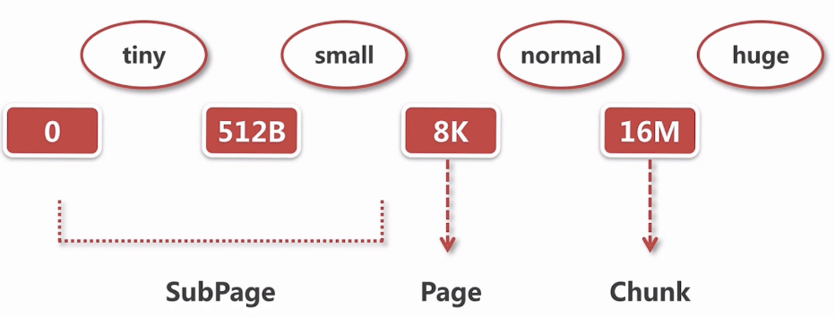
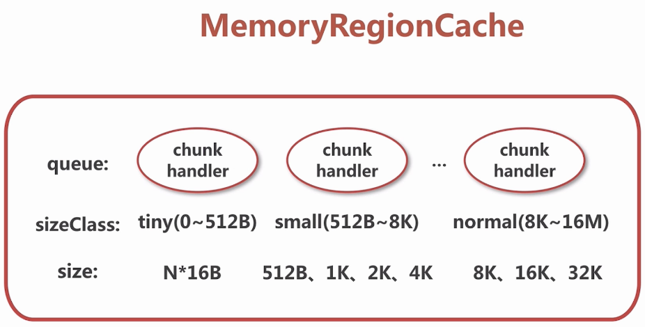
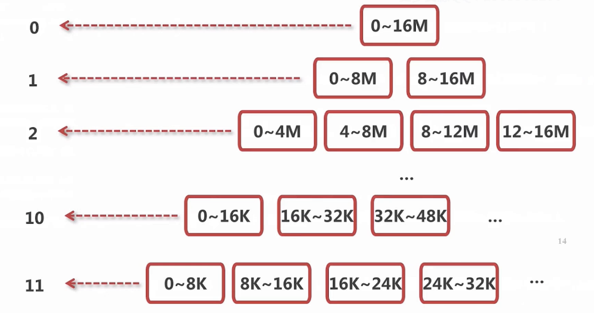
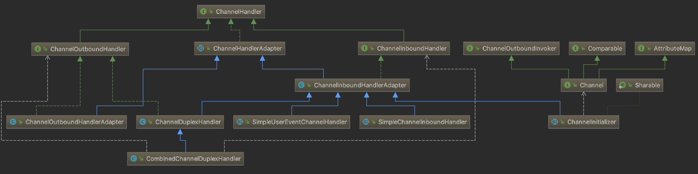

# Netty实战

[书籍源码](https://github.com/ReactivePlatform/netty-in-action-cn)

直接看源码太慢而且没有目的性,所以还是先从上层建筑开始,从简单的开始,先学会使用,
在使用中发现疑问再带着疑问去看源码,最后将上层代码与底层实现结合起来理解.

还有第一遍不要刻意码代码（浪费时间，整体框架原理都不清楚机械地抄一遍有个屁用，保证三天忘完，不要迷信任何人说的），
直接在书籍本身的例子上调试修改；第二遍研究源码和开源应用项目，写测试（这一步是必须认证做的，
不然第一遍的保留的记忆不久就会消失）；
第三遍开发自己的开源项目。

## 第一部分 Netty的概念及体系结构

### 1 Netty——异步与事件驱动

java.nio.channels.Selector是Java的非阻塞I/O实现的关键。它使用了事件通知API以确定在一组非阻塞套接字中有哪些已经就绪能够进行I/O相关的操作。
即可以同时监听多个通道，对就绪的通道进行处理。

TODO： Java NIO Channel Buffer Selector的工作原理

Netty核心组件
+ Channel
    
    可以把Channel看作是传入（入站）或者传出（出站）数据的载体。因此，它可以被打开或者被关闭，连接或者断开连接。
    
+ 回调

    ChannelInboundHandler

    ChannelInboundHandlerAdapter 用于定义回调函数。
    
    ChannelHandlerContext

    每个Channel都拥有一个与之相关联的ChannelPipeline，其持有一个ChannelHandler的实例链。
    在默认的情况下，ChannelHandler会把对它的方法的调用转发给链中的下一个Channel-Handler。
    因此，如果exceptionCaught()方法没有被该链中的某处实现，那么所接收的异常将会被传递到ChannelPipeline的尾端并被记录。
    
+ Future
    
    ChannelFuture  
    
    ChannelFutureListener Netty ChannelFuture可以通过注册多个ChannelFutureListener实现对多个操作结果的监听。
    
+ 事件和ChannelHandler

### 2 你的第一款Netty应用程序

### 3 Netty的组件和设计

#### Channel EventLoop ChannelFuture

Channel——Socket；基本的I/O操作（bind()、connect()、read()和write()）依赖于底层网络传输所提供的原语。     
EventLoop——控制流、多线程处理、并发；用于处理连接的生命周期中所发生的事件。  
ChannelFuture——异步通知。

#### ChannelHandler ChannelPipeline

ChannelPipeline为ChannelHandler链提供了容器，并定义了用于在该链上传播入站和出站事件流的API。
当Channel被创建时，它会被自动地分配到它专属的ChannelPipeline。

ChannelInboundHandler 处理入站事件

ChannelOutboundHandler 处理出站事件

Netty中，可以注册多个handler。ChannelInboundHandler按照注册的先后顺序执行；
ChannelOutboundHandler按照注册的先后顺序逆序执行。另外注意多个ChannelInboundHandler，
如果某个回调方法使用ctx.fireXXX(), 则这多个ChannelInboundHandler的此方法是作为一个整体执行的，
```
//如下：EchoServerHandler和EchoServerLastHandler的方法均使用ctx.fireXXX()连接，
//     执行的时候所有的channelReadComplete方法总是在所有的channelRead方法执行完成之后执行。
[EchoServerHandler]channelRead
[EchoServerHandler]Server received: Netty rocks!
[EchoServerLastHandler]channelRead
[EchoServerLastHandler]Server received: Netty rocks!
[EchoServerHandler]channelReadComplete
[EchoServerLastHandler]channelReadComplete
```

Netty中发送消息的方法（这里指将数据装载到管道Channel或者ChannelPipeline中）  
方法1：（导致消息从ChannelPipeline的尾端开始流动，即从ChannelOutboundHandler尾部逆序流动）  
```
ChannelFuture future = bootstrap.connect("localhost", 8888).sync();
String person = "Arvin Lee\r\n";
future.channel().writeAndFlush(person);
```
方法2：（导致消息从ChannelPipeline中的下一个ChannelHandler开始流动）
这里面要分两种情况：1）在ChannelInboundHandler执行ctx.write(),则从ChannelOutboundHandler尾部逆序流动；
2）在ChannelOutboundHandler中执行ctx.write()，则向下一个ChannelOutboundHandler流动。(
ChannelOutboundHandler write()方法官方注释：Calls {@link ChannelHandlerContext#write(Object, ChannelPromise)} to 
forward to the next {@link ChannelOutboundHandler} in the {@link ChannelPipeline})
```
@Override
public void channelActive(ChannelHandlerContext ctx) {
    //当被通知 Channel是活跃的时候，发送一条消息
    ctx.writeAndFlush(Unpooled.copiedBuffer("Netty rocks!",
            CharsetUtil.UTF_8));
}

@Override
public void channelRead(ChannelHandlerContext ctx, Object msg) {
    ByteBuf in = (ByteBuf) msg;
    System.out.println("Server received: " + in.toString(CharsetUtil.UTF_8));
    //（原本的注释）将接收到的消息写给发送者，而不冲刷出站消息
    ctx.write(in);      //（看书得出的结论）继续传递事件给 ChannelPipeline 中后续的 ChannelInboundHandler
}

```

编码器和解码器

和Spring的编解码器功能是差不多的。

SimpleChannelInboundHandler

#### Netty启动引导类


### 4 传输

#### 传输API

+ Channel
    
    - ServerChannel
    
    - ChannelPipeline
    
        实现了一种常见的设计模式——拦截过滤器（Intercepting Filter）。
    
    - ChannelConfig
    
    - AbstractChannel
    
+ Netty传输IO模型

    - NIO
    
        适用于任何平台。
    
    - Epoll
    
        如果客户端和服务端都是在Linux上，则可以使用这种实现方式。有比NIO更高的性能。
    
    - OIO
    
    - Local
    
    - Embedded
    
        适合用于为ChannelHandler编写单元测试。

### 5 ByteBuf

io.netty.buffer.ByteBuf

用于将数据从底层IO读取到ByteBuf传给应用程序,应用程序处理完后再封装成ByteBuf写回给底层IO。
ByteBuf是数据在应用程序和底层IO的中转站。

研究ByteBuf的分配和释放的原理。

#### ByteBuf的结构

内部包含三个指针读指针(readerIndex),写指针(writerIndex),容量指针(capacity,即容器的容量,一般会设置的非常大)  
0 <= readerIndex <= writerIndex <= capacity

Question：如果ByteBuf写满了继续写会怎么样？

为了防止这种情况出现要及时 discard 无效数据（0 - readerIndex 间的数据）或 clear 缓冲区（0 - writerIndex）。
```
AFTER discardReadBytes()

      +------------------+--------------------------------------+
      |  readable bytes  |    writable bytes (got more space)   |
      +------------------+--------------------------------------+
      |                  |                                      |
 readerIndex (0) <= writerIndex (decreased)        <=        capacity

AFTER clear()

      +---------------------------------------------------------+
      |             writable bytes (got more space)             |
      +---------------------------------------------------------+
      |                                                         |
      0 = readerIndex = writerIndex            <=            capacity
```

##### ByteBuf常用操作

查询可读可写的长度；  
读、写、设置；   
丢弃数据、清空；  
标注与恢复等。  

##### Netty的内存分类

+ Pooled / Unpooled
    从内存缓冲池(FastThreadLocal)中获取 或 直接在堆或Direct内存中创建。
    
+ Unsafe / 非Unsafe（框架自动选择，如果能取到Unsafe对象就创建Unsafe类型的ByteBuf）  
    JDK中Unsafe对象只可以取到内存指针地址并进行指针操作的对象；Java认为直接操作指针地址是不安全的。  
    
    这里Unsafe ByteBuf 指可以直接拿到内存地址进行操作。
    
+ Heap / Direct（堆外内存）  

    Heap ByteBuf （实现基于数组）直接在堆内存上分配，受JVM控制，可由GC自动释放；  
    Direct 调用JDK的API进行内存分配，分配内存是不受JVM控制的，不会参与GC过程（为此Netty为Direct ByteBuf
    引入了应用计数机制，管理Direct内存回收）。  

    Question：Direct ByteBuf 相对于 Heap ByteBuf有什么优势？
    使用Direct ByteBuf 避免了在Java堆和系统内存中来回复制数据。
    至于为何Direct ByteBuf减少了内存拷贝，对于Socket通信是通过IO与其他设备通信的，而IO与Java堆内存无法直接交互，
    而必须要在内核空间开辟一段内存作为Java堆内存的中转，再与IO交互，而Direct ByteBuf通过Native方法
    直接在系统内存中分配空间，可以直接与IO交互。
  
Question：  
1）如何避免多线程内存分配竞争  
    
2）不同大小的内存如何分配  
    不小于 Page 的内存分配是通过二叉树，而小于Page的内存分配使用位图进行分配。

3）ioBuffer 和 compositeByteBuf   
    compositeByteBuf：多个ByteBuf提供一个聚合视图。在这里你可以根据需要添加或者删除ByteBuf实例。
    
#### ByteBuf内存分配

+ ByteBufAllocator（接口）按需分配
    
    AbstractByteBufAllocator 实现了绝大部分ByteBufAllocator方法
    
    PooledByteBufAllocator 从已经分配好的内存池中取ByteBuf  
    UnpooledByteBufAllocator 直接调用API从Java堆或系统内存中分配ByteBuf  
    这两个类主要实现了newHeapBuffer 和 newDirectBuffer方法。
    
    ```
    //PooledByteBufAllocator
    
    private final PoolThreadLocalCache threadCache;
    
    public PooledByteBufAllocator(boolean preferDirect, int nHeapArena, int nDirectArena, int pageSize, int maxOrder,
                                      int tinyCacheSize, int smallCacheSize, int normalCacheSize,
                                      boolean useCacheForAllThreads, int directMemoryCacheAlignment) {
        super(preferDirect);
        threadCache = new PoolThreadLocalCache(useCacheForAllThreads);
        this.tinyCacheSize = tinyCacheSize;
        this.smallCacheSize = smallCacheSize;
        this.normalCacheSize = normalCacheSize;
        chunkSize = validateAndCalculateChunkSize(pageSize, maxOrder);

        //...
        
        int pageShifts = validateAndCalculatePageShifts(pageSize);

        if (nHeapArena > 0) {
            heapArenas = newArenaArray(nHeapArena);
            List<PoolArenaMetric> metrics = new ArrayList<PoolArenaMetric>(heapArenas.length);
            for (int i = 0; i < heapArenas.length; i ++) {
                PoolArena.HeapArena arena = new PoolArena.HeapArena(this,
                        pageSize, maxOrder, pageShifts, chunkSize,
                        directMemoryCacheAlignment);
                heapArenas[i] = arena;
                metrics.add(arena);
            }
            heapArenaMetrics = Collections.unmodifiableList(metrics);
        } else {
            heapArenas = null;
            heapArenaMetrics = Collections.emptyList();
        }

        if (nDirectArena > 0) {
            directArenas = newArenaArray(nDirectArena);
            List<PoolArenaMetric> metrics = new ArrayList<PoolArenaMetric>(directArenas.length);
            for (int i = 0; i < directArenas.length; i ++) {
                PoolArena.DirectArena arena = new PoolArena.DirectArena(
                        this, pageSize, maxOrder, pageShifts, chunkSize, directMemoryCacheAlignment);
                directArenas[i] = arena;
                metrics.add(arena);
            }
            directArenaMetrics = Collections.unmodifiableList(metrics);
        } else {
            directArenas = null;
            directArenaMetrics = Collections.emptyList();
        }
        metric = new PooledByteBufAllocatorMetric(this);
    }
    
    protected ByteBuf newHeapBuffer(int initialCapacity, int maxCapacity) {
        //threadCache是PoolThreadLocalCache类型的，在PooledByteBufAllocator初始化的时候创建
        PoolThreadCache cache = threadCache.get();
        PoolArena<byte[]> heapArena = cache.heapArena;

        final ByteBuf buf;
        if (heapArena != null) {
            buf = heapArena.allocate(cache, initialCapacity, maxCapacity);
        } else {
            buf = PlatformDependent.hasUnsafe() ?
                    new UnpooledUnsafeHeapByteBuf(this, initialCapacity, maxCapacity) :
                    new UnpooledHeapByteBuf(this, initialCapacity, maxCapacity);
        }
        return toLeakAwareBuffer(buf);
    }
    
    protected ByteBuf newDirectBuffer(int initialCapacity, int maxCapacity) {
        PoolThreadCache cache = threadCache.get();
        PoolArena<ByteBuffer> directArena = cache.directArena;

        final ByteBuf buf;
        if (directArena != null) {
            buf = directArena.allocate(cache, initialCapacity, maxCapacity);
        } else {
            buf = PlatformDependent.hasUnsafe() ?
                    UnsafeByteBufUtil.newUnsafeDirectByteBuf(this, initialCapacity, maxCapacity) :
                    new UnpooledDirectByteBuf(this, initialCapacity, maxCapacity);
        }

        return toLeakAwareBuffer(buf);
    }
    ```
    
    PoolThreadLocalCache extends FastThreadLocal<PoolThreadCache>
    
    PoolThreadCache  
    是池化内存的真正的结构，内部包含两个池化数据结构，分别表示从堆内存空间分配的空间和操作系统本地内存分配的空间。 
    ```
    final PoolArena<byte[]> heapArena;
    final PoolArena<ByteBuffer> directArena;
    ```
    
    由此可见预先分配好的池化内存的引用保存在线程的本地变量，threadCache在PooledByteBufAllocator被创建的时候声明；
    在首次调用get()方法的时候被分配，具体参考initialValue()被调用的层级关系。  
    引用关系：  
    （PoolThreadLocalCache）threadLocal -> (PoolThreadCache) cache -> （PoolArena）heapArena / directArena
    
+ PoolThreadCache(这个对象应该理解为是对物理内存的对象映射，MemoryRegionCache则映射物理内存的各个存储区间)
    
    应用程序是以trunk（16Mb）为单位向操作系统进行内存申请的，Netty又将这一trunk空间分为三种不同大小规格的空间
    
    
    PoolThreadCache 内存缓冲池，PooledByteBufAllocator分配ByteBuf时会通过PoolThreadCache分配池化的内存区间。
    ```
    final PoolArena<byte[]> heapArena;
    final PoolArena<ByteBuffer> directArena;

    // Hold the caches for the different size classes, which are tiny, small and normal.
    private final MemoryRegionCache<byte[]>[] tinySubPageHeapCaches;
    private final MemoryRegionCache<byte[]>[] smallSubPageHeapCaches;
    private final MemoryRegionCache<ByteBuffer>[] tinySubPageDirectCaches;
    private final MemoryRegionCache<ByteBuffer>[] smallSubPageDirectCaches;
    private final MemoryRegionCache<byte[]>[] normalHeapCaches;
    private final MemoryRegionCache<ByteBuffer>[] normalDirectCaches;

    // Used for bitshifting when calculate the index of normal caches later
    private final int numShiftsNormalDirect;
    private final int numShiftsNormalHeap;
    private final int freeSweepAllocationThreshold;
    private final AtomicBoolean freed = new AtomicBoolean();

    private int allocations;
    ```
    
    MemoryRegionCache内存结构
    ```
    private final int size;
    private final Queue<Entry<T>> queue;
    private final SizeClass sizeClass;
    private int allocations;
    
    static final class Entry<T> {   //通过chunk和handle可以唯一确定一段连续的内存区间
        final Handle<Entry<?>> recyclerHandle;
        PoolChunk<T> chunk;
        long handle = -1;
        // ...
    }
    ```
      
    queue中存储的即为下图所示的内存节点  
      
      
    arena是trunk的集合，trunk是page的集合，page是subpage的集合。
    Netty通过传参判断以哪种粒度进行分配内存，如果要分配大于page（默认8K）大小的内存，则以page为单位进行分配内存，
    大于32K的内存是不会被缓存的。    
    
    通过FastTreadLocal机制每个线程会维护一份PoolThreadCache的缓存对象（两大类三小类MemoryRegionCache数组对象）
    分配内存的时候会根据参数通过这个对象从缓存池中获取适合内存缓存对象，第一次操作肯定为空，则会创建一个对象，并映射到
    某段物理内存，线程使用这个内存完毕后，这个映射物理内存的对象并不会被GC回收而是放到缓存池中；后面线程中如果需要重新分配相同大小的内存，
    就根据传参从缓存池中重新取出这个内存对象直接复用。

    内存对象使用完后recycle到对象池，而不是被GC回收，避免了内存对象被重复创建和销毁的耗时流程。

    Question：  
    1）通过trunk和handle是如何命中一块物理内存的？  
        TODO：这个需要研究 PlatformDependent 的实现了。  
    2）假如有1000个线程通过PoolThreadCache分配内存，每个线程都会分配16M的内存空间么？  

+ ByteBufUtil

+ Unpooled 缓冲区

#### ByteBuf API

+ ByteBuf
    
    ByteBuf维护了两个不同的索引：一个用于读取，一个用于写入。当你从ByteBuf读取时，它的readerIndex将会被递增已经被读取的字节数。
    同样地，当你写入ByteBuf时，它的writerIndex也会被递增。

+ ByteBufHolder

    实现了缓冲池等高级特性。    
    
#### 字节级操作

#### 引用计数 与 内存释放

引用计数主要用于 PooledDirectByteBuf、UnpooledDirectByteBuf 以及 PooledHeapByteBuf，
但UnpooledHeapByteBuf也有使用。  
对于PooledDirectByteBuf、PooledHeapByteBuf引用计数决定了什么时候将内存放回池中给其他线程复用，
对于UnpooledDirectByteBuf引用计数决定了何时回收分配的内存；
对于UnpooledHeapByteBuf虽然即使没有引用计数也可以被GC回收，但是有引用计数可以加快对无用内存的回收。

+ 引用计数的原理

+ 内存释放及放回缓存池的时机
    
    引用计数为0的时候。
    
+ 官方文档关于引用计数使用说明

    [Reference counted objects](https://netty.io/wiki/reference-counted-objects.html)
    
    ByteBuf被创建的时候引用计数为1；
    通过retain()方法引用计数+1，通过release()方法引用计数-1。
    
    注意：
    实现ByteBufHolder的实现类实例共享它内部包含的同一个ByteBuf对象的引用计数，和通过ByteBuf.duplicate()派生的ByteBuf一样共享引用计数。
    A buffer holder shares the reference count of the buffer it contains, just like a derived buffer.

#### 内存泄漏检测（ResourceLeakDetector）

内存泄漏检测的四个等级：
```
DISABLED    disables leak detection completely. Not recommended.
SIMPLE      tells if there is a leak or not for 1% of buffers. Default.
ADVANCED    tells where the leaked buffer was accessed for 1% of buffers.
PARANOID    Same with ADVANCED except that it's for every single buffer. Useful for automated testing phase. 
            You could fail the build if the build output contains 'LEAK: '
```

项目自动化测试的时候，可以将内存泄漏检测设置为最高级别PARANOID（会检测每一个ByteBuf，而不是像SIMPLE和ADVANCED是1%的取样检测），
没有发现内存泄漏问题然后再检测等级设为SIMPLE。
    
但是应该注意在测试完成之后，将测试中分配的ByteBuf释放掉。
```
import static io.netty.util.ReferenceCountUtil.*;

@Test
public void testSomething() throws Exception {
    // ReferenceCountUtil.releaseLater() will keep the reference of buf,
    // and then release it when the test thread is terminated.
    ByteBuf buf = releaseLater(Unpooled.directBuffer(512));
    ...
}
```

### 6 ChannelHandler 和 ChannelPipeline

#### Channel的生命周期

一个Channel会依次经历下面四个生命周期：  
1）创建未注册 ChannelUnregistered  
2）注册未连接 ChannelRegistered  
3）连接 ChannelActive  
4）断开 ChannelInactive  

Question：  
这四个回调方法在源码中分别在何时被回调？  

#### ChannelHandler

##### 相关接口和类  


核心类：

+ ChannelHandler
    ```
    //ChannelHandler被加入到ChannelHandlerContext中时被回调
    void handlerAdded(ChannelHandlerContext ctx) throws Exception;
    //ChannelHandler被从ChannelHandlerContext中删除时被回调
    void handlerRemoved(ChannelHandlerContext ctx) throws Exception;
    //ChannelHandler回调方法出异常被回调
    @Deprecated
    void exceptionCaught(ChannelHandlerContext ctx, Throwable cause) throws Exception;
    //被注解的ChannelHandler对应的同一个实例可以被加入到一个或者多个ChannelPipelines一次或者多次，而不会存在竞争条件
    //sharable注解定义在ChannelHandler接口里面，该注解被使用是在ChannelHandlerAdapter类里面，
    //被sharable注解标记过的实例都会存入当前加载线程的threadlocal里面（其实还是有个多个实例）
    @Inherited
    @Documented
    @Target(ElementType.TYPE)
    @Retention(RetentionPolicy.RUNTIME)
    @interface Sharable {
    }
    ```
+ ChannelInboundHandler
    ```
    //当前Channel被注册到EventLoop后回调
    void channelRegistered(ChannelHandlerContext ctx) throws Exception;
    //当前Channel被从EventLoop注销后回调
    void channelUnregistered(ChannelHandlerContext ctx) throws Exception;
    //当前Channel活跃（即连接成功）的时候
    void channelActive(ChannelHandlerContext ctx) throws Exception;
    //当前Channel断开连接的时候
    void channelInactive(ChannelHandlerContext ctx) throws Exception;
    //当前Channel读取到数据的时候
    void channelRead(ChannelHandlerContext ctx, Object msg) throws Exception;
    //当前Channel数据被读取完时触发
    void channelReadComplete(ChannelHandlerContext ctx) throws Exception;
    //用户事件触发时回调
    void userEventTriggered(ChannelHandlerContext ctx, Object evt) throws Exception;
    //Channel可写状态发生变化时触发
    void channelWritabilityChanged(ChannelHandlerContext ctx) throws Exception;
    @Override
    @SuppressWarnings("deprecation")
    void exceptionCaught(ChannelHandlerContext ctx, Throwable cause) throws Exception;
    ```
+ ChannelOutboundHandler
    ```
    //bind操作执行前触发
    void bind(ChannelHandlerContext ctx, SocketAddress localAddress, ChannelPromise promise) throws Exception;
    //connect操作执行前触发
    void connect(
            ChannelHandlerContext ctx, SocketAddress remoteAddress,
            SocketAddress localAddress, ChannelPromise promise) throws Exception;
    //disconnect操作执行前触发
    void disconnect(ChannelHandlerContext ctx, ChannelPromise promise) throws Exception;
    //close操作执行前触发
    void close(ChannelHandlerContext ctx, ChannelPromise promise) throws Exception;
    //deregister操作执行前触发
    void deregister(ChannelHandlerContext ctx, ChannelPromise promise) throws Exception;
    //read操作执行前触发
    void read(ChannelHandlerContext ctx) throws Exception;
    //write操作执行前触发
    void write(ChannelHandlerContext ctx, Object msg, ChannelPromise promise) throws Exception;
    //flush操作执行前触发
    void flush(ChannelHandlerContext ctx) throws Exception;
    ```
+ ChannelHandlerAdapter

+ ChannelInboundHandlerAdapter

+ ChannelOutboundHandlerAdapter

+ ChannelHandlerContext
    ChannelPipeline维护的是ChannelHandlerContext的双向链表，而不是ChannelHandler的双向链表；
    但是可以通过ChannelHandlerContext获取ChannelHandler。
    
其他类：

+ ChannelDuplexHandler

+ CombinedChannelDuplexHandler 

+ SimpleUserEventChannelHandler

+ SimpleChannelInboundHandler

+ ChannelInitializer

##### @Sharable注解

##### 内存泄漏检测

通过 io.netty.leakDetectionLevel 设置检测级别；
分为四种级别：DISABLED SIMPLE ADVANCED PARANOID。

io.netty.leakDetectionLevel=ADVANCED

如果一个消息被消费或者丢弃了，并且没有传递给ChannelPipeline中的下一个ChannelOutboundHandler，
那么用户就有责任调用ReferenceCountUtil.release()。如果消息到达了实际的传输层，那么当它被写入时或者Channel关闭时，都将被自动释放。

#### ChannelPipline

##### 修改 ChannelPipline

ChannelHandler可以通过添加、删除或者替换其他的ChannelHandler来实时地修改ChannelPipeline的布局。（它也可以将它自己从ChannelPipeline中移除。）

如启动器中就是通过指定一个ChannelHandler实现（ChannelInitializer）在ChannelPipline中添加ChannelHandler的。
```
serverBootstrap.option(ChannelOption.SO_BACKLOG, 128)
    .option(ChannelOption.SO_KEEPALIVE, true)
    .childHandler(new ChannelInitializer<SocketChannel>() {
        @Override
        protected void initChannel(SocketChannel ch) {
            ch.pipeline().addLast(new DelimiterBasedFrameDecoder(Integer.MAX_VALUE, Delimiters.lineDelimiter()[0]));
            ch.pipeline().addLast(new ServerHandler());
        }
    });
```

在ChannelPipeline传播事件时，它会测试ChannelPipeline中的下一个ChannelHandler的类型是否和事件的运动方向相匹配。
如果不匹配，ChannelPipeline将跳过该ChannelHandler并前进到下一个，直到它找到和该事件所期望的方向相匹配的为止。
这句话的意思是ChannelHandler是带有方向的in/out/inout, 且在ChannelPipeline中只有一条链，而不是书上画的一条进一条出两条链；
所以为了只对进来的请求做入站处理或对出去的回复做出站处理，需要通过这个方向进行区分。

这个方向貌似是通过是否继承ChannelInboundHandler以及ChannelOutboundHandler判断的。

##### 触发事件

#### ChannelHandlerContext 

ChannelHandlerContext代表了ChannelHandler和ChannelPipeline之间的关联，每当有ChannelHandler添加到ChannelPipeline中时，
都会创建ChannelHandlerContext。ChannelHandlerContext的主要功能是管理它所关联的ChannelHandler和在同一个ChannelPipeline中的其他ChannelHandler之间的交互。

ChannelHandlerContext 与 ChannelHandler 是一对一的关系。
事件的传递就是依赖ChannelHandler实现的。

ChannelHandler 和 ChannelHandlerContext 的高级用法

#### 异常处理


### 7 EventLoop 和 线程模型

这里很有必要研究一下EventLoop的实现并与Java线程池对比一下，根据前面的章节得知，EventLoop的实现有好几种；
这里主要分析 NioEventLoop、EpollEventLoop。

先上两张图：


1）客户端 Channel 与 NioEventLoop NioEventLoopGroup 的关系？

2）企业级应用，一般有几个workerGroup？bossGroup中一般有几个NioEventLoop，
workerGroup中又有几个NioEventLoop，一个NioEventLoop又通常关联多少个工作者线程？

Netty线程模型工作原理（以NIO为例）

a) 客户端连接有很多，每个客户端连接有一个Channel（假设同时有10000个连接，就有10000个Channel）；  
b) 有两个NioEventLoopGroup线程池 bossGroup 和 workerGroup，  
其中bossGroup创建了M个（一个、几个、几十个）NioEventLoop，使用round-robin方式将10000个Channel
平均分配给M个NioEventLoop（即每个NioEventLoop 的 Selector 中注册了10000/M个Channel），用于监听处理Accept连接；   
一旦Accept连接成功，将这些连接成功的channel再通过round-robin的方式平均分配注册到workerGroup的N个NioEventLoop中，用于监听处理Read、Write等操作；  
```
serverChannel.register(selector, SelectionKey.OP_ACCEPT);
```
c) workGroup中除了包含了N个NioEventLoop线程外还有一些worker线程用于跑ChannelPipeline中的ChannelHandler。
NioEventLoop线程中维护了任务队列？NioEventLoop对应的worker线程不断地从队列获取并处理任务。


### 8 引导

### 9 单元测试

#### EmbeddedChannel

是专门为改进ChannelHandler单元测试而提供的。
通过EmbeddedChannel可以往ChannelPipeline中写入数据，通过链式的ChannelHandler处理之后，可以读取数据；
然后判断处理与预期是否相同。

## 第二部分 编解码器

### 10 编解码框架

### 11 预置的 ChannelHandler 和 编解码器

## 第三部分 网络协议

### 12 WebSocket

### 13 使用UDP广播事件

## 第四部分 案例研究

### 14 Droplr 构建移动服务

### 15 Firebase—实时的数据同步服务

### 16 Urban Airship—构建移动服务

### 17 Netty 在Facebook 的使用：Nifty 和Swift

### 18 Netty 在Twitter的使用：Finagle