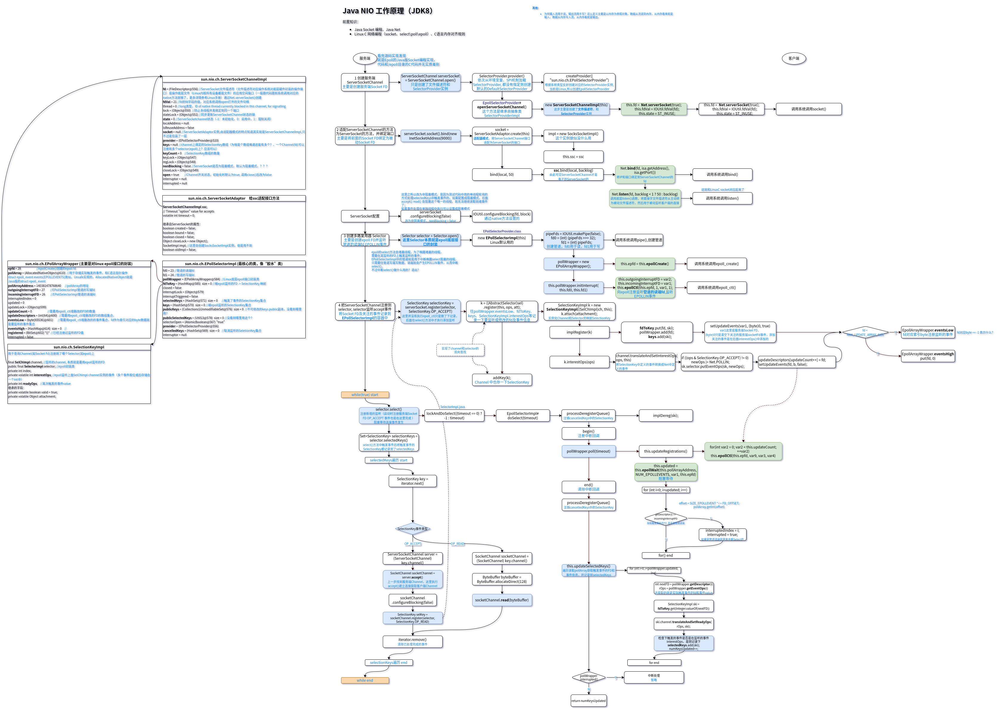

# Netty

从Linux epoll 到 Java NIO 再到 Netty 从源码循序渐进学懂 Netty实现原理。

## IO概念

文档：[docs/01-概念梳理](docs/01-概念梳理.md)

## Linux epoll 

Java NIO 依赖操作系统底层的多路复用模型并经过进一步封装实现，在Linux环境下依赖的是epoll。

Java NIO的通信相关接口最终实现都是native接口，native接口最终又对接到Linux epoll系统调用（包括3个核心的系统调用函数）。

另外需要理解epoll的工作原理，明白epoll为何高效。

文档：[docs/03-Linux_epoll](docs/03-Linux_epoll.md)

测试：epoll。

 

## Java NIO

需要理解Java NIO 三大组件本质是什么（Channel对应底层设备文件[主要是一个可读写设备文件的FileDescriptor]，Selector对应操作系统的多路复用器模型，ByteBuffer对应一块内存空间）。

以Linux操作系统为例，理解NIO是如何封装epoll的。

文档：[docs/03-Java_NIO](docs/03-Java_NIO.md)

测试：nio。

已Socket通信为例，NIO主流程：

## Netty封装原理

### Reactor模式

注意区分Reactor模式和响应式编程，Reactor模式是Doug Lea在《[Scalable IO in Java](https://gee.cs.oswego.edu/dl/cpjslides/nio.pdf)》中总结的一种网络服务器通信的编程模型。

Netty实现中遵循此编程模型，理解此模型对理解Netty为何这么封装有很大帮助。

文档：[docs/04-Reactor_Pattern](docs/04-Reactor_Pattern.md)

测试：nio。

### Netty工作流程

以TCP Socket通信为例。

## 其他

 ### Netty在其他框架或中间件中的使用

+ Spring Cloud Alibaba 各组件
+ Redisson
+ Zookeeper各客户端
+ Dubbo

+ ...

## 参考

+ [User guide for 4.x](https://github.com/kwseeker/netty.git)
+ [Netty 4.x User Guide 中文翻译](https://waylau.gitbooks.io/netty-4-user-guide/)
+ [Netty API Reference (4.1.33.Final)](https://netty.io/4.1/api/index.html)
+ 《Netty权威指南》
+ 《Netty实战》