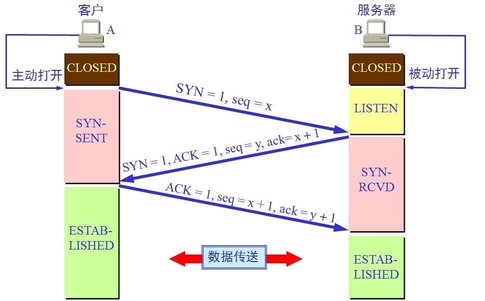
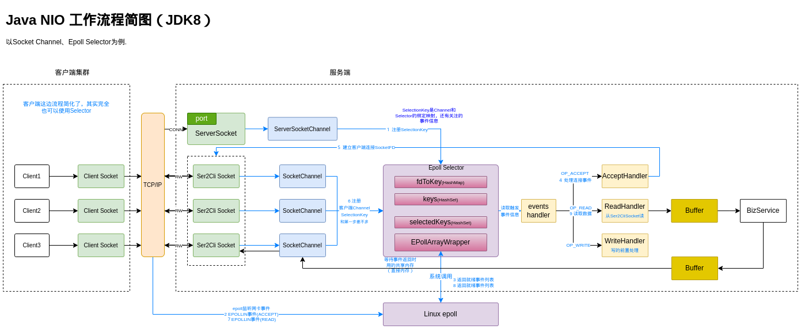

# Java NIO 完全解析

JDK源码下载（需要看一些JNI实现）：https://github.com/openjdk/jdk/tree/jdk8-b120

Java NIO 目的提升IO效率，处理性能（CPU不行搞GPU）已经不是瓶颈，IO性能才是软件性能的瓶颈。

NIO源码基本一行行地分析了全部流程，详细流程图参考：graph/java-nio-workflow.drawio（包含核心类数据结构说明）


## NIO 三大组件

### 通道 Channel

**channel本质就是文件描述符，这个文件描述符绑定着底层IO设备文件（TCP UDP File Pipe 等）**，ServerSocketChannelImpl 在 bind() 阶段将其绑定到了套接字接口，可以通过TCP/IP协议通信。

> 看其他Channel实现类：DatagramChannelImpl、FileChannelImpl、SinkChannelImpl、SourceChannelImpl 等，也都包含着一个 FileDescriptor 字段，因为IO操作底层经过Linux的syscall, 而IO设备在内核中都是"文件"。 
>
> ”Linux一切皆文件“。

#### **ServerSocketChannelImpl 创建**

主要字段是 fd、socket（bind阶段赋值）、provider。

```java
fd = {FileDescriptor@556} 	//ServerSocket文件描述符（文件描述符对应操作系统对底层硬件封装的操作接口）
							//是操作底层文件（Linux内核所有设备都是文件）的应用空间接口（一般跟代码跟到系统调用对应的native方法就够了，更多详情参考Linux手册）
							//通过Net.serverSocket()创建
fdVal = 21					//FileDescriptor的fd字段的值，对应系统调用open打开的文件句柄
thread = 0					//long类型，ID of native thread currently blocked in this channel, for signalling
lock = {Object@550} 
stateLock = {Object@551} 	//同步更新ServerSocketChannel状态的锁
state = 0					//ServerSocketchannel状态（-1：未初始化，0：启用中，1：强制关闭）
localAddress = null			
isReuseAddress = false
socket = null				//ServerSocketAdaptor实例,由适配器模式的特点知道其实就是ServerSocketChannelImpl,只不过是包装了一层
provider = {EPollSelectorProvider@510} 
keys = null
keyCount = 0
keyLock = {Object@547} 
regLock = {Object@548} 
nonBlocking = false			//ServerSocket是否为阻塞模式(Socket accept()、read()等是否阻塞），默认为阻塞模式，
    						//如果要像测试DEMO中要循环遍历处理selectedKey事件，这里必须设置非阻塞，如果处理逻辑在单独线程中可以设置为阻塞
closeLock = {Object@549} 
open = true
interruptor = null
interrupted = null
```

> 关于FileDescriptor, 参考 [JDK源码阅读-FileDescriptor](https://www.cnblogs.com/yungyu16/p/13053912.html)
>
> 它内部的 int fd; 就是对应系统调用open()返回的文件句柄。
>
> fd = ::open64(path, oflag, mode);

#### ServerSocketChannelImpl 绑定端口

内部实际干了两件事，Net.bind(...) 和 Net.listen(...) ，它们分别间接调用了系统调用bind() 和 listen()。

关于Net.listen() 传参 backlog 的作用参考《Unix网络编程》P4.5，以及参考这篇文章[深入探索 Linux listen() 函数 backlog 的含义](https://blog.csdn.net/yangbodong22011/article/details/60399728)。

**socket backlog** 在Linux2.2之后代表**等待accept的完全建立的套接字的队列长度**，即下面ESTABLISHED但是还没有执行accept()的连接队列长度（如果backlog=5,实际可以存６个，即backlog+1）。




### 多路复用器 Selector

Linux系统对应的Selector默认实现类是EPollSelectorImpl，本质就是对epoll系统调用的封装。

EPollSelectorImpl数据结构：

```java
fd0 = 23 //管道的读端fd
fd1 = 24 //管道的写端fd
pollWrapper = {EPollArrayWrapper@584}  	//Linux底层epoll接口封装类
fdToKey = {HashMap@585}  size = 0 		//被epoll监听的FD -> SelectionKey 映射
closed = false
interruptLock = {Object@579} 
interruptTriggered = false
selectedKeys = {HashSet@571}  size = 0	//触发了事件的SelectionKey集合
keys = {HashSet@570}  size = 0 			//被epoll监听的SelectionKey集合
publicKeys = {Collections$UnmodifiableSet@576}  size = 0  	//不可修改的keys public副本，没看到哪里用？
publicSelectedKeys = {Util$3@578}  size = 0 				//没看到哪里用这个？
selectorOpen = {AtomicBoolean@567} "true"
provider = {EPollSelectorProvider@556} 
cancelledKeys = {HashSet@569}  size = 0	//取消监听的SeletionKey集合
interruptor = null
```

#### EPollSelectorImpl的管道

EPollSelectorImpl 通过 IOUtil.makePipe() 调用系统调用pipe()创建了单向管道，返回long结果，高32位作为读文件描述符，低32位用于写文件描述符。

```java
long pipeFds = IOUtil.makePipe(true);
int readFd = (int) (pipeFds >>> 32);
int writeFd = (int) pipeFds;
```

关于管道的工作原理，详细参考《Unix网络编程,第２卷》P4.3，有工作流程图。

另外JDK也封装了IOUtil.makePipe()，实现了Java的管道，基本使用参考测试Demo: PipeTest.java。

#### JDK 对 Linux epoll的封装

EPollArrayWrapper（ 源码包路径：jdk\src\solaris\classes\sun\nio\ch ）是JDK对Linux epoll的封装。

关于Linux epoll的原理, 参考《Linux epoll.md》

```java
//这三个本地方法对应epoll的3个系统调用
//创建一个新的epoll实例,返回引用此epoll实例的文件描述符，当所有引用此epoll实例的文件描述符被关闭后，系统内核会自动释放此epoll实例的资源
private native int epollCreate();
//添加、修改、删除 epoll 实例 interest 列表中的条目（即添加、修改、删除epoll实例感兴趣的流对应的事件）
// epfd: epoll实例的文件描述符
// op: c操作类型: EPOLL_CTL_ADD EPOLL_CTL_MOD EPOLL_CTL_DEL
// fd: 感兴趣的文件描述符（即被监听的对象）
// event: 感兴趣的fd对象的事件集合
private native void epollCtl(int paramInt1, int paramInt2, int paramInt3, int paramInt4);
// 等待epoll实例监听的对象的事件发生，如果所有被监听对象都没有事件发生则会阻塞
// pollAddress: 触发的事件集合指针（用于存储实际触发的事件的数据）；JNI中将其转换成 struct epoll_event *events = jlong_to_ptr(address);
// numfds: 返回触发事件最大数量
// timeout: 阻塞时间ms，-1：只要没有事件会无限期阻塞，0：即使没有事件也会立即返回
 //epfd: epoll实例的文件描述符
// 返回值： 实际触发事件的个数
private native int epollWait(long pollAddress, int numfds, long timeout, int epfd) throws IOException
```

#### SelectionKey、Net、epoll 事件对应关系

Java SelectionKey只定义了４种事件，Java Net定义了６种事件（值都是通过native方法获取的，值和操作OS相关），Linux内核定义了15种事件(/sysdeps/unix/sysv/linux/sys/epoll.h ./sysdeps/unix/sysv/linux/bits/poll.h)。

| SelectionKey   | Net（Linux）  | Linux epoll      |
| -------------- | ------------- | ---------------- |
| OP_READ = 1    | POLLIN = 1    | EPOLLIN = 0x001  |
| OP_WRITE = 4   | POLLOUT = 4   | EPOLLOUT = 0x004 |
| OP_CONNECT = 8 | POLLCONN = 4  | EPOLLOUT = 0x004 |
| OP_ACCEPT = 16 | POLLIN = 1    | EPOLLIN = 0x001  |
|                | POLLERR = 8   | EPOLLERR = 0x008 |
|                | POLLHUP = 16  | EPOLLHUP = 0x010 |
|                | POLLNVAL = 32 | POLLNVAL = 0x020 |

Net和epoll事件值是对应的，关于SelectionKey中事件类型与Net/epoll事件转换参考 ServerSocketChannelImpl#translateReadyOps()。

### 缓冲区 Buffer

NIO Channel读写都是通过Buffer，然后看看引入Buffer有什么优点？之前看Netty知道里面重写了Buffer实现，引入对象池概念，通过Buffer对象复用大幅度减少了内存空间的重复分配和释放，提升了性能；然后比较NIO Buffer和Netty Buffer相比有什么不足？

NIO Buffer的引入相当于byte[]数组操作，方便很多，同时提供了直接内存访问以及mmap内存映射的支持，优化了数据读写的性能。

#### Buffer分类

NIO Buffer包中全部类都继承抽象类Buffer，基本对每一种基本数据类型封装了定制的Buffer抽象，而所有基本数据类型的Buffer又依赖ByteBuffer实现；Buffer默认使用Java Heap堆空间的内存(Java 创建一个基本数据类型就是在堆空间分配地址)，但是可以通过DirectBuffer接口拓展直接内存访问（以malloc、alloc分配，通过指针访问）；ByteBuffer额外提供了对Linux mmap的支持（MappedByteBuffer，即可使用直接内存也可使用Java Heap内存）。

+ **CharBuffer**(AC)
+ **DoubleBuffer**(AC)
+ **ShortBuffer**(AC)
+ **ByteBuffer**(AC)
  + HeapByteBuffer(AC)
  + MappedByteBuffer(AC)
+ **FloatBuffer**(AC)
+ **LongBuffer**(AC)
+ **IntBuffer**(AC)
+ **DirectBuffer**(I)

#### 常用方法

包含容量（Capacity）、上界（Limit，缓冲区现存元素的计数）、读写位置Position、标记（Mark，备忘位置） 、创建副本等操作。

#### NIO Buffer 与 Netty Buffer 对比

Netty引入对象池，对NIO Buffer做了进一步优化，详细参考《Netty Reactor模型分析.md》。


## NIO 工作流程简图

详细流程图参考：graph/java-nio-workflow.drawio




## NIO包其他组件

### 其他 Channel

#### AIO (AsynchronousSocketChannel)

#### UDP (DatagramChannel)

#### File (FileChannel)

### Bits

参考BitSetTest.java

### AllocatedNativeObject

参考：AllocateNativeObjectTest.java


## 待续

+ NIO Buffer & Linux mmap & 直接内存
+ EpollArrayWrapper eventsLow & eventsHigh 细节

+ java.nio 类组

  还有些与系统相关的实现类在sun.nio.ch包中。

  + Channel及Selector类

  + Charset类

  + File类

  + Buffer类

  + 异常类

  + CharBufferSpliterator

  + ByteOrder

  + Bits

- OP_CONNECT 和 OP_WRITE事件触发后如何区分

  SelectionKeyImpl 类中有个interestOps成员变量估计就是专门做这个事情的，Channel注册到Selector时是有明确指出是要关注OP_CONNECT还是OP_WRITE事件，走到系统层后才混淆的，那么在走到系统层之前记录下这个事件类型到interestOps，而且不允许同时监听这两种事件，那么后面触发的事件不就是 interestOps 记录的事件了么。然后先注册OP_CONNECT事件，建立连接之后，重新注册OP_WRITE事件（会清楚之前的SelectionKey），然后监可写事件。从而避免 OP_CONNECT和OP_WRITE的混淆问题。
