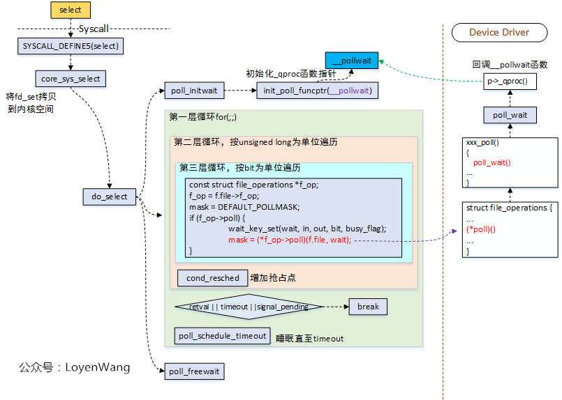
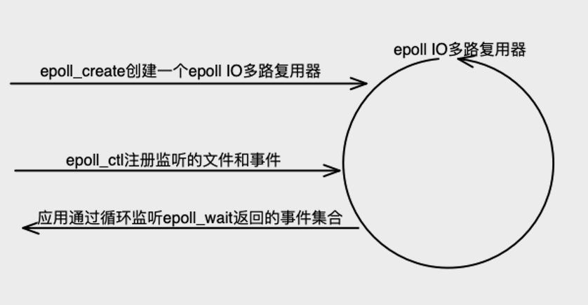

# Linux epoll

参考资料：

+ Linux手册：[EPOLL(7) man](http://www.man7.org/linux/man-pages/man7/epoll.7.html) 

+ GNU C 下载：[GNU libc](http://mirrors.nju.edu.cn/gnu/libc/)

  


## IO多路复用实现对比(select、poll、epoll)

IO多路复用就是指单个process同时处理多个连接的IO。

### 高并发模型

现在的**高并发模型**简单描述就是将连接上的消息处理分成两个阶段处理：

+ **消息等待**

  针对BIO线程捆绑带来的巨大资源浪费以及线程频繁睡眠唤醒带来的低效问题，现多用**IO多路复用**（非阻塞IO）单个或少量process主动查询IO事件(事件查询是非常高效的没有很耗时操作)。

  + **select**

    存储关注的文件符及事件的是 fd_set 数据结构，其实是个**位图**。比如：fd_set **readset* 值为 10001000,表示关注文件描述符{3, 7} 上的可读事件。

    **工作原理**：每次调用都会遍历各事件的fd_set位图（读、写、异常三种fd事件）,复杂度O(n)，检测对应FD上事件，保留fd_set上对应有事件发生的FD的位上的“1”，然后通过内存拷贝的方式将FD消息通知给用户空间。

  + **poll**

    存储关注的文件符及事件的是 **struct pollfd 的数组**。

    ```c
    struct pollfd {
    int fd; /* descriptor to check */
    short events; /* events of interest on fd */
    short revents; /* events that occurred on fd */
    };
    ```

    **工作原理**：每次调用都会遍历 pollfd *fds，复杂度O(n)，检测对应FD上事件，将发生的事件存储到revents，然后通过内存拷贝的方式将FD消息通知给用户空间。

    相对于select: 支持更多事件类型；重新调用poll不需要像select那样重新设置关注的FD和事件；没有并发数量限制（数组长度任意，不过还是要受内存空间和系统支持打开的最大文件句柄数限制）。

  + **epoll** 

    epoll官方解释是：为处理大批量句柄而作了改进的poll。

    select、poll 都是基于**轮询**实现的，当连接数很大时，尽管单个FD上的事件检测很快，但整体性能还是让人难以接受；

    epoll 则采用了基于**事件通知回调**的方式，FD上发生事件会以回调的方式将触发的事件和FD值写入到内核事件就绪队列。后面第二章节详细分析。

+ **消息处理**

  上一步的函数会返回表示“哪个FD触发了哪些事件”的数据，如: select 的 3个fd_set位图指针，poll 的 pollfd数组指针，epoll的事件就绪队列。

  下一步就是消息处理，取出上一步返回的数据，针对FD和事件做相应的处理。

### select、poll 原理流程图

#### select 

图片来自网文：[Linux select/poll机制原理分析 ](https://www.cnblogs.com/LoyenWang/p/12622904.html)




## Epoll工作原理

### 基本使用



```c
// 创建一个新的eventepoll对象,返回引用此eventepoll对象的文件描述符，当所有引用此epoll实例的文件描述符被关闭后，系统内核会自动释放此epoll实例的资源
int epoll_create(int size);		//linux 2.6.8 后 size参数被忽略
int epoll_create1(int flags);	//flag等于0等同于 epoll_create()
// 往eventpoll中添加、修改、删除 监听的文件描述符及事件（每一项都是一个关注某些epoll_event的文件描述符），单个单个地增删改
// 最终是封装成epitem对象注册到设备文件描述符的监听等待队列
// 	epfd: epoll实例的文件描述符
// 	op: c操作类型: EPOLL_CTL_ADD EPOLL_CTL_MOD EPOLL_CTL_DEL
// 	fd: 感兴趣的文件描述符（即被监听的对象）
// 	event: 感兴趣的fd对象的事件集合（更多事件查看后面说明）
//    EPOLLIN ：表示对应的文件句柄可以读（包括对端SOCKET正常关闭）；
//    EPOLLOUT：表示对应的文件句柄可以写；
//    EPOLLPRI：表示对应的文件句柄有紧急的数据可读（这里应该表示有带外数据到来）；
//    EPOLLERR：表示对应的文件句柄发生错误；
//    EPOLLHUP：表示对应的文件句柄被挂断；
//    EPOLLET：（不是事件、是一种工作模式）将EPOLL设为边缘触发(Edge Triggered)模式，这是相对于水平触发(Level Triggered)来说的。
//    EPOLLONESHOT：只监听一次事件，当监听完这次事件之后，如果还需要继续监听这个socket的话，需要再次把这个socket加入到//      EPOLL队列里。
int epoll_ctl(int epfd, int op, int fd, struct epoll_event *event);
// 等待epoll实例监听的对象的事件发生，如果所有被监听对象都没有事件发生则会阻塞
// 	epfd: epoll实例的文件描述符
// 	events: 触发的事件集合指针
// 	maxevents: 返回触发事件最大数量
// 	timeout: 阻塞时间ms
int epoll_wait(int epfd, struct epoll_event *events,
                      int maxevents, int timeout);
int epoll_pwait(int epfd, struct epoll_event *events,
                      int maxevents, int timeout,
                      const sigset_t *sigmask);
```

epoll_event的数据结构：

``` c
typedef union epoll_data {
	void    *ptr;
	int      fd;
	uint32_t u32;
	uint64_t u64;
} epoll_data_t;

struct epoll_event {
	uint32_t     events;    /* Epoll events */
	epoll_data_t data;      /* User data variable */
}
```

eventpoll的关键数据结构：

```C
struct eventpoll {
    ...
    wait_queue_head_t wq;
    ...
    struct list_head rdllist;	//就绪队列（双向队列）
    struct rb_root rbr;		//监听的文件描述符号和事件（红黑数）
    ...
};
```

**epoll事件**

```
EPOLLERR        表示对应的文件描述符发生错误；
EPOLLET         将EPOLL设为边缘触发(Edge Triggered)模式，这是相对于水平触发(LT)来说的。
EPOLLEXCLUSIVE 
EPOLLHUP        表示对应的文件描述符被挂断；
                并不代表对端结束了连接，这一点需要和EPOLLRDHUP区分。通常情况下EPOLLHUP表示的是本端挂断。
EPOLLIN         表示对应的文件描述符可以读（包括对端SOCKET正常关闭[即close]）；
                事件则只有当对端有数据写入时才会触发，ET模式触发一次后需要不断读取所有数据直到读完EAGAIN为止。否则剩下的数据只有在下次对端有写入时才能一起取出来了。
EPOLLMSG
EPOLLONESHOT    只监听一次事件;
                当监听完这次事件之后，如果还需要继续监听这个socket的话，需要再次把这个socket加入到EPOLL队列里
EPOLLOUT        表示对应的文件描述符可以写；
                事件只有在连接时触发一次，其他时候想要触发，那你要先准备好下面条件：
                1.某次write，写满了发送缓冲区，返回错误码为EAGAIN。
                2.对端读取了一些数据，又重新可写了，此时会触发EPOLLOUT。
                简单地说：EPOLLOUT事件只有在不可写到可写的转变时刻，才会触发一次，是边沿触发。
                如果想强制触发一次，直接调用epoll_ctl重新设置一下event(event.events必须包含EPOLLOUT)就可以了。
EPOLLPRI		表示对应的文件描述符有紧急的数据可读（这里应该表示有带外数据到来）；
EPOLLRDBAND
EPOLLRDHUP		表示对端关闭连接或者正在读写时被强制关闭；
EPOLLRDNORM
EPOLLWAKEUP
EPOLLWRBAND
EPOLLWRNORM
```

**关于LT和ET模式**

LT模式（水平触发）：默认工作模式，即当epoll_wait检测到某描述符事件就绪并通知应用程序时，应用程序如果不立即处理该事件；下次调用epoll_wait时，会再次通知此事件。

ET模式（边缘触发）：当epoll_wait检测到某描述符事件就绪并通知应用程序时，应用程序必须立即处理该事件。如果不处理，下次调用epoll_wait时，不会再次通知此事件。

测试案例：《Linux高性能服务器编程》9-3， 源码：epoll_et_server.c 。

```verilog
//测试代码，每次读取9字节。
//当选用LT模式时，client发送 一个长度超过9字节的消息 “A-long-message-more-than-9-bytes"，结果触发了四次分了4次读取
event trigger once
get 9 bytes of content:A-long-me
event trigger once
get 9 bytes of content:ssage-mor
event trigger once
get 9 bytes of content:e-than-9-
event trigger once
get 7 bytes of content:bytes
//当选用LT模式时，只会触发一次，必须循环读取完毕；否则没有读完的数据会在下一次和新数据拼接在一返回。
event trigger once
get 9 bytes of content:A-long-me
get 9 bytes of content:ssage-mor
get 9 bytes of content:e-than-9-
get 7 bytes of content:bytes
//LT模式，不循环读取完的话，那么没有读完的数据，跟随下次事件的数据一起返回
//客户端依次发送“A-long-message-more-than-9-bytes" "1" "2" "3" "4" "5"，然后就变成了下面的样子（注意消息后面还带了回车换行符）
event trigger once
get 9 bytes of content:A-long-me
event trigger once
get 9 bytes of content:ssage-mor
event trigger once
get 9 bytes of content:e-than-9-
event trigger once
get 9 bytes of content:bytes
1
event trigger once
get 9 bytes of content:
2
3
4
event trigger once
get 4 bytes of content:
5
```

### 工作原理

图片来自网文：[Epoll 实现原理](https://www.jxhs.me/2021/04/08/linux%E5%86%85%E6%A0%B8Epoll-%E5%AE%9E%E7%8E%B0%E5%8E%9F%E7%90%86/) ，这个图画得比较好。


可以结合这篇博客看：[从linux源码看epoll](https://cloud.tencent.com/developer/article/1401558)，补充了上文中缺失的设备收到数据触发中断到最终执行回调的这段逻辑。

主要分为两部分：

1）向epoll注册文件描述符和关注的事件，实际是注册对应的事件监听回调函数(ep_poll_callback())到设备文件描述符的监听等待队列；然后自己自旋阻塞；

2）设备事件触发（产生中断信号），最终执行回调函数，将就绪事件及文件描述符赋值到epoll_wait的events参数，并唤醒用户进程。

上面两篇文章还遗留了个问题没讲清：

<u>epoll_wait何时返回？并发产生的事件是如何返回的？</u>

找了下源码 epoll_wait() -> sys_epoll_wait() -> ep_poll(), 看起来有事件发生回调ep_poll_callback()，epoll_wait()就会立即返回。

ep_poll()中有这么一段代码

```c
static int ep_poll(struct eventpoll *ep, struct epoll_event __user *events,
		   int maxevents, long timeout)
{
	......
retry:
	// 获取spinlock
	spin_lock_irqsave(&ep->lock, flags);
	// 将当前task_struct写入到waitqueue中以便唤醒
	// wq_entry->func = default_wake_function;
	init_waitqueue_entry(&wait, current);
	// WQ_FLAG_EXCLUSIVE，排他性唤醒，配合SO_REUSEPORT从而解决accept惊群问题
	wait.flags |= WQ_FLAG_EXCLUSIVE;
	// 链入到ep的waitqueue中
	__add_wait_queue(&ep->wq, &wait);
	for (;;) {
		// 设置当前进程状态为可打断
		set_current_state(TASK_INTERRUPTIBLE);
		// 检查当前线程是否有信号要处理，有则返回-EINTR
		if (signal_pending(current)) {
			res = -EINTR;
			break;
		}
		spin_unlock_irqrestore(&ep->lock, flags);
		/*
			 * 主动让出处理器，等待ep_poll_callback()将当前进程
			 * 唤醒或者超时,返回值是剩余的时间。从这里开始
			 * 当前进程会进入睡眠状态，直到某些文件的状态
			 * 就绪或者超时。当文件状态就绪时，eventpoll的回调
			 * 函数ep_poll_callback()会唤醒在ep->wq指向的等待队列中的进程。
			 */
		jtimeout = schedule_timeout(jtimeout);
		spin_lock_irqsave(&ep->lock, flags);
	}
	// 到这里，表明超时或者有事件触发等动作导致进程重新调度
	__remove_wait_queue(&ep->wq, &wait);
	// 设置进程状态为running
	set_current_state(TASK_RUNNING);
	......
	// 检查是否有可用事件
	eavail = !list_empty(&ep->rdllist) || ep->ovflist != EP_UNACTIVE_PTR;
	......
	// 向用户空间拷贝就绪事件
	ep_send_events(ep, events, maxevents)
}		   
```


### 测试代码

https://github.com/kwseeker/netty/tree/master/epoll

