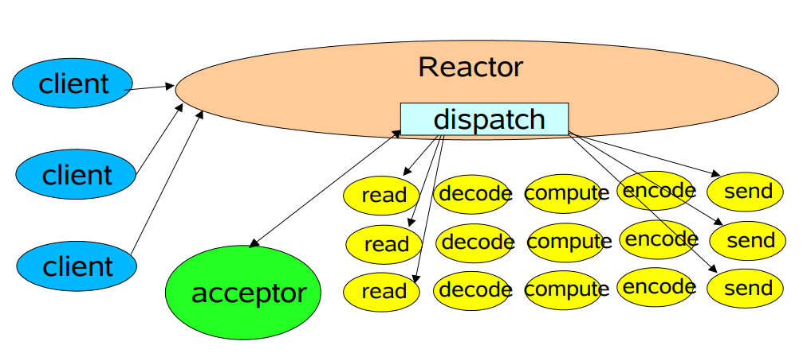

# Reactor 模式

英文：Reactor Pattern

要更好地理解Netty代码架构并形成长期记忆还是先理解清Reactor响应式编程模式比较好。

## 基本概念

里面涉及一些抽象容易混淆的概念。

### Reactor Pattern & Reactive Stream

维基百科关于响应式编程的定义：

**响应式编程**或**反应式编程**（英语：Reactive programming）是一种面向数据[流](https://zh.m.wikipedia.org/wiki/串流)和变化传播的[声明式](https://zh.m.wikipedia.org/wiki/声明式编程)[编程范式](https://zh.m.wikipedia.org/wiki/编程范式)。这意味着可以在编程语言中很方便地表达静态或动态的数据流，而相关的计算模型会自动将变化的值通过数据流进行传播。

> 要完全理解响应式编程概念需要理解流的实现原理，然后看响应式编程是如何处理流和变化传播的。

Reactor模式和Reactive Stream（响应式编程的一种规范）都称为响应式编程，都包含Reactor这个概念，但是它们两个貌似并没有什么关系。Reactive Stream 的一个框架 Reactor3实现了对Netty符合Reactive Stream规范的改造，叫Reactor-Netty（是基于Reactor Core和Netty构建的反应式网络库）。

**Reactor模式**源于《[Scalable IO in Java](https://gee.cs.oswego.edu/dl/cpjslides/nio.pdf)》中对于构建可伸缩的高性能IO服务的经验总结。

## NIO/Netty Reactor模式详解

手册中提到Reactor模式的特点：

+ **Reactor** responds to IO events by dispatching the appropriate handler (**Reactor通过分派适当的处理器来响应IO事件**)
  Similar to AWT thread
+ **Handlers** perform non-blocking actions（**处理器执行非阻塞操作**）
  Similar to AWT ActionListeners
+ Manage by binding handlers to events（**通过将处理器绑定到事件进行管理**）
  Similar to AWT addActionListener

### Reactor模式演化

《[Scalable IO in Java](https://gee.cs.oswego.edu/dl/cpjslides/nio.pdf)》手册中以Java NIO 为例，演示了Reactor 模式的代码结构（参考：reactor模块）以及演化（优化）。

#### 基本的响应式模式设计

代码包：package top.kwseeker.reactor.basic。

**Reactor**负载建立ServerSocket、Selector(注册、监听Socket事件)、轮询分发(dispatch)触发的事件。

**Acceptor**是专门处理ACCEPT事件的特殊Handler。

**Handler**(图中黄色部分)处理事件，一般分为read、decode、compute、encode、send操作。

#### 使用GoF状态对象模式改造

状态模式：

其实就是说为每一种事件封装一个处理器。

#### 多线程优化

措施：

+ 使用多个工作者线程/工作者线程池
+ 使用可调的线程池
+ 使用多个Reactor线程

多线程优化可能需要处理的问题：

+ 任务协调
  + 任务移交
  + 回调任务分发器
  + 队列
  + Futures

优点：

+ 充分使用多核心处理器
+ 避免因为事件处理延误事件分发
+ Reactor使用多线程（多Reactor），将负载分发到其他Reactor，避免某个Reactor过饱和（应该是说IO排队吧）

#### 使用其他NIO特性

#### 基于连接上的拓展

