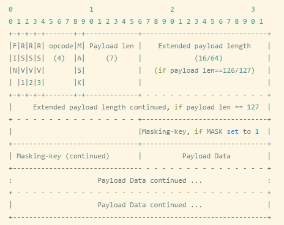

# Netty常用功能


## 编解码器


 ## 消息收发

### ChannelOutboundHandlerAdapter

> TODO read() 方法的作用？何时触发执行？


### 消息群发

依靠ChannelGroup实现，

```java
private static ChannelGroup channelGroup = new DefaultChannelGroup(GlobalEventExecutor.INSTANCE);
```

> TODO: ChannelGroup原理。


## 半包、粘包 & 拆包

由于TCP底层收发缓冲区大小有限制，如果一个包太大需要分成多个包发送，这就是半包处理；如果一个包比较小，多个包可以一起发送，就是粘包处理。拆包是指从半包或粘包数据中读取完整的数据包。

LinuxMint19配置的TCP收发缓冲区大小（分别是最小、默认、最大）。

```
➜  ~  cat /proc/sys/net/ipv4/tcp_rmem
4096	87380	6291456
➜  ~  cat /proc/sys/net/ipv4/tcp_wmem
4096	16384	4194304
```

Netty提供了多个解码器，可以进行拆包的操作，比如

+ **LineBasedFrameDecoder** 

  基于换行符号；读取的数据包如果没有换行符，那么会退出处理（注意要把读索引重置），继续读取数据包（之前传输来的的包的数据仍然在ByteBuf中），直到读取到换行符，然后一起处理；

  如果数据包有一到多个换行符，会对数据包进行拆分成多个完整包。

+ **DelimiterBasedFrameDecoder** 

  基于指定字符串，同上。

+ **FixedLengthFrameDecoder** 

  基于字符串长度；读取的数据包如果长度不够，那么会退出处理，继续读取数据包，直到达到指定长度，然后一起处理；

  如果数据包长度大于指定长度，会对数据包进行拆分成多个完整包。

```java
//ByteToMessageDecoder: in是存储读取到的包数据的ByteBuf对象，out是经过拆包处理后对象列表，每个对象对应一个完整数据包。
protected abstract void decode(ChannelHandlerContext ctx, ByteBuf in, List<Object> out) throws Exception;
```

当然也可以自行设计拆包方案。


## 心跳检测 & 断线重连

### 心跳检测

心跳检测实现是 IdleStateHandler，加在服务端pipeline，构造器包含３个参数：

+ readerIdleTimeSeconds：读超时。即当在指定的时间间隔内没有从 Channel 读取到数据时，会触发一个 READER_IDLE 的
  IdleStateEvent 事件。
+ writerIdleTimeSeconds：写超时。即当在指定的时间间隔内没有数据写入到 Channel 时，会触发一个 WRITER_IDLE 的
  IdleStateEvent 事件。
+ allIdleTimeSeconds：读/写超时。即当在指定的时间间隔内没有读或写操作时，会触发一个 ALL_IDLE 的 IdleStateEvent 事件。

事件会传递给下一个ChannelHandler的userEventTriggered()方法，用户需要自定义事件处理，比如断开连接。

### 断线重连

加在客户端。


## 数据传输协议

### HTTP

Netty支持通过HTTP协议传输数据，使用 HttpResponseEncoder、HttpRequestDecoder 编解码器，可以在入站时将HTTP请求解析为HttpRequest对象，出站时将HttpResponse对象编码为HTTP返回值。


### WebSocket

#### WebSocket工作原理

分为两个阶段：握手阶段、传输阶段；握手阶段通过HTTP协议建立连接通道，传输阶段通过WebSocket协议进行通信。

##### 握手阶段

**客户端发送websocket连接请求格式**：（发送这个的时候，TCP连接貌似已经建立完成了，调试可以看到服务端的客户端Channel以及worker NioEventLoop都建立了；TODO：wireshark 抓包看看流程）

```http
GET /chat HTTP/1.1
Host: server.example.com
Upgrade: websocket																	//定义协议转换，转成websocket协议
Connection: Upgrade																	//Upgrade、Connection这两个指明请求建立websocket连接
Origin: http://example.com
Sec-WebSocket-Key: dGhlIHNhbXBsZSBub25jZQ==		//是一个 Base64 encode 的值，由浏览器随机生成，用于结合返回值的Sec-WebSocket-Accept校验服务端WebSocket连接
Sec-WebSocket-Protocol: chat, superchat							//标识了客户端支持的子协议的列表, 用户指定
Sec-WebSocket-Version: 13														//选用的websocket协议版本
```

Netty中通过FullHttpRequest类接收握手HTTP请求。

**服务端返回格式**：

```http
HTTP/1.1 101 Switching Protocols
Upgrade: websocket
Connection: Upgrade
Sec-WebSocket-Accept: s3pPLMBiTxaQ9kYGzzhZRbK+xOo=		//通过Sec-WebSocket-Key计算得到的签名值，证明它支持请求的协议版本。
```

Sec-WebSocket-Key/Sec-WebSocket-Accept 主要作用在于提供基础的防护，减少恶意连接、意外连接，注意并不能保证安全性，因为都是默认是明文传输的，算法也是公开的，要保证安全需要添加TLS安全协议。

Sec-WebSocket-Accept 算法：

```stylus
const key = crypto.createHash('sha1')
      .update(req.headers['sec-websocket-key'] + constants.GUID, 'binary')
      .digest('base64')
```

**Netty处理**：

1）经过HttpRequestDecoder或HttpServerCodec解码后，是FullHttpRequest子类对象；

2）使用WebSocketServerHandshakerFactory建立握手并返回应答给客户端。

```java
WebSocketServerHandshakerFactory wsFactory = new WebSocketServerHandshakerFactory(
    "ws://" + httpRequest.headers().get(HttpHeaderNames.HOST), null, false);
handShaker = wsFactory.newHandshaker(httpRequest);
handShaker.handshake(ctx.channel(), httpRequest);
```

其中handshake()就是先创建一个应答`FullHttpResponse response = this.newHandshakeResponse(req, responseHeaders);`，将应答值通过pipeline编码器依次编码，最后通过`channel.writeAndFlush(response)`返回给客户端。

##### 传输阶段

Websocket协议的数据传输是按帧Frame格式传输的；Netty中通过WebSocketFrame类接收。

**Frame数据结构**：



+ **FIN**： 1bit，用来表明这是否是一个消息的最后的消息片断，当然第一个消息片断也可能是最后的一个消息片断；

+ **RSV1，RSV2，RSV3**： 分别都是1位，如果双方之间没有约定自定义协议，那么这几位的值都必须为0,否则必须断掉WebSocket连接。在ws中就用到了RSV1来表示是否消息压缩了的；

+ **opcode**：4 bit，表示被传输帧的类型：

  %x0 表示连续消息片断；
  %x1 表示文本消息片断；
  %x2 表未二进制消息片断；
  %x3-7 为将来的非控制消息片断保留的操作码；
  %x8 表示连接关闭；
  %x9 表示心跳检查的ping；
  %xA 表示心跳检查的pong；
  %xB-F 为将来的控制消息片断的保留操作码。

+ **Mask**： 1 bit。定义传输的数据是否有加掩码,如果设置为1,掩码键必须放在masking-key区域，客户端发送给服务端的所有消息，此位都是1；

+ **Payload length**：传输数据的长度，以字节的形式表示：7位、7+16位、或者7+64位。如果这个值以字节表示是0-125这个范围，那这个值就表示传输数据的长度；如果这个值是126，则随后的两个字节表示的是一个16进制无符号数，用来表示传输数据的长度；如果这个值是127,则随后的是8个字节表示的一个64位无符合数，这个数用来表示传输数据的长度。多字节长度的数量是以网络字节的顺序表示。负载数据的长度为扩展数据及应用数据之和，扩展数据的长度可能为0,因而此时负载数据的长度就为应用数据的长度

+ **Masking-key**：0或4个字节，客户端发送给服务端的数据，都是通过内嵌的一个32位值作为掩码的；掩码键只有在掩码位设置为1的时候存在；

+ **Extension data**： x位，如果客户端与服务端之间没有特殊约定，那么扩展数据的长度始终为0，任何的扩展都必须指定扩展数据的长度，或者长度的计算方式，以及在握手时如何确定正确的握手方式。如果存在扩展数据，则扩展数据就会包括在负载数据的长度之内；

+ **Application data**： y位，任意的应用数据，放在扩展数据之后，应用数据的长度=负载数据的长度-扩展数据的长度；

+ **Payload data**： (x+y)位，负载数据为扩展数据及应用数据长度之和；

**Netty处理**：

1）经过HttpRequestDecoder或HttpServerCodec解码后，是WebSocketFrame子类对象，如TextWebSocketFrame，除了FIN、RSV位，其他都在ByteBuf中存储；

2）根据WebSocketFrame类型进行不同的处理；IETF发布的WebSocket RFC，定义了6种帧，Netty为它们都提供了一个POJO实现。

+ BinaryWebSocketFrame——包含了二进制数据

+ TextWebSocketFrame——包含了文本数据

+ ContinuationWebSocketFrame——包含属于上一个BinaryWebSocketFrame或TextWebSocketFrame的文本数据或者二进制数据

+ CloseWebSocketFrame——表示一个CLOSE请求，包含一个关闭的状态码和关闭的原因

+ PingWebSocketFrame——请求传输一个PongWebSocketFrame

+ PongWebSocketFrame——作为一个对于PingWebSocketFrame的响应被发送

一般使用TextWebSocketFrame传输业务数据。然后读取消息主体，分发给对应的消息处理器即可。

#### HttpRequestDecoder & HttpResponseEncoder 编解码原理


#### HttpServerCodec 编解码原理


### Protobuf


## 传输Java对象


## 传输文件


## 跨服务端通信


## 多协议消息类型通信


## 基于SSL实现双向加密验证

