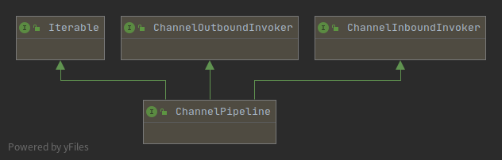
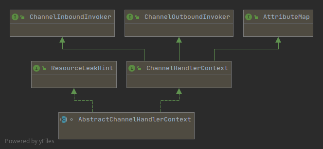
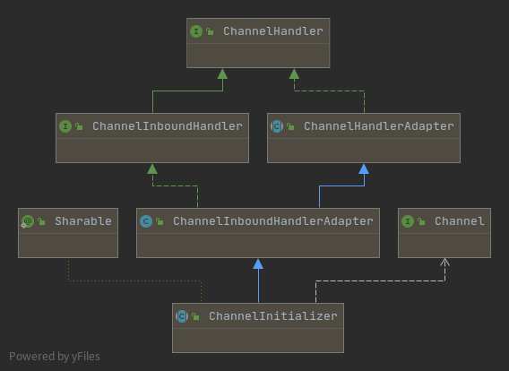

# Netty源码分析

详细过程参考流程图：graph/netty-workflow.drawio

这里只是梳理不方便在流程图里面分析的部分。


## ChannelPipeline

这块在流程图中不容易说清楚，单独拿出来分析。

ChannelPipeline默认实现是DefaultChannelPipeline。

ChannelPipeline是和SocketChannel绑定的，是一对一的关系。

**类UML & 数据结构**

+ **DefaultChannelPipeline**

  

  Iterable 泛型类型 Iterable<Entry<String, ChannelHandler>>

  ```java
  //head+tail: ChannelPipeline的核心组件之一，是一个AbstractChannelHandlerContext的链表
  final AbstractChannelHandlerContext head;
  final AbstractChannelHandlerContext tail;
  //ChannelPipeline的核心组件之一，其实是SocketChannel（服务端是ServerSocketChannel,客户端是SocektChannel），
  //	实现网络通信的数据读写传输
  private final Channel channel;
  private final ChannelFuture succeededFuture;
  private final VoidChannelPromise voidPromise;
  private final boolean touch = ResourceLeakDetector.isEnabled();
  private Map<EventExecutorGroup, EventExecutor> childExecutors;
  private volatile MessageSizeEstimator.Handle estimatorHandle;
  private boolean firstRegistration = true;
  private PendingHandlerCallback pendingHandlerCallbackHead;
  private boolean registered;
  
  //重要的静态字段
  private static final String HEAD_NAME = generateName0(HeadContext.class);
  private static final String TAIL_NAME = generateName0(TailContext.class);
  private static final FastThreadLocal<Map<Class<?>, String>> nameCaches =
      new FastThreadLocal<Map<Class<?>, String>>() {
      @Override
      protected Map<Class<?>, String> initialValue() {
          return new WeakHashMap<Class<?>, String>();
      }
  };
  ```

+ **AbstractChannelHandlerContext** (链表节点)

  

  AbstractChannelHandlerContext就是ChannelHandler的封装。

  DefaultChannelPipeline内部类 **HeadContext** 和 **TailContext** 以及要注册的 ChannelHandler 默认封装类 **DefaultChannelHandlerContext** 均继承此类。

  ```java
  TailContext extends AbstractChannelHandlerContext implements ChannelInboundHandler
  HeadContext extends AbstractChannelHandlerContext implements ChannelOutboundHandler, ChannelInboundHandler
  DefaultChannelHandlerContext extends AbstractChannelHandlerContext
      	比如 ChannelInitializer 
  
  HeadContext 的核心
  	unsafe = pipeline.channel().unsafe();
  DefaultChannelHandlerContext 的核心
  	private final ChannelHandler handler;
  ```

  

  AbstractChannelHandlerContext的数据结构：

  ```java
  volatile AbstractChannelHandlerContext next;
  volatile AbstractChannelHandlerContext prev;
  private final DefaultChannelPipeline pipeline;	//类似数据库冗余字段，主要是为了方便查pipeline中的信息
  private final String name;					//链表节点名称
  private final boolean ordered;			//invokeHandler()中使用，TODO
  private final int executionMask;		//可跳过的ChannelInboundHandler 、ChannelOutboundHandler方法位标志（1不可跳过、0跳过）, 方法上加@Skip注解可跳过
  																		//一共17位，低1位标识实现的ChannelHandlerContext的exceptionCaught方法是否可跳过
  																		//中8位标识实现的哪些ChannelInboundHandler方法可跳过，
  																		//高8位标识实现的哪些ChannelOutboundHandler方法可跳过
  final EventExecutor executor;			//NIOEventLoop，执行时才赋值 TODO
  private ChannelFuture succeededFuture;
  private Tasks invokeTasks;
  private volatile int handlerState = INIT;	//并发控制，防止重复添加相同的channelHandler到链表，原理是自旋CAS。
  //重要的静态字段
  private static final int INIT = 0;	//ChannelHandler初始状态
  private static final int ADD_PENDING = 1;
  private static final int ADD_COMPLETE = 2;		//此ChannelHandler成功加入链表的状态
  private static final int REMOVE_COMPLETE = 3;
  ```

  

  


