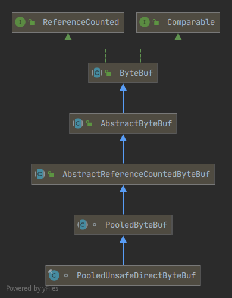

# Netty源码分析

详细过程参考流程图：graph/netty-workflow.drawio

这里只是梳理不方便在流程图里面分析的部分。


## Netty线程模型


## ChannelPipeline

这块在流程图中不容易说清楚，单独拿出来分析。

ChannelPipeline默认实现是DefaultChannelPipeline。

ChannelPipeline是和SocketChannel绑定的，是一对一的关系。

**类UML & 数据结构**

+ **DefaultChannelPipeline**

  

  Iterable 泛型类型 Iterable<Entry<String, ChannelHandler>>

  ```java
  //head+tail: ChannelPipeline的核心组件之一，是一个AbstractChannelHandlerContext的链表
  final AbstractChannelHandlerContext head;
  final AbstractChannelHandlerContext tail;
  //ChannelPipeline的核心组件之一，其实是SocketChannel（服务端是ServerSocketChannel,客户端是SocektChannel），
  //	实现网络通信的数据读写传输
  private final Channel channel;
  private final ChannelFuture succeededFuture;
  private final VoidChannelPromise voidPromise;
  private final boolean touch = ResourceLeakDetector.isEnabled();
  private Map<EventExecutorGroup, EventExecutor> childExecutors;
  private volatile MessageSizeEstimator.Handle estimatorHandle;
  private boolean firstRegistration = true;
  private PendingHandlerCallback pendingHandlerCallbackHead;
  private boolean registered;
  
  //重要的静态字段
  private static final String HEAD_NAME = generateName0(HeadContext.class);
  private static final String TAIL_NAME = generateName0(TailContext.class);
  private static final FastThreadLocal<Map<Class<?>, String>> nameCaches =
      new FastThreadLocal<Map<Class<?>, String>>() {
      @Override
      protected Map<Class<?>, String> initialValue() {
          return new WeakHashMap<Class<?>, String>();
      }
  };
  ```

+ **AbstractChannelHandlerContext** (链表节点)

  

  AbstractChannelHandlerContext就是ChannelHandler的封装。

  DefaultChannelPipeline内部类 **HeadContext** 和 **TailContext** 以及要注册的 ChannelHandler 默认封装类 **DefaultChannelHandlerContext** 均继承此类。

  ```java
  TailContext extends AbstractChannelHandlerContext implements ChannelInboundHandler
  HeadContext extends AbstractChannelHandlerContext implements ChannelOutboundHandler, ChannelInboundHandler
  DefaultChannelHandlerContext extends AbstractChannelHandlerContext
      	比如 ChannelInitializer 
  
  HeadContext 的核心
  	unsafe = pipeline.channel().unsafe();
  DefaultChannelHandlerContext 的核心
  	private final ChannelHandler handler;
  ```

  

  AbstractChannelHandlerContext的数据结构：

  ```java
  volatile AbstractChannelHandlerContext next;
  volatile AbstractChannelHandlerContext prev;
  private final DefaultChannelPipeline pipeline;	//类似数据库冗余字段，主要是为了方便查pipeline中的信息
  private final String name;					//链表节点名称
  private final boolean ordered;			//invokeHandler()中使用，TODO
  private final int executionMask;		//可跳过的ChannelInboundHandler 、ChannelOutboundHandler方法位标志（1不可跳过、0跳过）, 方法上加@Skip注解可跳过
  																		//一共17位，低1位标识实现的ChannelHandlerContext的exceptionCaught方法是否可跳过
  																		//中8位标识实现的哪些ChannelInboundHandler方法可跳过，
  																		//高8位标识实现的哪些ChannelOutboundHandler方法可跳过
  final EventExecutor executor;			//NIOEventLoop，执行时才赋值 TODO
  private ChannelFuture succeededFuture;
  private Tasks invokeTasks;
  private volatile int handlerState = INIT;	//并发控制，防止重复添加相同的channelHandler到链表，原理是自旋CAS。
  //重要的静态字段
  private static final int INIT = 0;	//ChannelHandler初始状态
  private static final int ADD_PENDING = 1;
  private static final int ADD_COMPLETE = 2;		//此ChannelHandler成功加入链表的状态
  private static final int REMOVE_COMPLETE = 3;
  ```


## ByteBuf

关于Netty ByteBuf 与 Java NIO ByteBuffer的关系及优缺对比，可以参考《Netty实战》第５章和《Netty权威指南》第15章。

> ByteBuf 是不是封装了ByteBuffer ? 半封装半参考重新实现。

ByteBuf用作传输数据的读写缓冲。

> 测试DEMO: ByteBufTest$testPooledUnsafeDirectByteBuf()

主要操作有：

+ **缓冲实例构造与内存分配**

  + **堆缓冲**

    缓冲在JVM堆中分配，可以使用JVM内存管理。

  + **直接缓冲**

    通过本地调用在JVM堆外分配。

  + **复合缓冲**

    将多个缓冲（可能是堆缓冲或直接缓冲）聚合到一个视图。

    场景：比如传输Http协议的消息（包含头部和主体两个相对独立的数据）

  + **池化和非池化**

+ **数据访问**

  + **数据读写**

    + **按几种基本数据类型**

      如按byte、按int读写（已byte、int为单位）。

    + **顺序读写**

      挨个一一读/写。

    + **随机读写**

      像数组一样使用索引读写。
    
      随机写（按索引写）：不会修改readerIndex、writerIndex的值，相当于数据覆盖（类比编辑器的Replace模式）。
    
      随机读（按索引读）：也不会修改readerIndex、writerIndex的值。
    
      > 由于不会修改readerIndex、writerIndex的值，调试时可以使用随机读读取内容用于打印日志。
    >
      > 随机读还可以用于重复读取缓冲数据。
    >
      > 重复读还可以通过mark

  + **复制和分片**
  
  + **位置指针操作**
  
    + **mark & Reset**
  
      标记与回滚，和NIO ByteBuffer 的含义是一样的。
  
  + **数据查找**
  
    indexOf() 或 定制ByteBufProcessor。
  
  + **缓冲空间动态拓展**

### PooledUnsafeDirectByteBuf 

以Netty默认使用的ByteBuf实现PooledUnsafeDirectByteBuf为例分析实现原理(4.1.35版本)。



类和接口说明：

+ **ReferenceCounted** 

  采用引用计数法管理ByteBuf对象的回收。包含增加引用计数、减少引用计数、返回引用计数等方法定义。

+ **ByteBuf**

  核心基础抽象类，定义了绝大部分的操作方法。

  包括：容量、内存分配、字节顺序（大端/小端）、字段属性操作、读写、压合、复制、分片等等操作方法的定义，以及继承自ReferenceCounted和Comparable的方法。

+ **AbstractByteBuf** 

  前面的类和接口只是方法定义，AbstractByteBuf是抽象实现。实现了ByteBuf定义的与下面数据结构相关的操作（但是又没有完全实现，依赖AbstractByteBuf新增的抽象方法[比如`_getByte()`、`_setByte()`等等]）。

  ```java
  int readerIndex;	//读索引（从哪里开始读，相当于ByteBuffer读模式的composition）
  int writerIndex;	//写索引（从哪里开始写，相当于ByteBuffer写模式的composition）
  private int markedReaderIndex;	//用于缓存读索引，用于reset
  private int markedWriterIndex;	//用于缓存写索引，用于reset
  private int maxCapacity;	//最大容量，相当于ByteBuffer的capacity
  ```

+ **AbstractReferenceCountedByteBuf**

  继承AbstractByteBuf，并进一步实现了引用技术与内存回收相关的方法（也是没有完全实现，引入了内存释放的抽象方法`deallocate()`）。

  ```java
  private volatile int refCnt = updater.initialValue();
  //通过下面两个Unsafe实现的Updater进行更新
  private static final long REFCNT_FIELD_OFFSET =
      ReferenceCountUpdater.getUnsafeOffset(AbstractReferenceCountedByteBuf.class, "refCnt");
  private static final AtomicIntegerFieldUpdater<AbstractReferenceCountedByteBuf> AIF_UPDATER =
      AtomicIntegerFieldUpdater.newUpdater(AbstractReferenceCountedByteBuf.class, "refCnt");
  ```

+ **PooledByteBuf**

  继承AbstractReferenceCountedByteBuf，进一步实现内存分配回收。

  ByteBuf 对象池数据结构:

  ```java
  private final Recycler.Handle<PooledByteBuf<T>> recyclerHandle;
  protected PoolChunk<T> chunk;
  protected long handle;
  protected T memory;
  protected int offset;
  protected int length;
  int maxLength;
  PoolThreadCache cache;
  ByteBuffer tmpNioBuf;
  private ByteBufAllocator allocator;
  ```

+ **PooledUnsafeDirectByteBuf**

  提供了Recycler.Handle的实现，以及通过Unsafe实现前面`_getByte()`、`_setByte()`等等操作。

  ```
  private long memoryAddress;
  ```

  