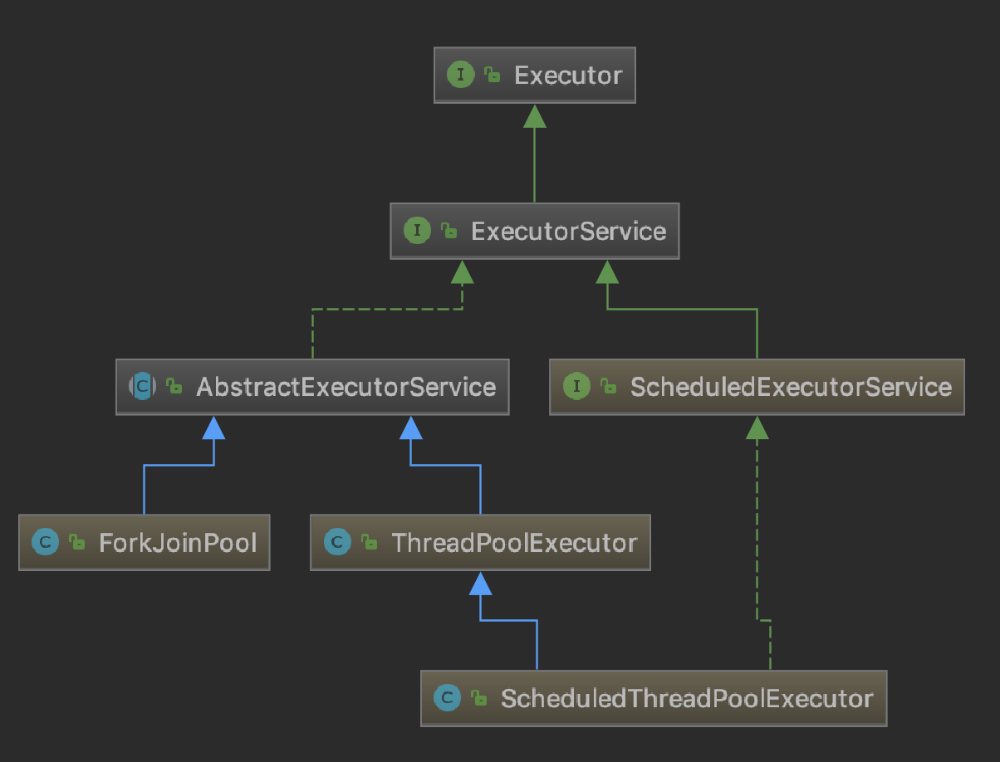
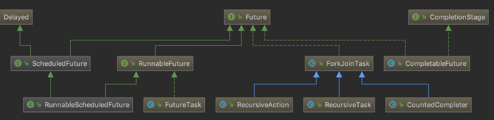
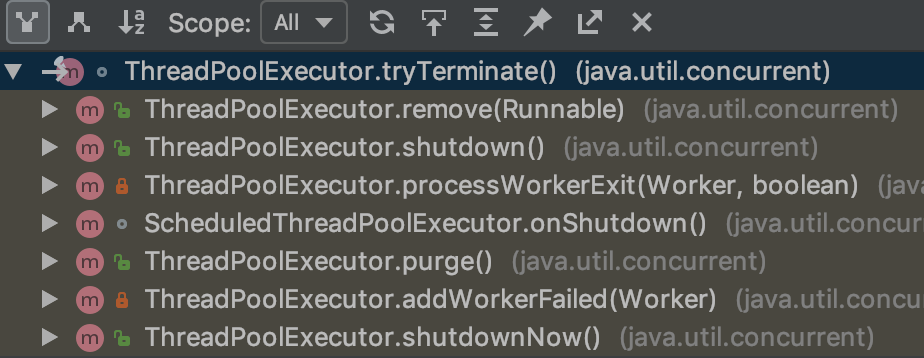

# Executor线程池 和 Future、Callable

之前对Executor框架和Future只是一知半解，看Netty源码有点吃力；索性就在这里将他们深入学习一下。
然而只是看Executor的源码，不理解其设计初衷也是难以把握重点，记不住。

### Executor线程池源码结构

+ Executor框架的作用

    设计Executor的初衷是想把任务和“任务的运行方法（是怎样运行的）”、“线程的使用”、“线程的调度”分离开来（也就是解耦）；
    即Executor框架把任务的提交和执行进行解耦，只需要定义好任务，然后提交给线程池，而不用关心该任务是如何执行、被哪个线程执行，以及什么时候执行。

+ Executor线程池类图

    
    
    - Executor
        
        定义了一个execute()方法用于执行Runnable实例。
        
    - ExecutorService(核心接口)
    
        就是按照设计初衷设计的接口，并不关注线程的实现，对外看来我们只需要提交任务（3种重载的submit方法，2种重载的invokeAll，2种重载的invokeAny；
        invokeAll是批量提交多个任务，全部执行结束后，将结果异步返回到集合类对象中，invokeAny是批量提交，任意一个执行完成或异常退出就返回，
        其他未执行完毕的任务被撤销）
        然后等待执行结果，以及对其进行状态检查（isShutdown，isTerminated），控制关闭（shutdown，shutdownNow，shutdownNow）。
        
    - ScheduledExecutorService
        
        在ExecutorService基础上添加了计划任务方法相当于submit方法的加强版。可以延迟执行，按周期循环执行，按延迟循环执行。
        
        scheduleAtFixedRate 与 scheduleWithFixedDelay区别：第一个方法是固定的频率来执行某项计划，它不受计划执行时间的影响。到时间，它就执行。 
        而第二个方法，相对固定，据鄙人理解，是相对任务的。即无论某个任务执行多长时间，等执行完了，我再延迟指定的时间。也就是第二个方法，它受计划执行时间的影响。 
    
    - AbstractExecutorService
        
        这个抽象类实现了提交任务的方法（3+2+2），submit和invokeAll借助FutureTask实现，invokeAny借助ExecutorCompletionService实现。
        
    - ForkJoinPool
    
        TODO: 一个比较另类的线程池，分析Netty源码用不到，后面再研究。
        
    - ThreadPoolExecutor（核心实现类）
    
        除了实现接口的方法外还提供了好多查询修改线程池本身状态的方法。
        
        ThreadPoolExecutor 线程池内部实现：下面单独开出一节分析。
        
    - ScheduleThreadPoolExecutor
    
        在ThreadPoolExecutor基础上主要拓展了计划任务方法。
        
    - Executors（具有参考意义）
        
        包装ThreadPoolExecutor方法做的一个工具类，内部基本都是static方法，很方便使用。
        实现了很多定制化的线程池类型，任务类型以及线程工厂。自己如果想定制一个线程池完全可以参考这个类的实现。
        
+ Callable 与 Future、FutureTask

    - Callable 
    
        Callable 和 Runnable 都是最基础且最简单的接口，一个带返回值一个不带返回值。

    - Future、FutureTask
    
        
    
        Future就是对于具体的Runnable或者Callable任务的执行结果进行取消、查询是否完成、获取结果的接口。
    
        FutureTask
    
+ FutureTask 与 ExecutorCompletionService

    CompletionService用于提交一组Callable任务，其take方法返回已完成的一个Callable任务对应的Future对象。

+ ThreadFactory

    接口，创建线程。

### ThreadPoolExecutor 内部实现原理

从一个简单的例子 ThreadPoolExecutorDemo.java（直接从Executors中copy出一个相对复杂的实例）开始，通过调试理解内部实现。

##### 1）Executors的线程工厂

```
private static final AtomicInteger poolNumber = new AtomicInteger(1);
private final ThreadGroup group;
private final AtomicInteger threadNumber = new AtomicInteger(1);
private final String namePrefix;

DefaultThreadFactory() {
    //获取安全管理器
    SecurityManager s = System.getSecurityManager();
    //获取main线程的线程组
    group = (s != null) ? s.getThreadGroup() :
                          Thread.currentThread().getThreadGroup();
    //构建线程名称前缀
    namePrefix = "pool-" +
                  poolNumber.getAndIncrement() +
                 "-thread-";
}
    
public Thread newThread(Runnable r) {
    Thread t = new Thread(group, r,
                          namePrefix + threadNumber.getAndIncrement(),
                          0);
    if (t.isDaemon())
        t.setDaemon(false);
    if (t.getPriority() != Thread.NORM_PRIORITY)
        t.setPriority(Thread.NORM_PRIORITY);
    return t;
}
```

+ SecurityManager

    SecurityManager是安全管理器，用于对代码中的敏感操作(系统权限修改，文件读写，网络连接，软件执行等等)做安全性检查，
    具体参考：  
    [Class SecurityManager](https://docs.oracle.com/javase/7/docs/api/java/lang/SecurityManager.html)  
    [The Security Manager](https://docs.oracle.com/javase/tutorial/essential/environment/security.html)  
    [The Java Security Manager: why and how?](https://blog.frankel.ch/java-security-manager/)  
    TODO: 暂时略过这部分，注意这里的安全是广义的安全。

+ Thread

    这里有必要深入了解下 Thread 的结构与实现原理，现在仅从理论上了解下；因为Thread下面是JVM，JVM下面是OS内核；
    往下挖，坑还深的的很。
    
    Thread JVM native 方法（之前做Android驱动开发的时候没少写这些，HAL->JNI->HIDL的流程估计和JVM差不多，
    JVM包装的是底层OS的方法，而HAL->JNI->HIDL是包装的底层驱动的拓展接口，应该可以看做是JVM的拓展）（TODO）。
    ```
    private static native void registerNatives();   //注册native方法，注册的方法名不是随便起的，必须要与JVM的方法映射表中的方法名一致。
    public static native Thread currentThread();
    public static native void yield();
    public static native void sleep(long millis) throws InterruptedException;
    private native void start0();
    private native boolean isInterrupted(boolean ClearInterrupted);
    public final native boolean isAlive();
    public native int countStackFrames();
    private native static StackTraceElement[][] dumpThreads(Thread[] threads);
    private native static Thread[] getThreads();
    private native void setPriority0(int newPriority);
    private native void stop0(Object o);
    private native void suspend0();
    private native void resume0();
    private native void interrupt0();
    private native void setNativeName(String name);
    
    //方法映射表
    static JNINativeMethod methods[] = {
        {"start0",           "()V",        (void *)&JVM_StartThread},
        {"stop0",            "(" OBJ ")V", (void *)&JVM_StopThread},
        {"isAlive",          "()Z",        (void *)&JVM_IsThreadAlive},
        {"suspend0",         "()V",        (void *)&JVM_SuspendThread},
        {"resume0",          "()V",        (void *)&JVM_ResumeThread},
        {"setPriority0",     "(I)V",       (void *)&JVM_SetThreadPriority},
        {"yield",            "()V",        (void *)&JVM_Yield},
        {"sleep",            "(J)V",       (void *)&JVM_Sleep},
        {"currentThread",    "()" THD,     (void *)&JVM_CurrentThread},
        {"countStackFrames", "()I",        (void *)&JVM_CountStackFrames},
        {"interrupt0",       "()V",        (void *)&JVM_Interrupt},
        {"isInterrupted",    "(Z)Z",       (void *)&JVM_IsInterrupted},
        {"holdsLock",        "(" OBJ ")Z", (void *)&JVM_HoldsLock},
        {"getThreads",        "()[" THD,   (void *)&JVM_GetAllThreads},
        {"dumpThreads",      "([" THD ")[[" STE, (void *)&JVM_DumpThreads},
        {"setNativeName",    "(" STR ")V", (void *)&JVM_SetNativeThreadName},
    };
    ```
    
    Java线程模型
    
    Java1.3及以后采用1：1线程模型（1个Java Thread对应一个OS内核线程）。  
    
    
    Ps：Go语言采用M:N的线程模型，不过要注意 M和N 说的是 goroutine 和 用户线程(下图的M)的对应关系。
    而对于单核CPU来说，所有 goroutine 都是执行在一个内核线程之上的。
    

    参考：  
    [JVM原理与实现——Thread](https://juejin.im/entry/5960852cf265da6c2e0f8a31)

    补充：
    
    Thread 的 join()的原理：其实就是同步等待wait()，targetThread.join() 后当前线程睡眠，直到被等待线程notify(),当前线程才被唤醒执行。
    线程退出在JVM中的实现是会调用notifyAll()唤醒所有等待线程的，所以join()等待线程退出并不需要在被等待线程中执行notify()。
    
    ```
    void JavaThread::exit(booldestroy_vm,ExitTypeexit_type)；
    static void ensure_join(JavaThread*thread) { 
             Handle threadObj(thread,thread->threadObj()); 
             ObjectLocker lock(threadObj,thread);thread->clear_pending_exception(); 
             java_lang_Thread::set_thread_status(threadObj(),java_lang_Thread::TERMINATED); 
             java_lang_Thread::set_thread(threadObj(),NULL); 
             lock.notify_all(thread);  //这里执行了notify_all,进行了wait的唤醒
             thread->clear_pending_exception();
    }
    ```
    
    等待线程退出的方法：
    
    a) join() 或 synchronized wait(); 只能等待一个线程，因为wait()后就会休眠,不会往下执行；  
    b) 使用阻塞，如 阻塞队列 和 Future 等; 只能等待一个线程,因为阻塞是忙等待不会继续往下执行；  
    c) 使用 CountDownLatch 倒数计数器; 可以实现等待多个线程退出。
    
##### 2）ThreadPoolExecutor线程池创建

    ```
    public ThreadPoolExecutor(int corePoolSize,             //线程池中维持的常备线程的数量
                                  int maximumPoolSize,      //最大线程数量
                                  long keepAliveTime,       //生存时间（线程中线程数量超过corePoolSize的话，线程空闲等待时间，超过这个时间没有使用线程会被回收）
                                  TimeUnit unit,            //生存时间的时间单位
                                  BlockingQueue<Runnable> workQueue,    //工作队列(所有线程公用)
                                  ThreadFactory threadFactory,          //构建工作者线程的线程工厂
                                  RejectedExecutionHandler handler) {   //线程工作队列堆满或线程数最大导致阻塞的处理回调，AbortPolicy();
        //一些参数校验
        
        this.acc = System.getSecurityManager() == null ?
                null :
                AccessController.getContext();
        this.corePoolSize = corePoolSize;
        this.maximumPoolSize = maximumPoolSize;
        this.workQueue = workQueue;
        this.keepAliveTime = unit.toNanos(keepAliveTime);
        this.threadFactory = threadFactory;
        this.handler = handler;
    }
    ```

##### 3）任务提交与执行

```
public void execute(Runnable command) {
    if (command == null)
        throw new NullPointerException();
    int c = ctl.get();                      //线程池控制状态（包括工作线程{创建还未停止的线程}数量及运行状态{运行中/关闭等等}）
                                            //使用一个32位的int，维护线程池线程数量（最高支持2^29-1个线程）和 线程池工作状态
                                            //虽然前面说限制最大数量为Integer.MAX_VALUE超过了2^29-1，但是现在现实中根本不可能达到2^29-1这么高的并发线程数（1个线程基本就是2M内存啊）
    if (workerCountOf(c) < corePoolSize) {  //workerCountOf()取 ctl的低29位
        if (addWorker(command, true))
            return;
        c = ctl.get();
    }
    if (isRunning(c) && workQueue.offer(command)) {
        int recheck = ctl.get();
        if (! isRunning(recheck) && remove(command))
            reject(command);
        else if (workerCountOf(recheck) == 0)
            addWorker(null, false);
    }
    else if (!addWorker(command, false))
        reject(command);
}
```
任务提交之后执行了下面3个步骤：

1）如果运行的线程数量小于常备线程数量则启动一个新的线程, 并将目标任务（Runnable的实现类）放到工作队列; 
    否则转2； 
2）如果运行的线程数量不小于常备线程数量则判断工作队列是否已满；
    未满则加入工作队列，然后重新获取线程池状态，线程池若非RUNNING状态要从队列移除此任务，若处于RUNNING状态但是工作者线程数为0，则新建非core类型工作者线程。
    已满，则转3
3）如果无法加入当前已有的线程的工作队列，则创建新的线程处理这个任务；如果还是失败则执行 RejectedExecutionHandler 处理。

!!! 注意：
1）任务并不一定会加入到工作队列，具体参考Worker的实现，任务作为线程的第一个任务时总是直接处理的。  
2）（纠正一个错误理解）`线程池运行的真正流程`：
    公司成立一个新的软件项目组，刚开始计划招 M 个人（初始0人）, 所有开发人员使用同一个任务表（任务表容量C）；
    项目组开始运行，有一个开发任务，然后招了一个程序员处理这个任务（并不加入任务表）；然后又来一个任务，
    继续招人处理第二个任务（等到招够了M个人同时也处理了M个任务）；这是又来了个任务项目组决定不招人了，把任务放到任务列表最后，
    说大家谁手头的工作做完了就从这个任务表里面取任务做（可以从头取，也可以从后面取，看项目组规定）；
    某一天又来了任务却发现任务表满了放不下了，然后项目组决定临时招个程序员处理这个任务，然后这个程序员任务做完后就跑去任务列表拿任务。
    慢慢的这样下去，突然某天有个程序员去任务表拿任务却发现任务表空了，然后项目组看了一下当前人数 N > M,然后看了下已经闲了keepAliveTime 天还多, 
    决定既然你没事干了，你就不要留在这个项目组了，然后把这个程序员剔出了项目组。
    
TODO：源码里面还有好多细节没有研究清楚，比如加锁控制，好多CAS操作，还有非常备线程(core线程)的释放流程细节，线程池构造传参不同后台执行逻辑的差别没有看透彻，
不过已经再这部分花了太多时间，而且与主要目标关系不大，所有后面有时间继续研究。

+ ctl 线程池控制码

    高3位作为状态标识，后29位作为线程数量计数。
    ```
    CAPACITY(0X1fffffff)
    
    RUNNING(111): （线程池默认状态）Accept new tasks and process queued tasks  
    SHUTDOWN(000): Don't accept new tasks, but process queued tasks  
    STOP(001):     Don't accept new tasks, don't process queued tasks,
              and interrupt in-progress tasks   
    TIDYING(010):  All tasks have terminated, workerCount is zero,
              the thread transitioning to state TIDYING
              will run the terminated() hook method  
    TERMINATED(011): terminated() has completed  
    
    //获取线程池工作状态
    private static int runStateOf(int c)     { return c & ~CAPACITY; }
    //获取线程池线程数量
    private static int workerCountOf(int c)  { return c & CAPACITY; }
    //获取线程池当前的控制码ctl
    private static int ctlOf(int rs, int wc) { return rs | wc; }
    ```
   
+ SynchronousQueue 同步队列

    [java并发之SynchronousQueue实现原理](https://blog.csdn.net/yanyan19880509/article/details/52562039)
    TODO：这篇文章将内部实现流程讲了下，但是内容是否正确待检验。
    
    - 公平模式模型 TransferQueue （所谓公平就是谁先入队了，谁就优先被唤醒，其实就是FIFO队列）
     
    - 非公平模式模型 TransferStack （其实是 Stack，操作规则也是后入先出）
    
+ 线程池如何实现线程不释放不断处理任务以及检测忙闲状态的?

添加工作者线程  
```
//工作者线程内存结构
private final class Worker
        extends AbstractQueuedSynchronizer
        implements Runnable
{
    private static final long serialVersionUID = 6138294804551838833L;
    /** Thread this worker is running in.  Null if factory fails. */
    final Thread thread;
    /** Initial task to run.  Possibly null. */
    Runnable firstTask;
    /** Per-thread task counter */
    volatile long completedTasks;
    
    //...
}

private boolean addWorker(Runnable firstTask, boolean core) {
    retry:
    for (;;) {
        int c = ctl.get();
        int rs = runStateOf(c);

        //检查线程池添加工作者线程的条件
        //SHUTDOWN（firstTask不为空或workQueue为空） STOP TIDYING TERMINATED状态不满足条件直接退出
        if (rs >= SHUTDOWN &&
            ! (rs == SHUTDOWN &&
               firstTask == null &&
               ! workQueue.isEmpty()))
            return false;

        for (;;) {
            int wc = workerCountOf(c);
            //检查当前线程数量是否超过或等于最大容量
            if (wc >= CAPACITY ||
                wc >= (core ? corePoolSize : maximumPoolSize))
                return false;
            //通过CAS的策略同步对c+1    
            if (compareAndIncrementWorkerCount(c))
                break retry;
            //失败的话重试，如果状态改变的话，还要从外围循环开始重试
            c = ctl.get();  // Re-read ctl
            if (runStateOf(c) != rs)
                continue retry;
            // else CAS failed due to workerCount change; retry inner loop
        }
    }

    boolean workerStarted = false;
    boolean workerAdded = false;
    Worker w = null;
    try {
        //创建工作者线程
        w = new Worker(firstTask);
        final Thread t = w.thread;
        if (t != null) {
            final ReentrantLock mainLock = this.mainLock;
            mainLock.lock();
            try {
                // Recheck while holding lock.
                // Back out on ThreadFactory failure or if
                // shut down before lock acquired.
                int rs = runStateOf(ctl.get());

                if (rs < SHUTDOWN ||
                    (rs == SHUTDOWN && firstTask == null)) {
                    if (t.isAlive()) // precheck that t is startable
                        throw new IllegalThreadStateException();
                    //workers是HashSet集合用于保存线程池所有的工作线程
                    workers.add(w);
                    int s = workers.size();
                    if (s > largestPoolSize)
                        largestPoolSize = s;    //保存线程池使用以来的最高线程数记录
                    workerAdded = true;
                }
            } finally {
                mainLock.unlock();
            }
            if (workerAdded) {
                t.start();      //启动线程
                workerStarted = true;
            }
        }
    } finally {
        if (! workerStarted)
            addWorkerFailed(w);
    }
    return workerStarted;
}

//Worker是线程池对Thread的包装类
public void run() {
    runWorker(this);
}

final void runWorker(Worker w) {
    Thread wt = Thread.currentThread();
    Runnable task = w.firstTask;
    w.firstTask = null;
    w.unlock(); // allow interrupts
    boolean completedAbruptly = true;
    try {
        //这里解释了线程池的线程池为何可以维持不关闭并不断处理新的任务
        while (task != null || (task = getTask()) != null) {
            w.lock();
            // If pool is stopping, ensure thread is interrupted;
            // if not, ensure thread is not interrupted.  This
            // requires a recheck in second case to deal with
            // shutdownNow race while clearing interrupt
            if ((runStateAtLeast(ctl.get(), STOP) ||
                 (Thread.interrupted() &&
                  runStateAtLeast(ctl.get(), STOP))) &&
                !wt.isInterrupted())
                wt.interrupt();
            try {
                beforeExecute(wt, task);
                Throwable thrown = null;
                try {
                    task.run();
                } catch (RuntimeException x) {
                    thrown = x; throw x;
                } catch (Error x) {
                    thrown = x; throw x;
                } catch (Throwable x) {
                    thrown = x; throw new Error(x);
                } finally {
                    afterExecute(task, thrown);
                }
            } finally {
                task = null;
                w.completedTasks++;
                w.unlock();
            }
        }
        completedAbruptly = false;
    } finally {
        processWorkerExit(w, completedAbruptly);
    }
}
```  
    
##### 3）线程池中线程的释放 

核心方法是 tryTerminate(), Option+Command+H 查看其调用位置可以看到释放的时机有以下几个：



a) 因为某些原因要从工作队列移除任务或批量移除任务时;  
b）关闭线程池时;  
c) 处理非常备线程(非core线程)退出时（非常备线程处理队列放不下的任务且处理完就退出）;  
d) 添加工作者线程失败时;  
