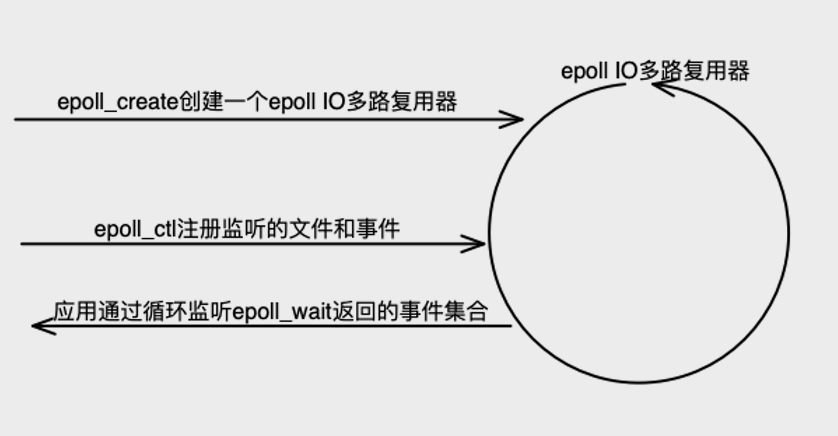

# Linux epoll

参考资料：

+ Linux手册：[EPOLL(7) man](http://www.man7.org/linux/man-pages/man7/epoll.7.html) 

+ GNU C 下载：[GNU libc](http://mirrors.nju.edu.cn/gnu/libc/)

  


## IO多路复用实现对比(select、poll、epoll)

IO多路复用就是指单个process同时处理多个连接的IO。

### 高并发模型

现在的**高并发模型**简单描述就是将连接上的消息处理分成两个阶段处理：

+ **消息等待**

  针对BIO线程捆绑带来的巨大资源浪费以及线程频繁睡眠唤醒带来的低效问题，现多用**IO多路复用**（非阻塞IO）单个或少量process主动查询IO事件(事件查询是非常高效的没有很耗时操作)。

  + **select**

    存储关注的文件符及事件的是 fd_set 数据结构，其实是个**位图**。比如：fd_set **readset* 值为 10001000,表示关注文件描述符{3, 7} 上的可读事件。

    **工作原理**：每次调用都会遍历各事件的fd_set位图（读、写、异常三种fd事件）,复杂度O(n)，检测对应FD上事件，保留fd_set上对应有事件发生的FD的位上的“1”，然后通过内存拷贝的方式将FD消息通知给用户空间。

  + **poll**

    存储关注的文件符及事件的是 **struct pollfd 的数组**。

    ```c
    struct pollfd {
    int fd; /* descriptor to check */
    short events; /* events of interest on fd */
    short revents; /* events that occurred on fd */
    };
    ```

    **工作原理**：每次调用都会遍历 pollfd *fds，复杂度O(n)，检测对应FD上事件，将发生的事件存储到revents，然后通过内存拷贝的方式将FD消息通知给用户空间。

    相对于select: 支持更多事件类型；重新调用poll不需要像select那样重新设置关注的FD和事件；没有并发数量限制（数组长度任意，不过还是要受内存空间和系统支持打开的最大文件句柄数限制）。

  + **epoll** 

    epoll官方解释是：为处理大批量句柄而作了改进的poll。

    select、poll 都是基于**轮询**实现的，当连接数很大时，尽管单个FD上的事件检测很快，但整体性能还是让人难以接受；

    epoll 则采用了基于**事件通知回调**的方式，FD上发生事件会以回调的方式将触发的事件和FD值写入到内核事件就绪队列。后面第二章节详细分析。

+ **消息处理**

  上一步的函数会返回表示“哪个FD触发了哪些事件”的数据，如: select 的 3个fd_set位图指针，poll 的 pollfd数组指针，epoll的事件就绪队列。

  下一步就是消息处理，取出上一步返回的数据，针对FD和事件做相应的处理。

### select、poll 原理流程图

#### select 

图片来自网文：[Linux select/poll机制原理分析 ](https://www.cnblogs.com/LoyenWang/p/12622904.html)


## Epoll工作原理

### 基本使用

```c
int epoll_create(int size);
int epoll_create1(int  flags);
int epoll_ctl(int epfd, int op, int fd, struct epoll_event *event); 
int epoll_wait(int epfd, struct epoll_event *events, int maxevents, int timeout);
```


### 工作原理

图片来自网文：[Epoll 实现原理](https://www.jxhs.me/2021/04/08/linux%E5%86%85%E6%A0%B8Epoll-%E5%AE%9E%E7%8E%B0%E5%8E%9F%E7%90%86/) ，这个图画得比较好。


可以结合这篇博客看：[从linux源码看epoll](https://cloud.tencent.com/developer/article/1401558)，补充了上文中设备收到数据触发中断到最终执行回调的这段逻辑。

主要分为两部分：

1）向epoll注册文件描述符和关注的事件，实际是注册对应的事件监听回调函数；

2）设备事件触发，最终执行回调函数，将就绪事件及文件描述符赋值到epoll_wait的events参数，并唤醒用户进程。


## 描述

可以监控多个文件描述符，查看是否可以在文件描述符上进行IO操作。

可以边沿触发或者水平触发。

水平触发：默认工作模式，即当epoll_wait检测到某描述符事件就绪并通知应用程序时，应用程序可以不立即处理该事件；下次调用epoll_wait时，会再次通知此事件。

边缘触发：当epoll_wait检测到某描述符事件就绪并通知应用程序时，应用程序必须立即处理该事件。如果不处理，下次调用epoll_wait时，不会再次通知此事件。（直到你做了某些操作导致该描述符变成未就绪状态了，也就是说边缘触发只在状态由未就绪变为就绪时通知一次）。

结构体epoll可以看做两个列表的容器，其中 interest list 保存要监控的文件描述符（包含感兴趣的事件），ready list 保存IO已准备好可访问的文件描述符。

三个系统调用



```C
// 创建一个新的epoll实例,返回引用此epoll实例的文件描述符，当所有引用此epoll实例的文件描述符被关闭后，系统内核会自动释放此epoll实例的资源
int epoll_create(int size);		//linux 2.6.8 后 size参数被忽略
int epoll_create1(int flags);	//flag等于0等同于 epoll_create()
// 添加、修改、删除 epoll 实例 interest 列表中的条目（每一项都是一个关注某些epoll_event的文件描述符）
// epfd: epoll实例的文件描述符
// op: c操作类型: EPOLL_CTL_ADD EPOLL_CTL_MOD EPOLL_CTL_DEL
// fd: 感兴趣的文件描述符（即被监听的对象）
// event: 感兴趣的fd对象的事件集合
int epoll_ctl(int epfd, int op, int fd, struct epoll_event *event);
// 等待epoll实例监听的对象的事件发生，如果所有被监听对象都没有事件发生则会阻塞
// epfd: epoll实例的文件描述符
// events: 触发的事件集合指针
// maxevents: 返回触发事件最大数量
// timeout: 阻塞时间ms
int epoll_wait(int epfd, struct epoll_event *events,
                      int maxevents, int timeout);
int epoll_pwait(int epfd, struct epoll_event *events,
                      int maxevents, int timeout,
                      const sigset_t *sigmask);
```

epoll_event 结构：

```C
typedef union epoll_data {
	void    *ptr;
	int      fd;
	uint32_t u32;
	uint64_t u64;
} epoll_data_t;

struct epoll_event {
	uint32_t     events;    /* Epoll events */
	epoll_data_t data;      /* User data variable */
}
```

epoll 事件类型：

```txt
EPOLLERR		表示对应的文件描述符发生错误；
EPOLLET			将EPOLL设为边缘触发(Edge Triggered)模式，这是相对于水平触发(LT)来说的。
EPOLLEXCLUSIVE 
EPOLLHUP		表示对应的文件描述符被挂断；
	EPOLLHUP并不代表对端结束了连接，这一点需要和EPOLLRDHUP区分。通常情况下EPOLLHUP表示的是本端挂断。
EPOLLIN			表示对应的文件描述符可以读（包括对端SOCKET正常关闭[即close]）；
	EPOLLIN事件则只有当对端有数据写入时才会触发，ET模式触发一次后需要不断读取所有数据直到读完EAGAIN为	止。否则剩下的数据只有在下次对端有写入时才能一起取出来了。
EPOLLMSG
EPOLLONESHOT	只监听一次事件;
	当监听完这次事件之后，如果还需要继续监听这个socket的话，需要再次把这个socket加入到EPOLL队列里
EPOLLOUT		表示对应的文件描述符可以写；
	EPOLLOUT事件只有在连接时触发一次，其他时候想要触发，那你要先准备好下面条件：
	1.某次write，写满了发送缓冲区，返回错误码为EAGAIN。
	2.对端读取了一些数据，又重新可写了，此时会触发EPOLLOUT。
	简单地说：EPOLLOUT事件只有在不可写到可写的转变时刻，才会触发一次，是边沿触发。
	如果想强制触发一次，直接调用epoll_ctl重新设置一下event(event.events必须包含EPOLLOUT)就可以了。
EPOLLPRI		表示对应的文件描述符有紧急的数据可读（这里应该表示有带外数据到来）；
EPOLLRDBAND
EPOLLRDHUP		表示对端关闭连接或者正在读写时被强制关闭；
EPOLLRDNORM
EPOLLWAKEUP
EPOLLWRBAND
EPOLLWRNORM
```

epoll 和 poll 区别：

(1) select==>时间复杂度O(n)

它仅仅知道了，有I/O事件发生了，却并不知道是哪那几个流（可能有一个，多个，甚至全部），我们只能无差别轮询所有流，找出能读出数据，或者写入数据的流，对他们进行操作。所以select具有O(n)的无差别轮询复杂度，同时处理的流越多，无差别轮询时间就越长。

(2) poll==>时间复杂度O(n)

poll本质上和select没有区别，它将用户传入的数组拷贝到内核空间，然后查询每个fd对应的设备状态， 但是它没有最大连接数的限制，原因是它是基于链表来存储的.

(3) epoll==>时间复杂度O(1) ，就是借助上面 epoll_event 将流和事件关联起来实现降低复杂度的

epoll可以理解为event poll，不同于忙轮询和无差别轮询，epoll会把哪个流发生了怎样的I/O事件通知我们。所以我们说epoll实际上是事件驱动（每个事件关联上fd）的，此时我们对这些流的操作都是有意义的。（复杂度降低到了O(1)）

### 实例代码

参考：[基于Linux epoll实现的Socket服务](https://github.com/kwseeker/netty/tree/master/epoll)

