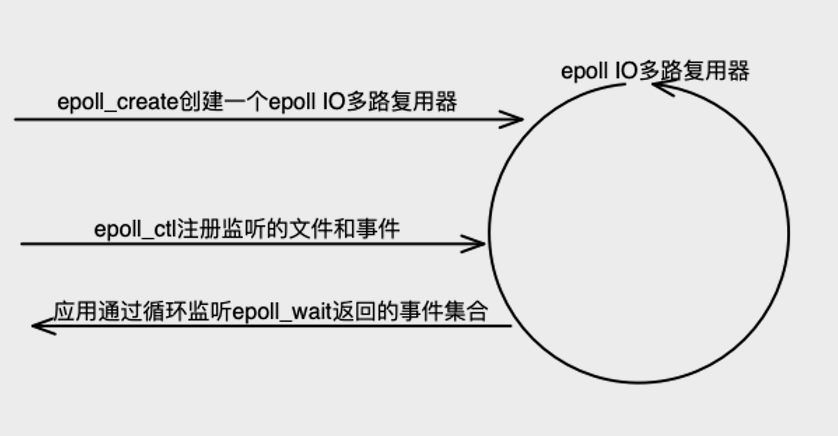

# interview

+ **BIO NIO AIO的区别？**


  BIO是阻塞IO模型，请求未处理完成之前，后续请求必须阻塞等待；为了解决这个问题，早期是通过为每一个请求开启一个线程的方式；但是随着并发量提高，这种方式不仅非常消耗系统资源而且由于大量线程上下文频繁切换，性能低下；为了解决这种问题引入NIO和AIO模型；  

  NIO核心是IO多路复用，基于操作系统底层IO多路复用实现，Linux系统的话是epoll模型，epoll原理核心实现在epoll_wait这个系统调用中实现（epoll_wait会死循环，监听通过epoll_ctl注册到epoll_create创建的epoll IO多路复用器中文件（一切皆文件）的事件，如果某些事件发生比如socket连接、读写等事件，则epoll_wait会返回对应事件集合）；

  

  Selector.open()方法就是通过epoll_create创建一个epoll IO多路复用器；EPollArrayWrapper是JDK最底层的epoll封装类。Selector对象核心就是一个IO多路复用器。
  ```java
  Selector.open()
    new EPollSelectorImpl(this)
      //创建epoll文件和Linux双向管道
      new EPollArrayWrapper()
  ```
  Channel对应Linux的一个文件，可以是Socket文件，可能是个文本文件等等。
  ```java
  //这一步只是创建一个文件
  ServerSocketChannel serverSocketChannel = ServerSocketChannel.open();
  //这个才是真正将文件绑定到某个socket端口之上
  serverSocketChannel.bind(new InetSocketAddress(port));
  ```
  Channel（比如SocketServerChannel）的register(Selector, int)方法就是将需要监听对象（对应Linux某文件）和要监听的事件，通过epoll_ctl注册到epoll中监听。
  ```java
  serverSocketChannel.register(selector, SelectionKey.OP_ACCEPT);
    //将Channel和OP_ACCEPT事件注册到epoll多路复用器
    pollWrapper.add(fd);
      //这个只是在事件监听记录容器中清空一下fd作为索引对应位置byte值
      setUpdateEvents(fd, (byte)0, true);
    //将事件添加到事件监听记录容器（每个Channel在这个容器占有１byte空间用于记录要监听哪些事件，以Channel fd 值作为索引）
    k.interestOps(ops);
      sk.selector.putEventOps(sk, newOps);
        pollWrapper.setInterest(ch.getFDVal(), ops);
          setUpdateEvents(fd, b, false);
  ```
  开始监听事件，就是调用epoll_wait的JDK封装方法，返回触发事件的个数，同时将触发事件的Channel的信息记录到Selector的SelectionKey Set集合(Set<SelectionKey> publicSelectedKeys)中。
  ```
  selector.select();
    doSelect(timeout)
      pollWrapper.poll(timeout);
        updated = epollWait(pollArrayAddress, NUM_EPOLLEVENTS, timeout, epfd);
  ```

+ ****


